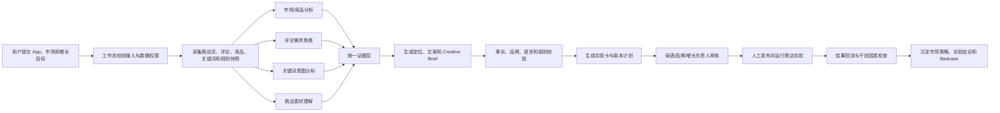

# 第一阶段：全球 ASO 与本地化增长 Agent 产品方向确认 v1.0

| 项目 | 内容 |
| --- | --- |
| 姓名 | 林扬宇 |
| 所属行业 | 移动互联网广告、App 全球化增长、营销科技 |
| 工作经历 | 读书郎双师直播课后端开发（2019-07～2020-04）<br>有米科技广告投放系统后端开发（2020-05～2023-03）<br>有米科技广告投放系统产品经理（2023-04～2025-06） |
| 项目名称 | 全球 ASO 与本地化增长 Agent |
| 当前阶段 | 产品方向确认，不是完整 PRD |
| 项目性质 | 【需确认】真实工作经验延伸 / 基于公司资源的概念方案 / 个人 PoC。现阶段默认按“个人 PoC + 产品概念方案”表述 |

> **目的：**明确 AI 产品的初始方向，回答三个核心问题：我们要做什么？为什么这个问题重要？为什么 AI 比单纯人工、翻译工具或传统数据看板更适合解决它？

> **事实边界：**本项目可以参考有米公开的 ASO、AppGrowing Global、广告情报和海外 App 增长资源，但在未确认本人实际参与范围前，不把公司产品或案例写成本人的已上线项目。所有业务效果数据均需通过真实实验验证，不能用模拟数据冒充上线结果。

---

## **项目概述**

**目的：**帮助出海 App 的增长产品经理、ASO 运营和本地化团队，在进入新市场或优化现有商店页时，快速理解当地用户需求、筛选关键词机会、形成符合当地语言和文化的商店页方案，并把方案转化为可验证的实验，而不是依赖翻译、经验或零散工具反复试错。

### 产品方向的三种可选形态

| 方案 | 产品形态 | 优点 | 局限 | 结论 |
| --- | --- | --- | --- | --- |
| 方案 A：本地化文案助手 | 输入原文，生成多语言标题、短描述和长描述 | MVP 最轻、易演示 | 与通用翻译/写作工具差异小，无法证明增长价值 | 不建议单独立项 |
| 方案 B：ASO 分析 Copilot | 汇总关键词、竞品和评论，输出分析报告 | 数据需求适中，能体现行业知识 | 容易停在“报告生成”，建议无法被验证和沉淀 | 可作为 MVP 的基础能力 |
| 方案 C：ASO 与本地化增长 Agent | 从市场洞察、关键词、评论、本地化到实验规划和复盘形成闭环 | 业务完整、差异化强、可沉淀学习资产 | 数据治理、实验和多市场规则更复杂 | **推荐方向** |

### 产品描述

> **产品公式：**为 `[目标用户]` 提供一款 `[产品形态]`，通过 `[核心技术/方法]`，解决 `[核心问题]`，实现 `[核心价值]`。

为出海 App 的增长产品经理、ASO 运营和本地化团队提供一款商店增长决策 Agent。产品通过多语评论分析、关键词语义聚类、竞品商店页与素材理解、国家/品类知识 RAG、本地化生成和实验规划，将分散的市场信号转化为带来源、可审核、可验证的商店增长方案，帮助团队缩短新市场研究和本地化准备时间，提高本地化决策质量，并持续沉淀“什么策略在什么市场有效”的增长知识。

### 核心问题定义

> 在多国家 App 商店增长中，团队难以把分散的关键词、评论、竞品页面、商店素材、平台规则和实验结果，转化为有证据、可执行、可验证的本地化迭代决策。

这个产品不只是回答“这句话怎么翻译”，而是回答：

```text
这个市场的用户为什么搜索这类产品？
他们最在意什么问题和价值？
应该优先覆盖哪些搜索意图？
标题、描述和截图应该强调什么？
哪些表达虽然翻译正确，但不符合当地用户习惯？
当前建议依据了哪些数据和来源？
先测试哪个变量，如何判断它是否有效？
实验结束后，团队学到了什么？
```

### 产品定位与边界

#### 产品定位

```text
商店增长决策 Agent
≠ 通用翻译工具
≠ 单纯关键词查询工具
≠ 自动冲榜工具
≠ 付费广告投放平台
```

#### 第一阶段包含

- 目标国家与竞品商店页研究；
- 公开评论的主题、情绪和需求分析；
- 关键词候选、搜索意图和优先级建议；
- 标题、短描述、长描述的本地化草案；
- 商店截图/视频的本地化 Creative Brief；
- 国家、品类、品牌和平台规则检查；
- 商店页实验假设、变量、优先级和复盘模板；
- 每条重要建议的来源、时间和置信度；
- 人工审核、修改、采纳和驳回反馈。

#### 第一阶段不包含

- 自动购买安装、刷榜、诱导评论等黑灰产 ASO；
- 承诺关键词排名、自然下载或收入必然提升；
- 自动修改付费广告预算和出价；
- 自动登录并发布商店页；
- 代替法务作最终合规判断；
- 自动回复或操纵用户评论；
- 在未经授权的情况下使用客户、用户或竞品敏感数据。

### 目标用户画像

#### 核心用户一：出海 App 增长产品经理

- **基本特征：**负责一个或多个 App 的海外增长，通常同时关注获客、激活、商店页转化、留存和收入。
- **工作场景：**
  - 评估应该优先进入哪些国家；
  - 为新市场准备商店页和本地化版本；
  - 协调 ASO、设计、本地化、投放和研发团队；
  - 关注商店页 CVR、自然下载、关键词覆盖和付费获客承接效果；
  - 决定下一轮应该改文案、截图、视频还是产品卖点。
- **核心痛点：**
  - 市场信息来自多个工具和团队，难以形成统一判断；
  - 不清楚建议是事实、经验还是生成式 AI 的猜测；
  - 很难判断某次商店页优化为何有效；
  - 多市场并行时，版本和实验状态容易失控。
- **核心诉求：**快速得到有证据的市场与商店增长方案，明确优先级、风险和验证方法。

#### 核心用户二：ASO 运营/应用增长运营

- **基本特征：**负责关键词研究、商店页元数据、竞品监控、版本更新和效果复盘，可能同时管理多个国家和语言。
- **工作场景：**
  - 查关键词、搜索建议、竞品排名和商店页变化；
  - 收集并分析用户评论；
  - 编写或修改标题、描述和推广文案；
  - 跟踪关键词、商店访问、详情页转化和自然新增；
  - 定期整理 ASO 周报或月报。
- **核心痛点：**
  - 大量时间消耗在复制、整理、翻译和表格维护；
  - 关键词、评论、素材和实验数据彼此割裂；
  - 产出的建议容易依赖个人经验，团队难复用；
  - 不同国家需要重新研究，历史经验迁移困难。
- **核心诉求：**降低重复分析成本，快速形成可解释、可执行的迭代方案，并沉淀策略资产。

#### 协作用户一：本地化/内容运营

- **基本特征：**负责多语言文案、文化适配、术语和品牌语气，可能是内部员工、外包译员或当地市场人员。
- **工作场景：**
  - 翻译标题、描述、截图文案和更新说明；
  - 检查品牌术语、语气、日期/货币/单位和文化表达；
  - 根据增长团队反馈反复修改版本。
- **核心痛点：**
  - 通常只收到待翻译文本，缺少用户、市场和关键词上下文；
  - 语言正确不等于搜索意图正确或具有转化力；
  - AI 草案中可能出现不自然表达、文化误用和品牌偏离；
  - 多轮修改缺少原因和版本记录。
- **核心诉求：**在完整市场上下文中做本地化，有术语、品牌和风险约束，并保留人工决策权。

#### 协作用户二：视觉设计/创意策略

- **基本特征：**负责商店截图、预览视频、图标和视觉卖点表达。
- **工作场景：**
  - 分析竞品截图结构和视觉风格；
  - 根据当地市场调整人物、场景、颜色、文案和卖点顺序；
  - 制作多个商店页实验版本。
- **核心痛点：**
  - 需求常以“做得更本地化”“参考竞品”这类模糊描述传递；
  - 缺少用户评论、关键词和产品卖点之间的证据连接；
  - 很难知道应该控制哪个变量，导致实验一次改太多内容。
- **核心诉求：**获得结构化 Creative Brief，明确目标用户、核心假设、控制变量、必要素材和风险项。

#### 购买者/决策者：增长负责人或中小开发者负责人

- **基本特征：**对自然增长、获客成本和全球化效率负责，关注团队人效和可衡量结果。
- **核心痛点：**
  - 小团队缺少完整 ASO、本地化和数据分析配置；
  - 外部服务质量依赖个人经验，过程和依据不透明；
  - 很难评估 ASO 工作到底带来了什么业务价值。
- **核心诉求：**用较低协作成本建立可重复的市场进入与商店增长流程，并通过实验而不是主观判断评估价值。

---

## **业务背景与问题定义**

### 现有业务/行业背景

- **行业整体情况：**出海 App 的增长不只依赖广告买量。用户看到广告、自然搜索或外部推荐后，仍需经过 App Store 或 Google Play 商店页完成理解、信任和下载决策。商店页同时承担搜索发现、产品定位、本地化表达和转化承接。

- **核心业务流程：**

```text
选择目标市场
→ 研究市场、用户和竞品
→ 收集关键词与搜索意图
→ 分析评论和用户痛点
→ 制定商店页定位
→ 本地化标题、描述、截图和视频
→ 内部审核与上架
→ 观察关键词、访问和转化数据
→ 设计实验并迭代
```

- **商业参与方：**
  - App 开发者和发行商；
  - 出海增长/ASO 团队；
  - 本地化服务商；
  - ASO 数据与咨询平台；
  - 广告代理商和全球化营销服务商；
  - Apple App Store、Google Play 等平台。

- **行业挑战：**
  - 商店搜索和推荐机制并不完全透明；
  - 同一产品在不同国家的用户需求、语言习惯和竞争格局不同；
  - 数据分散在商店后台、评论、关键词工具、竞品页面和团队文档中；
  - 生成式 AI 可以快速产出内容，但容易缺乏真实市场依据；
  - ASO 优化常同时修改多个变量，难以判断真正的影响因素；
  - 隐私和平台政策变化使可获得数据的粒度受限。

- **发展趋势：**
  - 从关键词堆叠转向搜索意图、用户需求和转化质量；
  - 从一次性翻译转向持续本地化与跨文化适配；
  - 从人工报告转向 AI 辅助研究、生成和实验；
  - 从“给建议”转向“证据—方案—实验—复盘”的增长闭环；
  - 从单个语言版本转向多市场资产、术语和实验状态统一管理。

### 核心问题识别

#### 问题一：市场、关键词、评论和竞品数据分散，研究成本高

一个 ASO 运营在评估印度尼西亚市场时，可能需要同时查看：

```text
Google Play 商店页
竞品标题、描述、截图和更新记录
公开用户评论
关键词和搜索建议
Google Trends
第三方 ASO/广告情报工具
当地语言和文化资料
平台政策
内部历史版本与实验记录
```

问题不是“没有数据”，而是数据分散、格式不同、时效不同，最终仍需人工复制到表格，再依赖个人经验形成结论。

**结果：**

- 新市场研究周期长；
- 结论难追溯到原始证据；
- 不同人员产出的结论不一致；
- 同一研究工作在不同国家反复重做。

#### 问题二：直译能保证字面正确，但不能保证搜索与转化有效

传统翻译通常从源语言文本出发，但商店增长要求同时考虑：

```text
当地用户如何描述问题
用户实际搜索什么意图
竞品采用什么定位
品牌希望强调什么差异
标题和描述的字符限制
截图中什么卖点优先出现
当地文化、敏感表达和平台规则
```

例如，英文里的一个产品卖点可能有多个语义正确的印尼语表达，但只有部分表达符合当地用户常用说法或搜索习惯。

**结果：**

- 文案语法正确但不自然；
- 关键词被硬塞进文案，影响可读性；
- 全球统一卖点没有适配当地真实需求；
- 截图和描述表达不一致；
- 本地化质量只能在上线后被动发现。

#### 问题三：关键词、评论、文案和视觉素材彼此割裂

现实中常见的分工是：

```text
ASO 运营查关键词
→ 产品经理定卖点
→ 翻译人员改语言
→ 设计师做截图
→ 数据人员看结果
```

每个角色只看到流程的一部分，导致：

- 评论里高频出现的痛点没有进入截图；
- 关键词覆盖了某个意图，但描述没有充分解释；
- 视觉强调的卖点与当地用户关注点不一致；
- 实验失败后，团队不知道应该修改语言、卖点还是视觉顺序。

#### 问题四：ASO 优化依赖经验，缺少可证伪的实验设计

团队常见做法是一次同时修改标题、描述、截图和图标，然后观察整体数据变化。

这种方式的问题是：

```text
变量过多，无法判断什么因素产生影响
没有明确实验假设
没有事先定义成功指标和停止规则
忽略版本、季节、投放和产品更新的干扰
实验失败后没有形成可复用知识
```

AI 如果只生成更多版本，会进一步增加试错数量；真正需要的是帮助团队提出可验证假设、控制变量、安排优先级并复盘结果。

#### 问题五：多市场版本、规则和团队协作难管理

当一个 App 同时覆盖多个国家和语言时，需要管理：

```text
不同市场的标题和描述
国家专属截图和视频
术语与品牌表达
平台字符和素材规格
实验版本和生效时间
审核反馈和修改原因
数据观察窗口
```

如果依赖表格、聊天记录和共享文件，容易出现旧版本误用、术语不一致、修改理由丢失和实验状态混乱。

### 问题量化与机会评估

> 当前没有可证明的本人真实 ASO 项目基线。以下不是结果数据，而是第一阶段需要验证的指标框架。

### 问题发生频率

建议通过 5–8 名目标用户访谈和 2–3 个真实商店页任务验证：

| 待验证问题 | 需要采集的基线 |
| --- | --- |
| 完成一个新市场研究需要多久 | 从收到需求到形成可审核方案的工时 |
| 信息检索是否重复 | 使用工具数、网页数、表格数、重复查询次数 |
| 本地化返工是否严重 | 每个版本的修改轮次、主要退回原因 |
| 建议是否有证据 | 可追溯到数据或来源的建议占比 |
| 实验是否规范 | 有明确假设、单一主变量和停止规则的实验占比 |
| 经验是否沉淀 | 历史实验可检索、可复用的比例 |

### 问题影响范围

1. **增长团队：**进入新市场和迭代商店页速度慢，机会判断依赖少数专家。
2. **ASO 运营：**大量时间消耗在数据收集和报告整理，而不是策略判断。
3. **本地化团队：**缺少用户、关键词和产品上下文，返工多。
4. **设计团队：**收到模糊需求，难以形成单变量、可验证的视觉方案。
5. **管理层：**无法判断 ASO 投入的过程质量和业务贡献。
6. **最终用户：**看到不自然、不相关或不符合当地习惯的商店内容。

### 当前解决方式的成本

```text
人工搜索竞品和关键词
人工下载或复制评论
人工使用翻译工具
人工整理多语言表格
人工编写设计需求
人工查看商店后台数据
人工对比实验版本
人工整理周报/月报
```

主要成本不是某一个步骤很难，而是：

- 多工具切换和数据搬运；
- 不同角色反复解释上下文；
- 决策依据不可追溯；
- 同类研究无法复用；
- 上线后才发现本地化或规则问题；
- 实验结果没有转化为下一轮策略。

### 机会评估

第一阶段不预设“排名提升多少”或“自然下载增长多少”，而是验证四类价值：

| 价值层 | 初步指标 |
| --- | --- |
| 效率价值 | 市场研究与首版方案用时、本地化返工轮次、报告整理时间 |
| 决策质量 | 建议证据覆盖率、关键词相关性、专家采纳率、实验方案完整率 |
| 安全质量 | 事实错误率、文化/政策风险漏检率、品牌术语偏离率 |
| 业务价值 | 上线实验后的商店页 CVR、目标关键词覆盖、自然新增及其增量 |

这个方向具有较高机会，原因是：

```text
痛点跨角色且反复发生
公开数据可以支撑 PoC
AI 对多语和非结构化数据有明确优势
结果可以通过人工评审和在线实验验证
与现有 AdOps Copilot 的投放排障范围不同
可从单商店、单品类、双市场开始控制范围
```

---

## **AI 技术应用方向初步探索**

**目的：**论证为什么 AI 是合适的技术，并明确 AI、规则、数据工具和人工分别负责什么。

### 为什么需要 AI？

#### AI 适合处理多语、非结构化和多模态市场信号

评论、标题、长描述、截图、视频和竞品页面并不是统一表格。传统规则可以统计词频，却难以理解：

- “难用”“广告太多”“注册失败”等不同表达是否属于同一问题；
- 用户是在抱怨功能、价格、性能还是信任；
- 截图表达的卖点是否与描述和评论需求一致；
- 同一个卖点在不同语言和文化中应该如何表达。

多语语言模型、多模态模型和 embedding 可以将这些分散信号转化为统一的主题、意图、卖点和风险标签。

#### AI 能支持“本地化”，而不只是“翻译”

本地化需要同时考虑源文案、目标用户、关键词意图、品牌语气、字符限制、文化背景和平台规则。AI 可以在这些上下文约束下生成多个草案，并说明：

```text
保留了什么产品事实
使用了什么当地表达
覆盖了什么搜索意图
为什么调整卖点顺序
哪些地方需要当地人员确认
```

但 AI 草案不能跳过母语审核和品牌审核。

#### AI 可以把分散信号转化为可验证的实验假设

例如，系统不应直接断言：

> “当地用户更喜欢安全卖点，所以换截图后 CVR 一定提升。”

更合理的输出是：

> “近 90 天目标市场评论中，隐私和权限相关主题频繁出现；建议测试在首张截图突出‘无需上传个人文件’。该结论目前是相关性假设，需要用单变量商店页实验验证。”

AI 的价值是帮助团队更快形成结构化假设和实验方案，而不是替代真实实验。

#### AI 可以在多轮迭代中保留状态和证据

传统聊天工具容易遗忘：

- 当前使用哪个国家和语言；
- 哪个版本已经上线；
- 哪条建议被驳回以及原因；
- 哪个实验正在运行；
- 某条“经验”是否只在一个市场成立。

本项目需要把市场、版本、假设、证据、实验和结果结构化保存，形成长期可复用的 ASO Growth State。

### AI、规则和人工的职责边界

| 参与方 | 负责内容 | 不负责内容 |
| --- | --- | --- |
| AI | 评论聚类、语义分析、竞品摘要、本地化草案、Creative Brief、实验草案、结果解释 | 保证排名、伪造市场数据、最终合规签字 |
| 数据工具 | 拉取公开商店页、评论、趋势、关键词和后台指标 | 自行生成策略结论 |
| 规则引擎 | 字符限制、必填项、禁用词、版本状态、实验门槛 | 处理复杂语言和文化语义 |
| 人工专家 | 确认市场策略、品牌表达、母语质量、实验发布和最终决策 | 重复搬运和整理所有基础数据 |

### 初步技术路径设想

```text
固定增长工作流
+ 多语大语言模型
+ 多模态商店素材理解
+ 关键词/评论 embedding 与聚类
+ 国家/品类/平台规则 RAG
+ 数据采集与分析工具
+ 实验规划规则
+ 人工审核与反馈闭环
```

不建议让多个 Agent 自由讨论后直接给结论。市场研究、评论分析、关键词策略、本地化和实验规划的步骤相对稳定，应由可追踪的工作流编排；AI 只在需要理解、生成和判断的节点发挥作用。

### 技术架构设想

```text
用户输入
App 链接 / 产品信息 / 目标市场 / 增长目标 / 品牌约束
↓
任务与数据完整性检查
缺国家、语言、商店、品类或基线时先追问
↓
数据采集与快照
商店页 / 评论 / 竞品 / 关键词 / 趋势 / 平台规则 / 授权后台数据
↓
并行分析
市场与竞品分析 / 评论需求聚类 / 关键词意图聚类 / 商店素材理解
↓
统一证据层
source_id / source_type / market / language / captured_at / claim_supported
↓
策略生成
定位建议 / 关键词组合 / 本地化文案 / 视觉 Brief / 风险项
↓
一致性与规则校验
产品事实 / 品牌术语 / 字符限制 / 平台规则 / 图文一致性
↓
实验规划
假设 / 主变量 / 指标 / 观察窗口 / 停止规则 / 干扰因素
↓
人工审核
采纳 / 修改 / 驳回 / 补充当地市场判断
↓
输出交付包
可发布草案 + 证据 + Creative Brief + 实验计划
↓
实验结果回流
版本表现 / 结论置信度 / 适用市场 / 下一轮建议
```

### 主要模块设计

| 模块 | 核心功能 | 主要输出 |
| --- | --- | --- |
| 市场与竞品研究 | 目标市场、品类、竞品定位和商店页差异 | 市场机会卡、竞品对标图 |
| 评论洞察 | 多语评论清洗、主题聚类、情绪和需求识别 | 用户痛点、原话证据、优先级 |
| 关键词策略 | 候选词、语义意图、品牌/功能/问题词分组 | 关键词组合、覆盖理由、风险 |
| 本地化生成 | 标题、短描述、长描述、更新说明 | 多版本草案、修改理由、需确认项 |
| 素材理解与 Brief | 截图/视频卖点、顺序、图文一致性 | 本地化 Creative Brief、实验变量 |
| 规则与风险 RAG | 平台规范、国家/品类风险、品牌术语 | 引用、风险等级、修改建议 |
| 实验规划 | 假设、变量、指标、窗口和停止规则 | 实验卡、版本关系、复盘模板 |
| 增长知识库 | 保存市场、假设、版本、结果和适用条件 | 可检索的策略与 Badcase |

### 可落地的 3 个子场景

#### 子场景一：新市场进入与商店页首版生成

用户输入：

```text
“我们准备把一款 Android 文件管理工具进入印度尼西亚市场。
请分析主要竞品、当地用户关注点和关键词机会，
输出 Google Play 商店页首版和截图 Brief。”
```

系统流程：

1. 校验产品事实、目标市场、语言和增长目标；
2. 收集竞品商店页、公开评论、趋势和关键词候选；
3. 聚类用户需求与竞品定位；
4. 输出市场机会、核心搜索意图和差异化卖点；
5. 生成标题、描述和截图 Brief；
6. 检查字符、品牌、事实和当地表达；
7. 标记需母语人员确认的内容；
8. 生成首轮实验路线图。

可能输出：

```text
建议优先验证的定位：轻量、离线文件整理与隐私控制。

证据：
- 目标市场竞品评论中，“广告打扰”“权限过多”“找不到大文件”是高频主题；
- 竞品多数首屏强调清理空间，但较少解释文件权限。

首轮实验：
- 控制标题和描述不变；
- 仅测试首张截图：
  A 版本强调“快速释放空间”；
  B 版本强调“离线管理，不上传个人文件”。

注意：
- “最安全”“零风险”等绝对化表达不建议使用；
- 印尼语最终文案需母语审核。
```

> 以上为输出格式示例，不代表真实市场结论；实际内容必须由当次数据和引用支持。

#### 子场景二：评论驱动的本地化优化

用户输入：

```text
“当前墨西哥西班牙语商店页转化一般，
请结合最近三个月评论，判断文案和截图应该优先改什么。”
```

系统流程：

1. 获取指定国家、语言和时间窗的评论；
2. 去重、过滤无关内容并识别版本；
3. 聚类功能需求、使用障碍、信任问题和正向价值；
4. 对照当前商店页是否覆盖这些需求；
5. 输出文案缺口、截图缺口和本地化表达建议；
6. 区分产品问题与商店表达问题；
7. 生成单变量实验优先级。

关键边界：

- 评论中的高频抱怨不一定代表全部用户；
- 如果问题来自崩溃或功能缺失，不能用文案包装替代产品修复；
- 不自动生成或操纵商店评论。

#### 子场景三：商店页实验规划与复盘

用户输入：

```text
“我们想同时测试新图标、新标题和新截图，
请帮我拆成合理的实验，并在结果回来后总结。”
```

系统流程：

1. 明确目标指标和当前基线；
2. 识别三个变量同时变化会导致归因不清；
3. 根据影响、成本和风险安排实验顺序；
4. 定义主变量、对照版本、观察窗口和停止规则；
5. 记录同期版本发布、广告活动和节日等干扰因素；
6. 实验结束后判断结果是否足以支持假设；
7. 将结论按国家、语言、品类和版本写入知识库。

### 可行性与风险评估

### **数据可行性**

第一阶段可以使用的数据：

| 数据 | 可得性 | 用途 | 风险 |
| --- | --- | --- | --- |
| Google Play/App Store 公开商店页 | 高 | 竞品定位、文案和素材分析 | 需保留采集时间和地区 |
| 公开用户评论 | 高 | 用户需求、痛点和语言表达 | 隐私、抽样偏差、虚假评论 |
| Google Trends 等公开趋势 | 中高 | 搜索趋势和市场变化参考 | 不能等同商店关键词搜索量 |
| AppGrowing/ASO 工具数据 | 【需确认】 | 关键词、竞品、广告与市场补充 | 权限、许可、估算口径 |
| 自有商店后台数据 | 【需授权】 | CVR、来源、实验与版本效果 | 商业敏感和访问权限 |
| 历史本地化和实验记录 | 【需补充】 | 策略复用和评测 | 格式不统一、样本有限 |

PoC 可以完全使用公开数据和明确标记的模拟实验结果，但不得把模拟结果写成真实业务增长。

### 技术可行性

该项目具备技术可行性：

1. 多语模型可以处理评论主题、语义意图和本地化草案；
2. 多模态模型可以分析截图、视频和图文一致性；
3. RAG 可以给平台规则、品类风险和市场资料提供引用；
4. embedding 与聚类适合评论和关键词归类；
5. 固定工作流可以控制数据、版本和实验状态；
6. 第一阶段不需要训练排名预测或实时竞价模型；
7. 人工审核可以控制母语、品牌和合规风险。

### 业务风险

| 风险 | 表现 | 初步控制 |
| --- | --- | --- |
| 把相关性当因果 | 高频词被直接解释为转化原因 | 统一输出为假设，必须通过实验验证 |
| 数据口径不透明 | 第三方关键词量或竞品数据为估算 | 展示来源、口径、时间和置信度 |
| 本地化幻觉 | AI 生成不自然或错误文化表达 | 母语审核、术语库、Badcase 集 |
| 产品事实错误 | 文案生成不存在的功能或承诺 | 产品事实库和生成后校验 |
| 平台规则过期 | 引用旧字符限制或政策 | 文档版本、抓取时间和失效提醒 |
| 评论样本偏差 | 极端用户或刷评影响分析 | 去重、异常检测、版本/时间分层 |
| 实验误判 | 样本不足或同期有其他改动 | 最低观察条件、干扰因素记录 |
| 数据合规 | 未授权使用用户或客户数据 | 最小化采集、脱敏、权限和审计 |
| 过度自动化 | AI 草案未经确认直接发布 | MVP 不自动发布，人工审批 |
| 求职表达失真 | 将概念方案写成公司上线项目 | 明确项目性质和证据等级 |

### 初步成功标准

#### PoC 阶段

- 能对一个 App、两个目标市场生成完整、可追溯的分析包；
- 重要事实和策略建议均能回到来源；
- 评论主题、关键词意图和本地化风险可由人工抽检；
- 能生成包含假设、主变量、指标和停止条件的实验卡；
- 模拟数据与公开事实在界面和文档中明确区分；
- 不出现虚构产品功能、自动发布或黑灰产建议。

#### 真实试点阶段

- 研究和首版方案时间相对人工基线下降；
- 本地化返工轮次下降；
- 建议证据覆盖率和专家采纳率提升；
- 实验方案完整率提升；
- 通过真实在线实验评估商店页 CVR、目标关键词覆盖和自然新增；
- 安全侧持续监控事实错误、品牌偏离、文化风险和政策漏检。

---

## **业务流程/场景分析**

**目的：**展示 AI 产品如何介入现有 ASO 与本地化流程，以及哪些环节仍由人工负责。

### 当前业务流程图


当前流程的主要问题：

- 数据搜集、策略判断、翻译和设计彼此割裂；
- 决策依据不能稳定追溯；
- 多个变量同时修改；
- 实验结果没有进入统一知识库；
- 每进入一个新市场都重复相似工作。

### 引入 AI 后的理想业务流程图



AI 主要增强：

- 数据归集与结构化；
- 多语评论和关键词语义理解；
- 有上下文的本地化草案；
- 证据关联、风险检查和实验规划；
- 跨版本的结果复盘与知识沉淀。

人工保留：

- 市场优先级和预算决策；
- 产品事实与品牌定位确认；
- 母语和文化质量审核；
- 最终商店发布；
- 实验启动、停止和结果采纳；
- 法务与平台合规最终判断。

---

## 本轮需要重点讨论的 6 个问题

1. **核心用户是否准确：**第一优先用户应是出海 App 增长产品经理，还是 ASO 运营？
2. **首个品类：**工具 App、游戏、短剧或电商 App，哪个最贴近本人真实经历？
3. **首个市场：**是否采用“Google Play + 英语/印度尼西亚语双市场”作为 PoC？
4. **项目性质：**最终按个人 PoC、概念方案，还是可追溯的真实工作延伸呈现？
5. **可用资源：**本人是否实际接触过 ASOGrow、AppGrowing Global 或商店增长流程？
6. **MVP 深度：**第一版止于“有证据的策略与实验包”，还是继续做可交互 Demo？

在以上问题确认前，本文件作为方向讨论 v1，不进入详细 PRD和简历结果包装。
