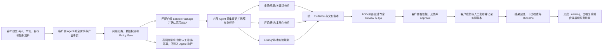

# 第一阶段：全球 ASO 与本地化增长 Agent 产品方向确认 v2.0

| 项目 | 内容 |
| --- | --- |
| 姓名 | 林扬宇 |
| 所属行业 | 移动互联网广告、App 全球化增长、营销科技 |
| 工作经历 | 读书郎双师直播课后端开发（2019-07～2020-04）<br>有米科技广告投放系统后端开发（2020-05～2023-03）<br>有米科技广告投放系统产品经理（2023-04～2025-06） |
| 项目名称 | 全球 ASO 与本地化增长 Agent / ASO Growth Service Agent |
| 当前阶段 | 产品方向重新确认，不是完整 PRD、已上线产品或已验证业务结果 |
| 项目性质 | 【需确认】真实业务升级 / 基于公司资源的概念方案 / 个人 PoC。确认前按“产品概念方案 + AI 产品经理求职项目”表述 |

> **目的：** 明确一个能从内部 ASO 运营起步、最终进入对外 ASO 服务的 AI 产品方向，回答三个核心问题：客户为什么会购买这项服务？内部团队为什么需要 Agent 才能稳定交付？白帽 ASO 如何成为可信的服务入口，并为更广泛的 ASO 业务形成需求识别与商业线索？

> **事实边界：** 用户已确认现有 ASO 业务以黑帽服务为主、白帽服务占比较小，期望用 AI 提升白帽 ASO 的效果与交付效率，并逐步把能力集成到对外服务。真实客户规模、收入结构、服务价格、交付工时、历史效果、本人参与范围、可用数据和组织隔离机制尚未提供。本文将用户输入视为业务背景，将产品形态、用户优先级和商业路径标记为建议或待验证假设，不承诺排名、安装、评分、评论、收入或 ROI 结果。

---

## **项目概述**

**目的：** 帮助来寻求 ASO 优化的 App 开发者、增长负责人和发行团队，把“想提升自然增长、进入新市场或改善商店页”的模糊诉求，转化为有证据、可审核、可交付、可验证的白帽 ASO 方案；同时帮助内部 ASO 运营、母语、本地化、设计和客户成功团队降低重复研究与沟通成本，形成可以逐步对客户开放的标准化服务能力。

产品从内部 ASO 运营工作流起步，但产品价值不止于内部提效：

```text
外部客户是价值主体：提出目标、提供事实与授权、理解依据、审核版本、观察结果
内部 ASO 运营是首阶段执行用户：完成诊断、策略、交付、质检、沟通和复盘
Agent 是连接层：保留客户上下文、组织证据、辅助专业任务、管理版本和生成可解释交付物
```

### 产品方向的三种可选形态

| 方案 | 产品形态 | 优点 | 局限 | 结论 |
| --- | --- | --- | --- | --- |
| 方案 A：内部 ASO 运营 Copilot | 面向内部运营查询数据、整理评论、生成文案和报告 | 起步成本低，能直接验证内部人效 | 客户价值不可见，容易停在“员工工具”，难形成可售卖服务 | 作为第一阶段的使用入口，不作为最终产品定位 |
| 方案 B：客户自助式 ASO AI 工具 | 客户自行输入 App 和市场，获取关键词、文案和诊断 | 外部产品形态清晰，获客路径短 | 客户数据和专业能力差异大，错误建议、服务承诺和自助流失风险高 | 可作为后续轻量入口，不适合直接承担完整交付 |
| 方案 C：ASO 与本地化增长服务 Agent | 客户服务入口 + 内部交付 Agent + 专家审核 + 客户审批 + 实验复盘 | 同时提高内部交付能力和客户体验，可逐步形成服务产品与复购 | 需要服务标准、证据、权限、状态、SLA 和黑白帽隔离 | **推荐方向：按“内部先用、客户逐步可见、能力逐步外放”建设** |

### 产品描述

> **产品公式：** 为 `[需要外部 ASO 优化服务的 App 开发者、增长负责人和发行团队]` 提供一款 `[由内部专家与 Agent 共同交付、并逐步面向客户开放的白帽 ASO 服务产品]`，通过 `[多语评论与关键词理解、竞品和商店素材分析、证据化策略生成、受控本地化、版本审批和实验复盘]`，解决 `[客户不知道该优化什么、服务过程不透明、内部交付依赖个人经验、优化结果难解释和难复用]`，实现 `[白帽服务标准化、客户信任提升、交付人效改善和持续服务机会增长]`。

客户提交 App、商店、目标国家、增长目标、产品事实和可用数据，系统先判断问题是否适合白帽 ASO、需要补充什么资料以及应该进入哪类服务。内部 ASO 运营使用 Agent 完成市场研究、评论分析、关键词策略、本地化草案、Creative Brief 和实验设计；重要结论绑定来源和局限，并经过专家审核。客户看到的是可理解的诊断、建议依据、版本差异、待确认问题和验证计划，而不是内部工具堆叠或黑盒报告。

白帽服务既是独立可收费的价值，也可以成为更广 ASO 业务的可信入口：通过诊断和持续协作识别客户的真实增长目标、预算和后续需求，再将符合政策与公司治理要求的服务线索交给人工商务承接。涉及刷榜、虚假安装、虚假评论、诱导评分或规避平台检测的需求，不由 Agent 推荐、设计或执行，也不进入共享学习闭环。

### 核心问题定义

> 在对外 ASO 服务中，客户的增长诉求、公开市场信号、商店页内容、内部专家经验、客户审批和上线结果没有形成一条连续证据链，导致白帽服务难以标准化、客户难以判断价值、内部团队难以复用经验。

这个产品不只是回答“应该用哪个关键词”或“这段文案怎么翻译”，而是回答：

```text
客户当前遇到的是搜索覆盖、商店表达、素材、本地化、产品体验还是投放承接问题？
这个问题是否适合由白帽 ASO 服务解决？
目标市场的用户为什么搜索这类产品，最在意什么？
本次建议使用了哪些数据，哪些只是推断，哪些需要客户补充？
标题、描述、截图和视频应该围绕什么假设调整？
内部由谁研究、谁审核、谁负责母语和品牌质量？
客户需要确认哪个版本，最终由谁发布？
先验证哪个变量，怎样判断结果，哪些干扰因素会影响归因？
本次服务结束后形成了什么可复用结论和下一项合规服务机会？
```

### 产品定位与边界

#### 产品定位

```text
白帽 ASO 与本地化增长服务 Agent
= 面向客户的需求受理、诊断解释、交付审核与结果复盘入口
+ 面向内部 ASO 运营的研究、生成、质检、协作与项目状态工作台
+ Evidence Object、Listing Version、Review、Approval、Experiment、Outcome
+ Policy Gate、权限隔离和人工最终责任

≠ 通用翻译或文案生成工具
≠ 单纯关键词查询或数据看板
≠ 无人值守的自动优化系统
≠ 自动冲榜、刷安装、刷评论或诱导评分工具
≠ 付费广告自动投放平台
```

#### 第一阶段包含

- 客户、App、商店、国家、语言、目标和授权信息的结构化建档；
- 客户需求澄清、资料完整性检查、问题分类和白帽服务匹配；
- 目标市场、品类和竞品商店页研究；
- 公开评论的主题、情绪、需求和用户原话分析；
- 关键词候选、搜索意图、覆盖关系和优先级建议；
- 标题、短描述、长描述和更新说明的本地化草案；
- 商店截图/视频的本地化 Creative Brief；
- 产品事实、品牌术语、国家/品类风险和平台规则检查；
- 每条重要建议的来源、时间、市场、口径、置信度和局限；
- 内部任务分派、专家 Review、版本记录和质量检查；
- 客户可见交付物、修改意见、Approval 和项目进度；
- 商店页实验假设、主变量、指标、观察窗口和复盘模板；
- 经客户授权的反馈、Badcase 和适用范围受控的增长知识沉淀。

第一阶段的产品形态可以由“内部运营工作台 + 客户可见报告/审核页”组成，不要求客户立即自助完成所有操作。

#### 第一阶段不包含

- 自动购买安装、刷榜、虚假评论、诱导评分或规避平台检测；
- 承诺关键词排名、自然下载、评分、收入或 ROI 必然提升；
- Agent 自动推荐、报价或执行黑帽 ASO 服务；
- 自动修改广告预算和出价；
- 自动登录并发布商店页，或未经客户批准启动/停止实验；
- 用第三方估算、单次前后变化或模型判断冒充真实因果；
- 代替客户、母语专家、品牌、法务或平台作最终决定；
- 未经授权使用客户后台、用户数据、历史项目或其他客户资料；
- 将高风险业务的数据、工具、账号、提示词或结果直接回流到白帽 Agent。

### 目标用户画像

#### 核心用户一：出海 App 增长产品经理

- **角色定位：** 外部客户侧的价值主体和主要专业使用者，可能也是中小团队的购买者。
- **基本特征：** 负责一个或多个 App 的海外增长，同时关注自然获客、付费流量承接、商店页转化、留存和收入；有明确增长目标，但未必具备完整 ASO 专业配置。
- **典型场景：**
  - 一个已上线 App 自然新增停滞，不知道问题来自关键词、商店页、素材还是产品评价；
  - 准备进入一个新国家，希望外部团队完成市场研究和首版商店页；
  - 付费广告有曝光，但商店页转化较弱，希望判断承接问题；
  - 已经购买过 ASO 服务，但看不懂报告依据，也无法判断下一步。
- **核心痛点：**
  - 不知道应该购买“诊断、关键词、本地化、素材还是持续优化”；
  - 外部服务往往直接交付结论，过程和证据不透明；
  - 多个供应商、内部团队和工具之间上下文反复丢失；
  - 很难区分 ASO 贡献、产品变化、广告流量和季节因素；
  - 对结果有期待，但缺少合理的实验和归因边界。
- **核心诉求：** 获得范围清晰、依据可信、版本可审核、结果可解释的白帽 ASO 服务，并能随时知道项目做到哪里、自己还需确认什么。

#### 核心用户二：ASO 运营/应用增长运营

- **角色定位：** 第一阶段最主要的产品操作用户，也是白帽服务质量和交付效率的直接责任人。
- **基本特征：** 负责客户需求澄清、关键词研究、商店页元数据、竞品监控、本地化协同、版本更新和效果复盘，可能同时服务多个 App、国家和客户。
- **典型场景：**
  - 根据客户一句“帮我提高排名”重新澄清目标和可交付范围；
  - 在多个 ASO 工具、商店页面、评论和内部表格间收集材料；
  - 为不同市场编写诊断、关键词方案和本地化建议；
  - 协调母语、设计、客户成功和客户审批；
  - 处理客户修改、版本差异、上线状态和阶段报告；
  - 从白帽诊断中识别客户后续的合规增长需求并交给商务跟进。
- **核心痛点：**
  - 大量时间消耗在复制、整理、翻译、格式调整和进度沟通；
  - 服务范围、客户承诺和专业交付物缺少统一模板；
  - 关键词、评论、素材、版本和实验数据彼此割裂；
  - AI 生成内容仍需逐项核对事实、语言和政策，可能增加审核成本；
  - 专家经验留在个人文档和聊天记录中，难以复用；
  - 高风险需求如果没有明确 Gate，容易混入白帽工作流。
- **核心诉求：** 用 Agent 降低基础研究和协作成本，把精力放在策略判断和客户沟通上，并通过标准对象稳定交付、解释和复盘。

#### 协作用户一：本地化/内容运营

- **基本特征：** 可能来自内部服务团队、外包译员、当地市场人员或客户品牌团队，负责多语言文案、文化适配、术语和品牌语气。
- **工作场景：**
  - 审核标题、描述、截图文案和更新说明；
  - 检查当地常用表达、品牌术语、日期/货币/单位和敏感内容；
  - 在客户反馈后修改版本并说明原因；
  - 对 AI 草案标注“可采用、需修改、不可使用”。
- **核心痛点：**
  - 常只收到待翻译文本，不知道用户需求、关键词意图和客户商业目标；
  - 语言正确不等于搜索意图匹配或具有转化力；
  - AI 可能生成自然但不符合产品事实、品牌或当地文化的表达；
  - 多轮修改缺少证据、原因和版本关系。
- **核心诉求：** 在完整市场和产品上下文中审核本地化内容，有术语、事实和风险约束，并保留人工决策权。

#### 协作用户二：视觉设计/创意策略

- **基本特征：** 负责商店截图、预览视频、图标和视觉卖点表达，可能属于内部设计、外包团队或客户设计团队。
- **工作场景：**
  - 分析目标市场竞品截图结构和卖点顺序；
  - 根据评论、关键词和客户定位调整人物、场景、颜色与文案；
  - 制作商店页实验版本并响应客户反馈。
- **核心痛点：**
  - 需求常以“更本地化”“更有转化”“参考竞品”传递，缺少可执行标准；
  - 不知道卖点来自客户偏好、用户评论还是运营经验；
  - 一次修改过多视觉变量，实验后无法归因；
  - 外部客户的品牌意见和内部策略建议容易在聊天中冲突。
- **核心诉求：** 获得结构化 Creative Brief，明确目标用户、证据、主假设、卖点顺序、控制变量、素材要求、客户确认项和风险项。

#### 购买者/决策者：增长负责人或中小开发者负责人

- **基本特征：** 对自然增长、获客成本、全球化效率和服务预算负责，关注结果，也关注团队是否投入了合理时间。
- **购买前问题：**
  - 当前问题是否值得做 ASO，还是应优先修产品、投放或留存？
  - 为什么需要这一服务包，具体交付什么、不交付什么？
  - AI、专家和客户分别做什么，怎样避免生成错误？
  - 需要多久、修改几轮、谁负责上线、效果如何判断？
- **核心痛点：**
  - 小团队缺少完整 ASO、本地化、设计和数据分析配置；
  - 外部服务质量依赖个人经验，过程、版本和责任不透明；
  - 难以评估白帽 ASO 的过程质量和业务贡献；
  - 容易被“保证排名”等短期承诺吸引，又担心平台和账号风险。
- **核心诉求：** 以可控成本获得可信服务，明确交付、风险和验证方式；当白帽诊断发现其他增长需求时，能获得清晰但不过度承诺的后续选择。

> **首阶段用户关系建议：** 第一操作用户是内部 ASO 运营，第一价值验证对象是已有 App 增长停滞或准备进入单一新市场的中小开发者/Growth Lead。前者验证交付人效，后者验证服务是否值得购买和持续使用；两种成功不能相互替代。

---

## **业务背景与问题定义**

### 现有业务/行业背景

- **现有业务事实：** 用户输入确认，现有 ASO 业务以黑帽服务为主，白帽服务占比较小。调整目标不是用 AI 提高黑帽执行效率，而是先把白帽诊断、策略、本地化、创意和复盘做得更有效、更标准，形成对外服务入口和客户信任。

- **产品演进背景：** 当前 ASO Agent 方案偏内部运营使用，这符合早期落地条件，但如果长期只优化内部查询和报告生成，就无法回答客户为什么购买、怎样参与、怎样审批以及怎样评价结果。产品设计需要从一开始保留客户、项目、交付物、版本、审批和结果对象，即使第一阶段界面主要由内部人员使用。

- **行业整体情况：** App Store 和 Google Play 商店页同时承担搜索发现、产品定位、信任建立和转化承接。ASO 的效果不仅受关键词影响，还受到产品口碑、元数据、视觉素材、本地化质量、广告流量、版本节奏、平台机制和竞争变化影响。

- **核心业务流程：**

```text
客户提出自然增长或新市场需求
→ 销售/客户成功澄清目标与预算
→ ASO 运营诊断问题并定义服务范围
→ 收集市场、竞品、关键词、评论和客户资料
→ 输出策略、文案、本地化和 Creative Brief
→ 内部专家审核并与客户往返修改
→ 客户或授权人员发布商店页/启动实验
→ 观察关键词、访问、转化和自然新增
→ 复盘结果并形成下一项服务建议
```

- **商业参与方：**
  - App 开发者、发行商和客户增长团队；
  - 内部销售、客户成功、ASO 运营和服务经理；
  - 本地化/母语、内容、设计和数据分析人员；
  - ASO 数据平台、翻译/创意供应商和广告代理商；
  - Apple App Store、Google Play 等平台；
  - 公司现有其他 ASO 服务团队与治理责任人。

- **行业挑战：**
  - 商店搜索、推荐和排名机制不完全透明，第三方数据常为估算；
  - 同一 App 在不同国家、语言和品类中的用户需求与竞争格局不同；
  - 客户常用“提升排名/下载”描述目标，但真实问题可能来自产品、素材或投放；
  - 白帽服务需要持续研究、内容、设计、审核和实验，交付成本高；
  - 生成式 AI 可以快速产出内容，但容易缺乏真实依据或编造产品事实；
  - 一次修改多个变量、结果窗口不统一，会让服务效果难以解释；
  - 黑帽与白帽业务并存时，销售承诺、数据、账号、工具和学习资产容易混淆；
  - 平台政策、数据权限和隐私要求持续变化。

- **发展趋势：**
  - 从关键词堆叠转向搜索意图、用户需求和商店页转化质量；
  - 从一次性翻译转向持续本地化和跨文化适配；
  - 从单点工具采购转向数据、专家和执行协同的服务闭环；
  - 从黑盒报告转向客户可理解的证据、版本和过程可见性；
  - 从“AI 给建议”转向“AI 辅助交付 + 专家审核 + 客户审批 + 实验复盘”；
  - 从内部提效工具逐步演进为客户自助、托管服务和合作伙伴 API 的混合产品。

### 核心问题识别

#### 问题一：市场、关键词、评论和竞品数据分散，研究成本高

当客户提出“我们想进入印度尼西亚”或“为什么自然下载下降”时，内部 ASO 运营通常需要同时查看：

```text
客户 App 的商店页、版本和产品事实
目标市场竞品的标题、描述、截图和更新记录
公开用户评论和版本反馈
关键词、搜索建议和第三方估算
趋势、品类和广告投放信息
当地语言、文化和平台政策
客户历史服务、审批和实验记录
```

客户交付的资料往往不完整，不同数据的市场、时间和口径也不一致。运营人员先花时间找资料、复制表格和补问客户，再依赖个人经验拼成报告；服务量增加后，同类研究会在不同客户和市场重复发生。

**结果：**

- 销售承诺与实际可交付范围容易错位；
- 首次诊断和首版方案周期长；
- 建议难以追溯到原始证据；
- 不同运营人员的结论和交付标准不一致；
- 客户只能看到最终报告，无法判断资料缺口与结论可靠性；
- 白帽服务的人力成本难下降，也难规模化销售。

#### 问题二：直译能保证字面正确，但不能保证搜索与转化有效

客户购买“本地化”时，期待的通常不是逐句翻译，而是内容能被当地用户理解、能覆盖重要搜索意图并符合品牌。服务交付需要同时考虑：

```text
当地用户如何描述问题和价值
用户实际搜索什么意图
竞品如何定位和排序卖点
客户产品真实提供什么能力
品牌希望强调什么差异
标题、描述和截图的字符/素材限制
文化、敏感表达和平台规则
```

传统翻译工具只看到源文本，通用大模型也可能写出自然但不真实的卖点。内部运营如果缺少母语和产品上下文，需要多轮返工；客户如果只在最终版本出现时参与，修改意见又会推翻前面的关键词和创意策略。

**结果：**

- 文案语法正确但不自然或不符合搜索习惯；
- 关键词被硬塞进文案，影响可读性和品牌表达；
- 全球统一卖点没有适配当地用户需求；
- AI 生成不存在的产品功能、绝对化承诺或敏感表达；
- 标题、描述和截图强调的价值不一致；
- 客户与内部团队围绕主观偏好反复修改，服务成本失控。

#### 问题三：关键词、评论、文案和视觉素材彼此割裂

现实服务中常见的分工是：

```text
销售记录客户目标
→ ASO 运营查关键词和竞品
→ 产品/客户确认卖点
→ 本地化人员改语言
→ 设计师做截图
→ 客户在邮件或聊天中审批
→ 数据人员观察结果
```

每个角色只看到流程的一部分，Agent 如果只服务 ASO 运营查询数据，仍然无法解决上下文断裂：

- 评论里高频出现的问题没有进入关键词和截图；
- 关键词覆盖了某个意图，但描述没有解释产品如何满足；
- 视觉强调的卖点与产品事实或当地用户关注点不一致；
- 客户修改了文案，但修改原因没有同步给设计和实验计划；
- 实际发布版本与内部分析版本不一致；
- 服务结束后，专家修改和客户反馈没有成为可复用资产。

#### 问题四：ASO 优化依赖经验，缺少可证伪的实验设计

客户通常希望尽快看到结果，团队容易同时修改标题、描述、截图和图标，再观察总体变化。服务商也可能用一次前后变化证明自身价值。

这种方式的问题是：

```text
没有明确的客户问题和实验假设
变量过多，无法判断什么因素产生影响
没有事先定义成功指标、观察窗口和停止规则
忽略产品版本、广告活动、节日、平台变化和样本结构
第三方估算被当成真实结果
实验失败后没有形成可复用知识
```

AI 如果只生成更多版本，会扩大试错和审核成本。真正需要的是帮助运营把证据转成可证伪假设、控制变量、记录实际版本，并向客户解释“当前能说明什么、不能说明什么”。

#### 问题五：多市场版本、规则和团队协作难管理

对外服务不只管理多语言内容，还要管理客户、项目和责任：

```text
客户与 App/商店/国家的授权关系
服务目标、范围、交付物、SLA 和修改轮次
不同市场的标题、描述、截图和视频
术语、产品事实、品牌表达和平台规则
内部运营、母语、设计和客户审批状态
实际发布版本、生效时间和数据观察窗口
高风险需求的拒绝、升级与隔离记录
```

如果依赖表格、聊天和共享文件，容易出现旧版本误用、承诺超范围、客户意见丢失、审批责任不清、上线版本无法对账和跨客户资料误用。产品只做内部分析 Copilot，无法支撑未来对外服务所需的权限、状态和信任。

### 问题量化与机会评估

> 当前没有可证明的真实白帽 ASO 服务基线。以下不是业务结果，而是第一阶段应通过历史任务回放、客户访谈和 concierge 试点采集的指标框架。

### 问题发生频率

建议访谈 5–8 名内部销售/ASO/客户成功/本地化人员和 5–8 名目标客户，并选择 3–5 个真实或可脱敏服务任务记录：

| 待验证问题 | 需要采集的基线 |
| --- | --- |
| 客户是否知道该买什么 | 需求澄清轮次、资料补件次数、服务匹配接受率、报价异议 |
| 完成一次诊断和首版方案需要多久 | 从收到需求到内部可审、客户可审的分别用时 |
| 信息检索是否重复 | 使用工具数、网页数、表格数、重复查询和跨角色解释次数 |
| 本地化与交付返工是否严重 | 内部 Review、母语修改、客户退回的轮次和原因 |
| 建议是否有证据 | 可追溯到来源、市场、时间和口径的重要主张占比 |
| 客户是否参与和理解 | 交付物阅读、评论、Approval 完成率和待确认项响应时间 |
| 实验是否规范 | 有明确假设、主变量、指标、窗口和干扰记录的项目占比 |
| 结果是否可对账 | 实际发布版本、时间、指标与内部建议一致的项目占比 |
| 服务能否形成后续机会 | 客户主动继续白帽服务或咨询其他合规增长服务的比例与原因 |

### 问题影响范围

1. **外部客户：** 不知道问题是否适合 ASO、服务为何收费、建议是否可信和结果如何评价。
2. **ASO 运营：** 大量时间消耗在资料搬运、格式整理、重复解释和状态沟通。
3. **销售/客户成功：** 服务范围和效果预期难标准化，容易过度承诺或漏掉后续机会。
4. **本地化与设计团队：** 缺少用户、关键词、产品事实和客户决策上下文，返工多。
5. **服务管理者：** 无法比较不同客户、运营和服务包的工时、质量、毛利与风险。
6. **管理层：** 白帽业务难以规模化，也难判断它是否能带来续费和更广服务机会。
7. **合规/安全责任人：** 黑白帽业务边界、数据、权限和学习回流若不分离，会形成平台和客户风险。
8. **最终用户：** 看到不自然、不相关、夸大或不符合当地习惯的商店内容。

### 当前解决方式的成本

```text
销售/客户经理口头接收需求
→ ASO 运营反复追问目标与资料
→ 人工在多个工具和网页查数据
→ 人工复制评论、关键词和竞品信息到表格
→ 人工编写诊断、文案和设计需求
→ 母语、设计、运营分别修改
→ 客户通过聊天/邮件反馈和审批
→ 客户或内部人员手工发布
→ 人工观察数据并写周报/月报
→ 结论、版本、返工和后续需求散落在多个位置
```

主要成本不是某个 ASO 技能本身，而是：

- 客户上下文在销售、运营、母语、设计和客户之间反复搬运；
- 每个项目重新定义范围、模板和交付标准；
- AI 草案没有证据和事实约束，增加专家审核；
- 客户看不见过程，集中在最终交付时提出大改；
- 实际发布版本、结果和服务建议无法对账；
- 专家经验、客户反馈和失败案例没有形成组织学习；
- 白帽服务产生的客户需求画像无法稳定支持后续商业跟进。

### 机会评估

第一阶段不预设“排名提升多少”或“自然下载增长多少”，而是先验证五类价值：

| 价值层 | 初步指标 |
| --- | --- |
| 客户价值 | 服务匹配接受率、证据/交付物理解度、Approval 完成率、主动继续服务率 |
| 交付效率 | 首次内部可审/客户可审时长、总交付人时、补件和返工轮次、SLA 达成率 |
| 决策质量 | Evidence 覆盖率、产品事实正确率、专家有效采纳率、实验方案完整率 |
| 商业价值 | 首包购买率、白帽复购率、服务毛利、超范围工时、合规后续服务线索率 |
| 安全质量 | 高风险识别/拒绝/升级正确率、越权率、跨客户泄露、红线放行率 |

产品策略需要九个部分相互支持：

| Product Strategy Canvas | 方向判断 |
| --- | --- |
| Vision | 让白帽 ASO 从依赖个人经验的外包工作，变成客户可理解、专家可负责、结果可复盘的持续服务 |
| Market Segments | 第一价值验证对象是已有 App 增长停滞或进入单一新市场的中小开发者/Growth Lead；第一操作用户是内部 ASO 运营 |
| Relative Costs | 不自建全量 ASO 数据库或无人服务体系；用连接器、标准服务包和 Agent 降低研究、沟通、返工与报告成本 |
| Value Proposition | 客户获得范围清晰、依据可信、可审核的服务；内部获得可复用、可排期、可质检的交付工作流 |
| Trade-offs | 不承诺排名/安装/评论结果，不做黑帽执行，不做一期全自助、多租户白标和自动发布，不为所有品类无限定制 |
| Key Metrics | 北极星候选：按范围完成、被客户批准且具备完整证据与结果记录的白帽服务项目数；OMTM 先验证首次客户可审时长 |
| Growth | 公开内容/轻诊断或现有客户入口 → 白帽首包 → 周期优化 → 合规相邻服务 → 代理商/白标/API |
| Capabilities | ASO 专家、客户成功、母语/设计资源、服务设计、证据/权限/审计、数据连接器、Agent 评测和 Policy Gate |
| Defensibility | 经授权的项目上下文、专家修改、客户审批、版本结果、服务 SOP 和 Badcase；不是模型名称或关键词数量 |

建议按服务而不是按 AI 功能组织首期产品：

| 服务包 | 客户问题 | 主要交付物 | 阶段 |
| --- | --- | --- | --- |
| 白帽 ASO 健康诊断 | 我的问题到底在哪里、先做什么 | 问题地图、证据、缺口、优先级、建议服务与不适用项 | 一期入口 |
| 新市场诊断与商店页首版 | 如何进入一个目标市场 | 市场/竞品、关键词/评论、Listing 草案、Creative Brief、本地化审校、验证计划 | 一期核心 |
| 评论驱动的商店页迭代 | 用户反馈与当前表达哪里不一致 | VoC 主题、产品问题/表达问题区分、版本建议和实验卡 | 一期核心 |
| 周期白帽增长服务 | 如何持续管理多个版本与机会 | 周期诊断、机会队列、版本、实验、Outcome 和复盘 | 二期 |
| Partner/白标交付 | 如何提升多客户服务吞吐 | 多租户、模板、API、权限和合作方审计 | 三期 |

白帽诊断可以成为现有 ASO 业务的前置需求识别入口，但其商业价值应首先由白帽首包购买、复购、交付毛利和客户认可证明。对涉及高风险服务的后续咨询，只形成带风险标签和客户同意的人工线索，不作为 Agent 的推荐效果、自动转化目标或学习样本。

---

## **AI 技术应用方向初步探索**

**目的：** 论证为什么 AI 适合同时提升客户服务体验与内部交付效率，并明确 AI、规则、数据工具、内部专家和客户分别负责什么。

### 为什么需要 AI？

#### AI 适合处理多语、非结构化和多模态市场信号

一次 ASO 服务可能同时包含客户需求、产品说明、标题、长描述、截图、视频、评论、竞品页面、历史报告和聊天反馈。这些信息格式不统一、语言不同、来源和时间也不同。传统规则可以做字符校验和词频统计，却难以理解：

- 客户说的“排名下降”实际对应搜索覆盖、口碑、转化还是产品问题；
- “难用”“广告太多”“注册失败”等表达是否属于同一用户问题；
- 用户是在抱怨功能、价格、性能、隐私还是信任；
- 竞品截图表达的卖点是否与描述和评论需求一致；
- 客户反馈“再突出一点安全”具体应该影响标题、描述还是首张截图；
- 同一个卖点在不同语言和文化中应该如何表达。

多语语言模型、多模态模型和 embedding 可以把这些信号转化为统一的主题、意图、卖点、证据和风险标签，再交给运营和专家判断。

#### AI 能支持“本地化”，而不只是“翻译”

本地化服务需要同时考虑源文案、客户产品事实、目标用户、关键词意图、品牌语气、字符限制、文化背景和平台规则。AI 可以在约束下生成多个草案并说明：

```text
保留了什么产品事实
使用了什么当地表达
覆盖了什么搜索意图
为什么调整卖点和截图顺序
对应哪条评论、竞品或市场证据
哪些地方需要客户、母语或品牌人员确认
```

这比无上下文翻译更适合服务交付，但 AI 草案不能跳过产品事实、母语、品牌和客户审批。

#### AI 可以把分散信号转化为可验证的实验假设

系统不应直接断言：

> “当地用户更喜欢隐私卖点，所以换截图后 CVR 一定提升。”

更合理的客户交付是：

> “近 90 天目标市场的公开评论中，权限与隐私相关主题多次出现；当前商店页没有解释文件如何处理。建议将‘本地处理、不上传个人文件’作为首张截图候选卖点。该结论是相关性假设，需要客户确认产品事实，并通过单变量商店页实验验证。”

AI 的价值是更快完成证据整理、假设结构化、实验卡和结果解释，而不是替代真实数据或替服务商证明效果。

#### AI 可以在多轮迭代中保留状态和证据

对外服务会跨越数天或数周，传统聊天工具容易遗忘：

- 当前服务的是哪个客户、App、商店、国家和语言；
- 客户的目标、产品事实、品牌约束和授权范围；
- 哪条建议来自什么证据，是否已被专家修改；
- 哪个版本已交付、客户是否批准、实际发布了哪一版；
- 哪个实验在运行、同期发生了什么干扰；
- 某个结论是否只在一个客户、市场、品类或版本成立；
- 哪些需求因政策或权限被拒绝、升级或隔离。

本项目需要把客户、服务范围、市场、证据、交付物、版本、审批、实验和结果结构化保存，形成可供内部和客户按权限查看的 ASO Growth Service State。

### AI、规则和人工的职责边界

| 参与方 | 负责内容 | 不负责内容 |
| --- | --- | --- |
| 客户侧 Agent | 需求澄清、资料补全、服务解释、进度问答、交付物解释、待确认项和审批提醒 | 代客户签约/审批、保证排名、自动发布、提供高风险执行方案 |
| 内部交付 Agent | 数据整理、评论/关键词聚类、竞品摘要、本地化草案、Creative Brief、任务拆解、版本比较、QA 提示和报告初稿 | 自行扩大服务范围、绕过 Policy Gate、使用未授权数据、替专家作最终判断 |
| 数据工具/连接器 | 获取公开商店页、评论、趋势、关键词和经授权后台指标 | 自行生成策略结论、把估算冒充真实平台数据 |
| 规则引擎/Policy Gate | 字符限制、必填项、产品事实、禁用词、权限、版本状态、审批门槛、高风险请求识别 | 处理复杂语言、文化、品牌和市场判断 |
| 内部专家 | 服务定界、市场策略、证据判断、母语/品牌质量、风险升级、客户沟通和交付签字 | 重复搬运和格式化全部基础材料 |
| 外部客户 | 提供产品事实和授权、确认品牌与目标、反馈/审批版本、决定发布和采纳结果 | 把 AI 或第三方数据当作平台结果保证 |
| 合规/业务责任人 | 维护黑白帽边界、数据与账号隔离、例外审批和审计 | 将高风险例外默认下放给 Agent |

### 初步技术路径设想

```text
结构化 Service Intake 与问题分类
+ 固定白帽服务工作流
+ 多语大语言模型和多模态素材理解
+ 关键词/评论 embedding 与聚类
+ 产品事实、品牌、国家/品类/平台规则 RAG
+ 公开/授权数据连接器
+ Evidence Object 与 Claim-Evidence 关系
+ Listing Version、Review、Approval 和 SLA 状态
+ Experiment / Outcome / Learning
+ Policy Gate、权限、审计和人工兜底
```

不建议让多个 Agent 自由讨论后直接生成客户结论。白帽诊断、新市场首版、评论驱动迭代和实验复盘的步骤相对稳定，应由可追踪工作流编排；模型只在理解、检索、生成、归类和解释节点发挥作用，高风险动作和最终专业判断由规则与人工控制。

### 技术架构设想

```text
客户输入
Customer / App / Store / Country / Goal / Product Facts / Authorization
↓
需求与数据完整性检查
缺目标、市场、产品事实、基线、审批人或权限时先追问
↓
问题分类与 Policy Gate
判断是否属于白帽 ASO、产品问题、投放问题、数据不足或高风险请求
↓
Service Package 与范围确认
目标 / 交付物 / 不包含项 / SLA / 角色 / 修改轮次 / 发布责任
↓
数据采集与快照
商店页 / 评论 / 竞品 / 关键词 / 趋势 / 平台规则 / 授权后台 / 历史版本
↓
并行专业分析
市场与竞品 / 评论需求 / 关键词意图 / Listing 与素材 / 本地化风险
↓
统一证据层
source_id / market / language / captured_at / metric_definition / claim_supported / confidence / limitations
↓
策略与交付物生成
诊断 / 关键词组合 / Listing Version / Creative Brief / 风险项 / 待确认项
↓
规则校验与内部 Review
产品事实 / 品牌术语 / 字符限制 / 图文一致性 / 母语 / 平台政策 / 专家签字
↓
客户 Review 与 Approval
查看依据 / 对比版本 / 评论 / 退回 / 批准 / 记录责任
↓
客户或授权人工发布与实验
系统记录实际版本、时间、指标、窗口和同期干扰
↓
Outcome Report 与 Learning
结论证据等级 / 无法归因原因 / 适用范围 / Badcase / 下一项合规服务
```

### 主要模块设计

| 模块 | 核心功能 | 主要输出 |
| --- | --- | --- |
| 客户/App Workspace | 客户、App、商店、国家、语言、目标、产品事实、角色和授权 | 统一项目上下文、资料缺口和权限状态 |
| 服务受理与诊断分流 | 需求追问、问题分类、Policy Gate、服务包匹配和范围确认 | 受理结论、补件清单、服务建议、拒绝/升级记录 |
| 市场与竞品研究 | 目标市场、品类、竞品定位、Listing 与素材差异 | 市场机会卡、竞品对标和证据 |
| 评论洞察 | 多语评论清洗、主题聚类、情绪、需求和版本识别 | 用户痛点、原话证据、产品问题/表达问题区分 |
| 关键词策略 | 候选词、语义意图、品牌/功能/问题词分组和覆盖分析 | 关键词组合、覆盖理由、优先级和风险 |
| 本地化生成 | 标题、短描述、长描述、更新说明和修改解释 | 多版本草案、事实/术语检查、需确认项 |
| 素材理解与 Brief | 截图/视频卖点、顺序、图文一致性和竞品视觉分析 | Creative Brief、版本差异、实验主变量 |
| 证据与规则中心 | Evidence、Claim、产品事实、品牌术语、政策和权限规则 | 引用、置信度、局限、风险等级和审计记录 |
| 内部交付工作台 | Service Project、任务、负责人、SLA、Review、QA、变更 | 内部交付状态、专家队列、返工与工时记录 |
| 客户 Review/Approval | 客户可见交付物、版本比较、评论、批准/退回和状态问答 | Approval、修改原因、责任与时间线 |
| 实验与结果复盘 | 假设、版本、指标、窗口、停止规则、干扰和结果解释 | Experiment Card、Outcome Report、无法归因状态 |
| 增长知识库 | 保存经授权的市场、假设、版本、结果、专家反馈和 Badcase | 带适用条件的 Learning 和后续服务候选 |

### 可落地的 3 个子场景

#### 子场景一：新市场进入与商店页首版生成

客户输入：

```text
“我们准备把一款 Android 文件管理工具进入印度尼西亚市场。
团队没有当地 ASO 人员，希望你们先判断机会，
再交付 Google Play 商店页首版和截图方向。”
```

系统与服务流程：

1. 客户侧 Agent 追问产品真实功能、目标用户、品牌语气、当前市场表现、可用素材、时间和审批人；
2. Policy Gate 判断需求属于白帽市场研究与本地化，不包含排名或安装保证；
3. 系统推荐“新市场诊断与商店页首版”服务包，展示交付物、不包含项、角色和时间；
4. 内部 Agent 收集目标市场竞品商店页、公开评论、趋势、关键词候选和平台规则；
5. 聚类用户需求、搜索意图和竞品定位，并区分事实、第三方估算和推断；
6. 运营输出市场机会、关键词组合、核心卖点、Listing 草案和 Creative Brief；
7. 母语、品牌和 ASO 专家完成 Review，系统检查事实、字符和风险；
8. 客户查看证据与版本差异，补充事实、提出修改并批准交付版本；
9. 客户或授权人工发布，系统生成首轮实验与观察计划；
10. 结果回流后生成 Outcome，并判断继续迭代、停止或转其他合规服务。

可能输出：

```text
建议优先验证的定位：轻量、离线文件整理与隐私控制。

证据：
- 目标市场指定竞品的公开评论中，“广告打扰”“权限过多”“找不到大文件”多次出现；
- 当前样本内，多数竞品首屏强调清理空间，较少解释文件处理方式。

需客户确认：
- 产品是否确实在本地处理文件；
- 是否存在云同步或第三方分析 SDK；
- “不上传个人文件”的表述能否由技术和法务确认。

首轮实验：
- 控制标题和描述不变；
- 仅测试首张截图：A 强调“快速释放空间”，B 强调“本地整理与隐私控制”。

不承诺：
- 关键词排名、自然下载、转化率或收入必然提升。
```

> 以上为输出结构示例，不代表真实市场结论；实际交付必须由当次数据、客户产品事实和专家审核支持。

#### 子场景二：评论驱动的本地化优化

客户输入：

```text
“当前墨西哥西班牙语商店页转化一般，
请结合最近三个月评论，判断文案和截图应该优先改什么。”
```

系统与服务流程：

1. 确认国家、语言、商店、时间窗、当前 Listing Version 和可用后台指标；
2. 获取公开评论并去重，按评分、时间、版本和主题分层；
3. 聚类功能需求、使用障碍、信任问题和正向价值，保留代表性原话；
4. 对照当前标题、描述和截图是否覆盖这些需求；
5. 将问题分为“产品应修复”“商店表达可优化”“数据不足无法判断”；
6. 输出文案缺口、截图缺口、本地化表达和优先级；
7. 内部专家检查样本偏差、产品事实、母语和品牌风险；
8. 客户确认是否真实具备相应功能，并审核版本；
9. 生成单变量实验和结果观察计划。

客户可见交付物：

- 评论主题、占比口径、代表性原话和样本限制；
- 当前商店页与用户关注点的覆盖矩阵；
- 产品问题与商店表达问题的明确区分；
- 建议修改的 Listing Version 和 Creative Brief；
- 需要客户产品、技术或品牌确认的事项；
- 实验假设、主变量、指标和干扰因素。

关键边界：

- 评论中的高频抱怨不代表全部用户；
- 如果问题来自崩溃、收费、广告过多或功能缺失，不能用文案包装替代产品修复；
- 不自动回复、购买或操纵商店评论；
- 无后台数据时不能把评论变化直接解释为转化变化。

#### 子场景三：商店页实验规划与复盘

客户输入：

```text
“我们想同时测试新图标、新标题和新截图，
希望你们给出测试顺序，并在结果回来后说明是否有效。”
```

系统与服务流程：

1. 明确客户希望改善的指标、当前基线和可用实验能力；
2. 识别多个变量同时变化会导致归因不清；
3. 结合证据强度、预期影响、制作成本和风险安排顺序；
4. 为每轮实验定义主变量、对照版本、目标指标、观察窗口和停止规则；
5. 记录客户 Approval、实际发布版本和发布时间；
6. 记录同期产品版本、广告活动、节日、商店流量结构和平台变化；
7. 结果回来后判断样本是否足够、结果是否稳定、能否支持原假设；
8. 输出“支持、部分支持、不支持、无法判断”及理由；
9. 将结论按客户授权、国家、语言、品类、版本和适用范围写入 Learning；
10. 基于未解决问题提出下一项白帽服务，不用不可归因变化进行效果销售。

### 可行性与风险评估

### **数据可行性**

第一阶段可以使用的数据：

| 数据 | 可得性 | 用途 | 风险与前置条件 |
| --- | --- | --- | --- |
| Google Play/App Store 公开商店页 | 高 | 客户现状、竞品定位、文案和素材分析 | 记录商店、国家、语言、采集时间和版本 |
| 公开用户评论 | 高 | 用户需求、痛点、当地表达和产品问题线索 | 隐私最小化、抽样偏差、虚假评论、版本/时间分层 |
| Google Trends 等公开趋势 | 中高 | 搜索趋势和市场变化参考 | 不能等同于商店关键词搜索量 |
| ASOWorld/AppTweak/MobileAction 等第三方工具数据 | 【需授权/采购】 | 关键词、竞品、趋势和市场补充 | 许可、费用、估算口径、导出和再展示权限 |
| 客户产品事实与品牌资料 | 【需客户提供】 | 生成和校验文案、卖点与风险 | 版本化、可撤回、不能编造不存在的功能 |
| 客户商店后台与分析数据 | 【需授权】 | CVR、来源、实验、版本和结果复盘 | 最小权限、租户隔离、商业敏感和审计 |
| 内部历史白帽交付记录 | 【需确认】 | 服务模板、专家反馈、工时、Badcase 和评测 | 脱敏、客户授权、格式不一、不能跨客户直接复用 |
| 黑帽业务数据与工具 | 不进入白帽 Agent | 仅用于组织层面的风险隔离清单 | 不接入、不训练、不推荐、不跨账号或知识库共享 |

PoC 可以使用公开数据、用户提供的产品事实和明确标记的模拟实验结果，但不得把模拟结果写成真实业务增长，也不能据此声称公司已有相关 Agent 能力。

### 技术可行性

该项目具备分阶段技术可行性：

1. 多语模型可以处理需求澄清、评论主题、关键词意图、本地化草案和客户解释；
2. 多模态模型可以分析截图、视频和图文一致性；
3. RAG/事实库可以为产品功能、品牌术语、平台规则和服务 SOP 提供引用；
4. embedding 与聚类适合评论、关键词和相似历史案例归类；
5. 固定工作流和 Schema 可以管理项目、证据、版本、审批、SLA 和结果状态；
6. 第一阶段不需要训练排名预测模型、建设全量关键词数据库或自动写入商店；
7. 可以先由内部运营使用，再把资料补全、交付查看、评论和 Approval 等低风险能力逐步开放给客户；
8. 人工审核和 Policy Gate 可以控制母语、品牌、事实、权限和高风险需求；
9. 技术评测应覆盖任务路由、证据完整、事实正确、语言质量、风险拒答、专家采纳和端到端人时，而不只评测生成文本。

### 业务风险

| 风险 | 表现 | 初步控制 |
| --- | --- | --- |
| 产品价值偏内部 | 只提升运营写报告速度，客户仍看不到价值 | 以客户问题和交付物组织功能，早期就保留客户 Review/Approval 和结果对象 |
| 黑白帽边界混淆 | Agent 被要求导流、推荐或执行高风险服务 | 独立销售口径、账号、权限、工具和知识回流；受理前 Gate 与人工升级 |
| 期望与范围错配 | 客户以为 AI 会自动发布或保证结果 | 服务包显式展示目标、交付物、不包含项、修改轮次、审批和发布责任 |
| 把相关性当因果 | 高频主题或前后变化被写成转化原因 | 统一输出假设，记录版本、窗口、干扰和证据等级，允许“无法判断” |
| 第三方数据口径不透明 | 估算关键词量或竞品数据被当成平台真实数据 | 展示来源、时间、口径、置信度和许可范围 |
| 产品事实/本地化幻觉 | 生成不存在的功能、不自然表达或文化误用 | Product Fact Store、术语库、母语/品牌 Review 和 Badcase 回归 |
| 客户/租户数据风险 | 错读客户、缓存串租户或将资料用于其他项目 | 最小权限、租户隔离、审计、删除、导出控制和红队测试 |
| 专家抵触或审核成本上升 | Agent 草案质量低，运营需要逐项重做 | 先自动化检索、整理、比较和 QA；以总交付人时和有效采纳率决定扩展 |
| 服务毛利风险 | 无限修改、复杂品类或低质量输入吞噬人时 | 标准服务包、受理门槛、修改轮次、变更单和专家路由 |
| 平台规则变化 | 字符、素材、实验或数据权限变化 | 官方来源版本、更新时间、失效提醒和人工复核 |
| 求职表达失真 | 将概念方案或公司资源写成本人上线成果 | 明确项目性质、本人动作、公开事实、假设和模拟数据 |

### 初步成功标准

#### PoC 阶段

- 能由内部 ASO 运营对一个 App、一个商店和两个目标市场完成完整白帽服务演示；
- 从客户目标和资料开始，而不是从内部工具功能开始；
- 能生成诊断、关键词/评论洞察、Listing 草案、Creative Brief 和实验卡；
- 重要事实和策略主张均能回到来源、市场、时间、口径和局限；
- 客户角色能查看交付物、版本差异、待确认项并完成模拟 Approval；
- 内部专家能修改、驳回并记录原因，形成可回归 Badcase；
- 能正确区分产品问题、ASO 表达问题、数据不足和高风险请求；
- 模拟结果与真实公开事实明确区分；
- 不出现自动发布、排名/安装/评论保证或黑帽执行建议。

#### 真实试点阶段

- 建立从需求受理到内部可审、客户可审和最终交付的时间基线；
- 相对人工流程降低资料整理、版本比较、报告编排或沟通人时；
- 产品事实错误率、本地化风险和红线放行保持在可接受门槛内，具体阈值由试点定义；
- 客户能理解范围和证据，完成 Approval，并愿意购买或继续明确范围的白帽服务；
- 实际发布版本、观察窗口、指标口径和干扰因素能够对账；
- 能记录白帽复购和其他合规服务咨询，但不以高风险服务转化作为 Agent 成功指标；
- 红线放行、越权、跨客户泄露和未授权学习事件为零。

---

## **业务流程/场景分析**

**目的：** 展示 AI 产品如何从内部 ASO 运营切入，同时改变客户受理、专业交付、审批、验证和后续服务的完整链路，并明确哪些环节仍由人工负责。

### 当前业务流程图


当前流程的主要问题：

- 客户问题没有先被分类，服务范围和承诺依赖个人；
- 数据搜集、策略、翻译、设计、审批和结果彼此割裂；
- 客户只在需求开始和最终交付时出现，缺少过程可见性；
- 决策依据、实际版本和结果不能稳定追溯；
- 每个新客户和市场都重复相似研究与沟通；
- 专家经验没有形成可评测、可授权复用的服务资产；
- 白帽服务无法稳定证明独立价值，也难安全承接后续商业需求。

### 引入 AI 后的理想业务流程图



AI 主要增强：

- 客户需求澄清、资料缺口识别和服务匹配；
- 多源数据归集与结构化；
- 多语评论、关键词和搜索意图理解；
- 有产品事实、品牌和市场上下文的本地化草案；
- 证据关联、风险检查、任务路由和版本对比；
- 客户可理解的交付解释、状态问答和 Approval 提醒；
- 实验规划、结果报告初稿和带适用范围的学习候选。

人工保留：

- 销售价格、合同、服务承诺和例外审批；
- 客户目标、预算和产品事实确认；
- ASO 策略、母语、文化、品牌和设计质量判断；
- 高风险请求与黑白帽业务边界治理；
- 客户最终 Approval、商店发布和实验启动/停止；
- 法务、平台合规和业务结果的最终解释；
- 是否将客户需求转为后续服务机会的人工商业判断。

---

## 本轮需要重点讨论的 6 个问题

1. **首阶段双用户：** 是否确认“内部 ASO 运营是第一操作用户，已有 App 增长停滞或进入单一新市场的中小开发者/Growth Lead 是第一价值验证对象”？
2. **首个服务包：** 应先验证“白帽 ASO 健康诊断”，还是“新市场诊断与商店页首版”，两者的价格、交付物、修改轮次和 SLA 分别是什么？
3. **首个品类与市场：** 哪个 App 品类、商店和国家最贴近真实客户资源，并能取得公开数据、产品事实、客户审批和结果窗口？
4. **项目性质与可用资源：** 本项目最终按真实业务升级、公司资源延伸还是个人 PoC 呈现；本人能否接触真实 ASO 运营、客户、历史任务和脱敏结果？
5. **白帽与黑帽的商业/系统边界：** 谁负责线索分流和人工升级，销售口径、账号、数据、工具、权限、审计和 Learning 是否能真正隔离？
6. **MVP 深度与放量 Gate：** 第一版做到“内部工作台 + 客户可见交付/Approval”还是完整客户 Portal；达到什么人时、质量、购买/复购和安全信号后，才扩大到周期服务、多市场、代理商、API/白标或受控自动化？

在以上问题和至少一轮 concierge 服务验证完成前，本文件作为产品方向确认稿，不进入大规模工程化，不把公司资源或模拟结果包装成本人已上线成果，也不对外承诺增长结果。
