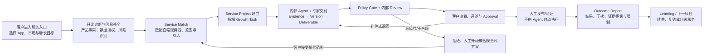
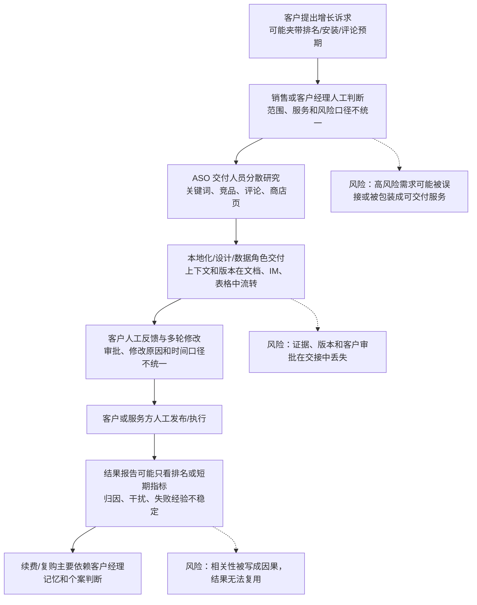
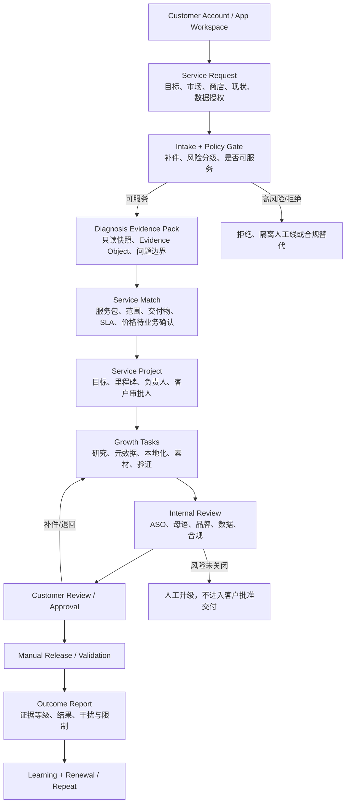
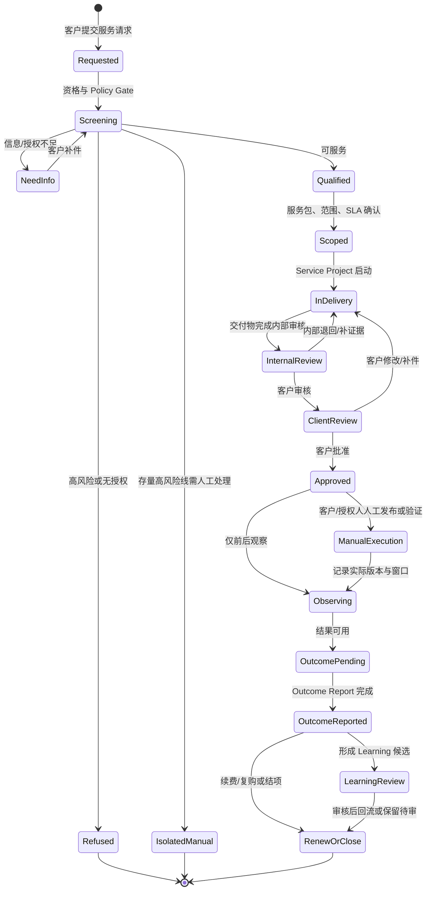
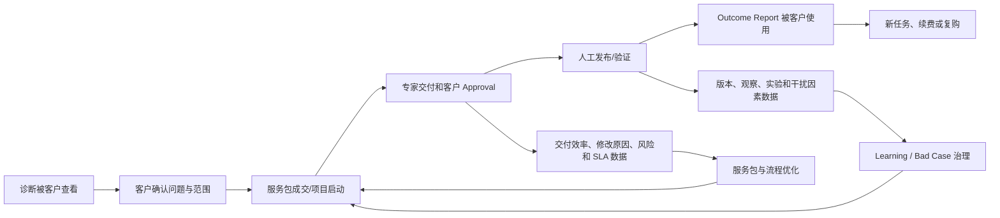
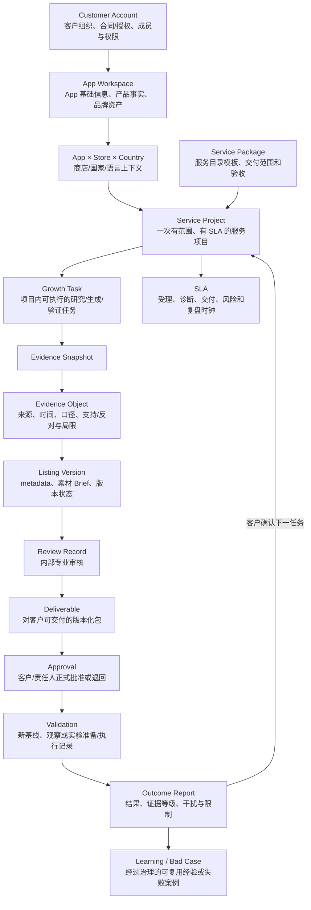
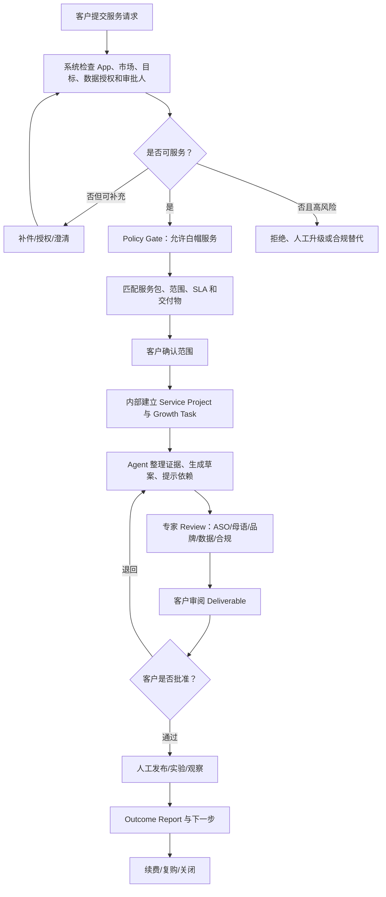

# ASO Growth Service Agent / 全球 ASO 与本地化增长 Agent 产品方向确认 v2.0

> **本文件的结论：** 产品主线从“面向内部 ASO 运营的商店增长决策工作台”升级为“面向外部客户的 ASO 商店增长服务 Agent”。它由客户侧服务入口和内部 ASO 服务交付系统组成，共用 Customer Account、App Workspace、App×Store×Country、Service Project、Growth Task、Evidence Object、Listing Version、Review、Approval、Validation、Outcome Report、Learning 等业务内核。
>
> **事实边界：** 本文件是产品方向与战略基线，不是已上线产品、已完成客户交付、已验证的增长结果或公司对外承诺。用户最新输入确认的现有业务结构、公开竞品实测和平台政策事实，与合理推断、待验证假设、建议方案和风险分别标注。没有提供的客户数量、价格、交付时长、转化提升、排名提升、续费率和利润数据，不在本文中虚构。

---

## 0. 文档说明与项目总览

### 0.1 文档目的

本文件回答以下问题：

1. 为什么要把白帽 ASO 业务服务化，并以 Agent 支撑外部客户交付？
2. 产品到底服务谁，谁购买、谁使用、谁审批、谁受益、谁承担交付风险？
3. 客户侧服务入口与内部交付系统如何组成一条可重复的服务链？
4. 哪些业务对象、证据、版本、审核、验证和学习状态必须统一？
5. 哪些能力属于白帽服务，哪些高风险存量业务必须拒绝、隔离或转人工？
6. 一期验证什么，什么情况下扩大、收缩或停止？

本文件不替代后续 PRD。它先冻结产品主线、客户分层、服务闭环、对象模型、边界、指标和验证问题，再指导 PRD 重写。

### 0.2 事实、推断、假设、建议与风险标签

| 标签 | 含义 | 本文件的使用规则 |
| --- | --- | --- |
| `【事实 F】` | 用户最新输入、已有项目文件、只读实测或官方政策中已明确的内容 | 可作为当前基线，但仍注明来源和适用范围 |
| `【推断 I】` | 基于事实和业务逻辑形成的判断 | 不写成已验证的客户结论，不作为真实业务结果 |
| `【假设 H】` | 必须通过访谈、任务对照、试点或实验验证的判断 | 必须配验证方法、指标和停止条件 |
| `【建议 R】` | 本文件提出的产品、服务或运营方案 | 需要业务 owner、合规和交付团队确认后才能冻结 |
| `【风险 K】` | 可能导致客户、平台、公司或产品损失的因素 | 必须转成边界、Gate、人工动作或监控项 |
| `【待补充 T】` | 当前材料缺失且会影响产品判断的信息 | 不用默认值补齐，不写成事实 |
| `【决策 D】` | 需要在方向或 PRD Gate 上确认的选择 | 记录候选、选择依据、代价和重评触发 |
| `【示例 S】` | 用于解释流程的模拟情境 | 不代表真实客户、真实 App 或真实效果 |

### 0.3 本次重写使用的材料

| 材料 | 在本文件中的用途 | 证据边界 |
| --- | --- | --- |
| [v1 产品方向确认](./全球_ASO_与本地化增长_Agent_产品方向确认_v1.md) | 保留原有字段、ASO 问题框架、Evidence Object、增长状态和人工边界 | v1 是旧方向基线，不自动代表新服务已存在 |
| [当前 PRD v2](../03_prd/global_aso_localization_agent_prd_v2/全球_ASO_与本地化增长_Agent_PRD_v2.md) | 提取 Growth Task、Evidence Object、Listing Version、Review、Validation、Learning、Policy Gate、只读数据、版本状态和归因边界 | 当前 PRD 主要面向内部任务工作台，需要重新面向外部客户服务化 |
| [PRD 全文大纲 v2](../03_prd/global_aso_localization_agent_prd_v2/全球_ASO_与本地化增长_Agent_PRD_全文大纲_v2.md) | 复用 Why / Why not / Know how / Evidence / Boundary / Migration / Interview 的写作契约，以及对象、状态、权限、异常、评测和 Gate 要求 | 只迁移方法，不迁移其他行业事实或未验证数值 |
| [ASOWorld 产品调研报告](../02_competitive_analysis/ASOWorld_产品调研报告_2026-08-03.md) | 参考 App×Store×Country 对象、免费诊断到服务订单的行动闭环、客户经理与订单履约形态 | 登录后台字段是单账号只读实测；服务效果和公司自述不等于独立验证 |
| [ASOWorld Insights 深度阅读](../02_competitive_analysis/ASOWorld_Insights_全量文章深度阅读与核心观点汇总_2026-08-04.md) | 参考“市场—元数据—创意—评论—本地化—版本—验证”的增长系统和内容获客飞轮 | 算法权重、案例数字、排名因果和高风险交易说法不能直接采信 |
| 用户最新任务输入 | 确认现有 ASO 业务主要包含 ASO 黑帽和少量白帽，以及白帽服务化、外部客户化的方向变化 | 真实业务规模、客户、用户本人参与范围和存量业务处理方式仍需补充 |
| `product-strategy` Product Strategy Canvas | 组织愿景、市场、相对成本、价值主张、取舍、指标、增长、能力和防御性判断 | Canvas 是战略分析方法，不是业务事实来源 |

### 0.4 项目基本信息

| 项目要素 | v2 方案设定 | 状态 |
| --- | --- | --- |
| 姓名 | 林扬宇 | 来自 v1，事实 F |
| 所属行业 | 移动互联网广告、App 全球化增长、营销科技 | 来自 v1，事实 F |
| 工作经历 | 读书郎双师直播课后端开发（2019-07～2020-04）；有米科技广告投放系统后端开发（2020-05～2023-03）；有米科技广告投放系统产品经理（2023-04～2025-06） | 来自 v1，事实 F |
| 项目名称 | ASO Growth Service Agent / 全球 ASO 与本地化增长 Agent | v2 方向建议 R |
| 产品主线 | 白帽 ASO 商店增长服务的客户入口 + 内部交付系统 | 本次方向决策 D |
| 服务对象 | 外部 App 开发者、增长负责人、全球化团队、代理商/合作伙伴 | 分层假设 H，待访谈 |
| 当前阶段 | 产品方向重做，不是完整 PRD，不是已上线系统 | 事实 F |
| 项目性质 | 【待确认】真实业务升级、基于公司资源的概念方案或个人 PoC；在确认前按“产品概念方案 + 个人求职资产”表述 | 事实边界 F/T |
| 一期推荐范围 | 白帽服务；优先一个 App、一个商店、一个或两个市场；客户只读数据、人工审核、人工发布/验证 | 建议 R，待 Gate |
| 黑帽/操纵类存量业务 | 不进入白帽 Agent 主流程；如公司保留，作为隔离人工服务线处理，Agent 只做识别、拒绝、升级和合规替代 | 安全边界 D/R |

### 0.5 与 v1 的根本变化

| 维度 | v1 方向 | v2 新基线 |
| --- | --- | --- |
| 首要服务对象 | 内部 ASO / App Growth 运营及协作角色 | 外部客户的增长负责人、开发者和客户侧 ASO 使用者；内部团队负责交付 |
| 产品形态 | 证据驱动的商店增长决策工作台 | 客户服务入口 + 内部交付工作台 + 受控 Agent，共用服务对象和证据内核 |
| 价值交付 | 帮内部团队形成策略与实验准备 | 将白帽 ASO 诊断、服务匹配、专家交付、客户审批和结果复盘变成可售卖服务 |
| 核心业务对象 | Growth Task、Evidence、Listing Version、Validation、Learning | 在原对象之上增加 Customer Account、App Workspace、App×Store×Country、Service Project、Service Package、Deliverable、Approval、SLA、Outcome Report |
| 成功单位 | 可审核、可验证的增长方案 | 客户批准、按 SLA 交付、可人工执行/验证、可形成结果报告并支持续费或复购的白帽服务项目 |
| 交易与履约 | 主要没有外部服务订单模型 | 需要服务目录、范围、交付物、审批、SLA、项目状态和复购触发 |
| 黑帽边界 | 不做刷榜、虚假安装、诱导评论等 | 明确禁止设计或自动化高风险行为；存量高风险线与白帽产品、数据、权限和学习隔离 |
| Agent 角色 | 辅助内部研究、生成、审核和学习 | 同时辅助客户受理/解释和内部交付；不替代销售承诺、专家责任、客户批准或外部动作 |

---

## 1. 一页纸项目摘要

### 1.1 一句话产品定位

> 面向需要合规商店增长服务的 App 开发者、增长负责人和全球化团队，提供一个把只读诊断、证据化策略、专家交付、客户审批、人工验证和结果复盘串起来的 **ASO Growth Service Agent**，帮助客户以可追溯、可审核、可复用的方式推进白帽 ASO，而不是购买排名、安装或评论承诺。

### 1.2 产品公式

```text
为外部 App 增长客户
提供“客户服务入口 + 内部 ASO 交付系统 + 受控 Agent”
通过 Evidence Object、Policy Gate、版本化交付物、人工审核与结果归因边界
解决白帽 ASO 服务前诊断不清、方案不透明、交付难规模化、客户审批和结果复盘断裂的问题
形成可说明范围、可按 SLA 履约、可人工执行、可验证并支持续费/复购的服务能力
```

### 1.3 核心服务闭环



### 1.4 方向结论

1. **【事实 F】** 用户最新输入确认，现有 ASO 业务主要包含 ASO 黑帽和少量白帽；现在希望把白帽业务通过 Agent 服务化，提高白帽交付成效并形成对外服务能力。
2. **【建议 R】** 产品不再以“内部 ASO 运营效率工具”为第一叙事，而以“白帽 ASO 服务产品化与交付系统”为主线。
3. **【推断 I】** 对外服务化的关键瓶颈不是单纯生成更多文案，而是把客户目标、服务范围、证据、专家交付、审批、SLA、版本、验证和结果报告串成可履约的状态机。
4. **【建议 R】** 一期先验证中小开发者/增长负责人对一个已上线 App 的诊断和商店页优化服务是否愿意提供数据、参与审批并进入人工验证；新 App/新市场、多市场团队和代理商作为相邻场景逐步扩展。
5. **【风险 K】** 如果客户购买预期仍是“保证排名、快速安装、虚假评论”而不是白帽服务，产品会同时面临销售错配、交付争议和平台合规风险；服务入口必须在诊断和报价前设置 Policy Gate。

### 1.5 一期要证明的最大问题

> 对一个已上线 App、一个商店和一个或两个目标市场，Agent 是否能在不扩大平台政策风险、不把证据核验负担转嫁给专家或客户的前提下，帮助内部团队按约定范围完成客户认可的白帽 ASO 服务交付，并让客户愿意继续进行验证、复购或续费？

---

## 2. 业务背景与问题定义

### 2.1 已确认的业务变化

| 内容 | 状态 | 对产品方向的影响 |
| --- | --- | --- |
| 现有 ASO 业务主要包含 ASO 黑帽和少量白帽 | `【事实 F】` 用户最新输入 | 不能直接把旧业务流程包装为合规白帽 Agent；必须先定义服务隔离和迁移边界 |
| 白帽业务希望通过 Agent 服务化 | `【事实 F】` 用户最新输入 | 产品目标从内部提效扩展为客户获客、服务匹配、专家交付、客户审批、验证和商业闭环 |
| 未来面向外部 ASO 服务客户 | `【事实 F】` 用户最新输入 | Customer Account、客户角色、项目范围、服务包、交付物、Approval、SLA 和 Outcome Report 成为 P0 级对象 |
| 当前方向文件和 PRD 偏内部 ASO 运营 | `【事实 F】` 对已有文件的阅读结论 | v2 必须调整第一用户、产品形态、成功标准和服务生命周期，而不是只在旧 PRD 上加一个客户入口 |
| 公司现有白帽交付能力、客户规模、定价和结果基线 | `【待补充 T】` 当前未提供 | 不得编造服务成熟度、价格、客户数、交付时长或效果承诺；需先做能力盘点 |

### 2.2 外部客户服务化要解决的业务矛盾

白帽 ASO 服务面对的不是“客户有没有一个问题”，而是多个角色共同完成一次交付：客户要说明 App、市场和目标；服务方要判断是否有足够证据和合规空间；专家要将诊断转成版本与素材方案；客户需要审批范围和内容；发布或实验仍由客户或授权人员执行；之后还需要区分观察、实验和不可归因结果。

当前内部工具型方向如果直接对外，会出现四个断裂：

1. **服务范围断裂：** 客户看到一个 Agent，却不知道买到的是诊断、文案、本地化、素材 Brief、实验准备还是持续运营。
2. **责任断裂：** Agent 输出被误认为服务承诺，客户、ASO 专家、母语审核、发布者和合规责任没有分开。
3. **履约断裂：** 内部 Growth Task 能产出方案，但不一定记录服务包、交付物、审批、SLA、补件和项目关闭条件。
4. **商业断裂：** 完成一次分析不等于完成客户价值；没有 Outcome Report、Learning 和下一任务入口，就无法支持复购和服务改进。

### 2.3 As-Is：传统或现有服务链的待优化位置



> **说明：** 以上是基于用户最新方向和现有 PRD 的流程重构，属于 `【推断 I】`，不是对所有现有项目交付的事实审计。需要通过内部服务访谈、历史订单/项目抽样和客户任务回放确认。

### 2.4 To-Be：白帽 ASO 服务化链路



### 2.5 问题优先级

| 问题 | 外部客户影响 | 内部交付影响 | 一期处理 |
| --- | --- | --- | --- |
| 客户目标模糊，服务包和交付范围难定义 | 买到的服务与预期不一致，容易产生争议 | 销售、客户经理和专家反复解释 | P0：服务受理、诊断补件、Service Match、范围确认 |
| 客户只看到结论，看不到证据和限制 | 难判断是否值得审批和执行 | 专家需要重复证明数据来源 | P0：Evidence Object、只读快照、来源/时间/口径/局限 |
| 内部交付依赖少数专家 | 交付波动，无法稳定扩大白帽服务 | 研究、文案、本地化和设计交接返工 | P0：Growth Task、版本化交付物、Review、SLA 队列 |
| 客户审批和修改原因不结构化 | 交付周期不可预测，版本争议难追踪 | 专家无法判断哪些意见是事实、品牌还是偏好 | P0：客户 Review、Approval、Diff、修改原因 |
| 发布/实验结果无法正确归因 | 客户可能把观察误解成保证或失败 | 复盘不能形成下一次服务的证据 | P0：Validation、Outcome Report、归因等级与干扰因素 |
| 高风险诉求与白帽服务混在一起 | 平台、账号和品牌风险上升 | 服务人员可能被迫承接不应自动化的动作 | P0：Policy Gate、拒绝/升级/隔离/合规替代 |
| 一次性项目没有下一次服务入口 | 客户价值难持续，无法形成复购 | 历史经验散落，交付不能复用 | P1：Learning、项目关闭、续费/复购触发 |

### 2.6 北极星问题

> 我们能否把一个外部客户的白帽 ASO 需求，从合规受理开始，转化为有明确范围和 SLA 的服务项目，由 Agent 降低证据整理和交付协作成本，由专家和客户共同完成审批与人工执行，并把结果以正确证据等级回流为下一次可复用的服务学习？

---

## 3. Product Strategy Canvas

本章按 `product-strategy` skill 的九段 Product Strategy Canvas 组织战略判断。每一段都同时写“选择什么”和“暂时不声称什么”，确保愿景、客户、成本、价值、取舍、指标、增长、能力和防御性相互一致。

### 3.1 Vision：愿景

#### 愿景

让 App 团队能够以透明、合规、可验证的方式获得商店增长服务：客户不必把 ASO 当成一组不可解释的排名承诺，服务方也不必依赖少数专家记忆和分散文档完成每次交付。

#### 长期希望形成的状态

```text
客户知道自己要解决的增长任务、买到的服务范围和需要承担的审批责任；
服务团队能够根据证据、风险和资源匹配项目，而不是先承诺不可控结果；
专家交付有共享上下文、版本、审核和 SLA；
上线或验证后，结果报告区分观察与因果证据；
经过授权和脱敏的 Learning 能帮助下一次服务更快、更稳、更合规。
```

#### 不承诺的愿景表达

- 不承诺让任意 App 获得固定排名、安装量、评分或收入。
- 不承诺 Agent 可以代替 ASO 专家、母语专家、客户审批人或发布者。
- 不承诺把现有高风险业务自动转换为合规服务；迁移需要逐项审计和业务决策。

### 3.2 Market Segments：市场分层、JTBD 与一期选择

#### 3.2.1 外部客户分层

| 客户分层 | 典型触发 | 购买者 | 主要使用者 | 受益者 | 主要约束 | 服务机会 |
| --- | --- | --- | --- | --- | --- | --- |
| 新 App / 新市场 | 新 App 即将上线，或已上线 App 准备进入新国家/语言 | 创始人、增长负责人、发行负责人 | 增长/营销人员、ASO 服务方、本地化和设计协作方 | 新市场收入和获客团队 | 缺少历史基线，产品事实和本地资源不完整 | 先做市场/商店诊断与首版本地化交付，结果以新基线和观察为主 |
| 已有 App 增长停滞 | 自然曝光、商店页转化、关键词覆盖或市场扩张停滞 | 增长负责人、产品负责人、App 负责人 | ASO 运营、增长经理、客户侧营销人员 | App 业务负责人、获客和产品团队 | 需要解释现状、区分商店表达问题和产品问题 | 适合做诊断→优先级→Listing Version→验证与复盘 |
| 中小开发者 / 增长负责人 | 团队没有完整 ASO、本地化或数据能力，希望外包部分工作 | 创始人、开发者、增长负责人 | 同一人兼任产品、营销、审批和发布 | App 业务和用户增长 | 预算、时间、专业人力有限，审批集中在少数人 | 以范围清晰的服务包降低协作门槛，避免无限定制 |
| 多市场团队 | 同时维护多个国家、语言、商店和版本 | 全球增长负责人、区域负责人、采购/运营负责人 | ASO、本地化、区域市场、设计、数据团队 | 多市场组合的效率和一致性 | 权限、版本、术语、政策和本地差异复杂 | 在单市场服务稳定后扩展为 Portfolio / 多市场治理 |
| 代理商 / 合作伙伴 | 代理商需要提升交付效率、承接更多客户或提供白标服务 | 代理商负责人、交付负责人、客户总监 | 代理商 ASO、客户经理、合作方专家 | 代理商及其终端客户 | 多租户、白标、SLA、权限和责任分摊复杂 | 后期提供 Partner Workspace 和受控交付能力，不作为一期主战场 |

#### 3.2.2 一期优先用户

> **标签：** `【建议 R】` + `【假设 H】`。一期优先选择：已有 App 且存在明确增长停滞或单一新市场进入需求的中小开发者/增长负责人。优先服务一个 App、一个商店、一个或两个市场，并要求客户能提供产品事实、只读数据或公开数据、审核人和人工发布/验证资源。

选择依据：

| 选择标准 | 一期判断 | 依据性质 |
| --- | --- | --- |
| 痛点紧迫性 | 增长停滞通常比“泛泛想做 ASO”更容易形成明确服务诉求 | `【推断 I】`，需客户访谈验证 |
| 结果可观察性 | 已有 App 有当前商店页、版本和部分指标，可形成前后观察或合格实验；比新 App 更容易建立基线 | `【推断 I】`，需数据盘点 |
| 交付可标准化 | 一个 App、一个商店、少量市场能约束服务范围和专家协作 | `【建议 R】` |
| 客户决策链 | 中小团队购买者、使用者和审批人较接近，减少企业采购和多层授权 | `【推断 I】` |
| Agent 增量可观察 | 诊断、证据整理、版本协作、交付说明和结果报告都有明确人工基线 | `【假设 H】`，需任务对照 |
| 合规可控性 | 可将高风险诉求在客户入口前拦截，并坚持只读、人工审批和人工执行 | `【建议 R】`，需安全评测 |
| 不选代理商作为一期 | 代理商规模化价值高，但多租户、白标和责任边界会掩盖白帽交付本身是否成立 | `【建议 R】` |
| 不选纯新 App 冷启动作为唯一一期 | 冷启动缺少历史基线，服务结果更难归因；可作为一期的第二场景样本 | `【推断 I】` |

#### 3.2.3 一期主 JTBD

> 当我的 App 已经上线但在某个市场增长停滞，或我准备进入一个新的目标市场时，我希望先获得一个有证据、能说明风险和服务范围的诊断，再由专业团队按约定交付商店页、本地化或验证方案，并让我能在线审批和看到结果边界，从而不用购买无法解释的排名/安装承诺，也不用自己协调所有 ASO 角色。

#### 3.2.4 相邻 JTBD

| JTBD | 客户想完成什么 | Agent / 服务应帮助什么 | 不能承诺什么 |
| --- | --- | --- | --- |
| 新 App / 新市场 | 快速建立可用的首版本地化商店表达 | 准备市场证据、产品事实、metadata、Creative Brief、风险和新基线计划 | 不承诺冷启动排名、下载或收入 |
| 增长停滞诊断 | 判断问题是发现、转化、表达、产品体验还是数据/执行问题 | 连接商店快照、评论、关键词、竞品、版本和产品事实，形成优先级 | 不把观察到的相关性写成唯一根因 |
| 白帽服务采购 | 明确买什么、谁交付、何时交付、客户要审批什么 | Service Match、范围、Deliverable、SLA、责任人和状态可见 | 不用模糊的“保证增长”替代服务范围 |
| 多市场协作 | 让不同市场版本和术语一致又保留本地差异 | App×Store×Country、版本、审批、权限和历史学习管理 | 不把一个市场的结论自动复制给其他市场 |
| 代理商交付 | 在不泄露客户数据的情况下提高交付吞吐 | 后期提供模板、任务、证据和审批能力 | 一期不承诺白标、多租户和无限并发 |

### 3.3 Relative Costs：相对成本定位

#### 选择

> **【建议 R】** 采用“专业价值优先、Agent 辅助降低交付成本”的中高价值服务定位，而不是最低价的自助工具或结果保证型交易。

#### 成本结构

| 成本项 | 主要来源 | Agent 可以降低什么 | 不能省略什么 |
| --- | --- | --- | --- |
| 专家交付 | ASO 策略、市场判断、母语/文化、品牌、设计、数据和客户沟通 | 减少检索、整理、交接和报告编排 | 专业判断、人工审核和客户责任确认 |
| 数据与知识 | 公开/授权数据采集、规则、产品事实、历史版本和学习维护 | 归一化、引用、检索和时效提醒 | 数据许可、来源记录、删除/撤权和质量抽检 |
| 服务运营 | 受理、匹配、派单、SLA、补件、返工和结项 | 自动检查完整性、状态提醒和接手包 | 客户经理/交付负责人和异常升级 |
| AI / 系统 | 模型调用、工作流、存储、日志、评测和安全 | 结构化处理和局部自动化 | 质量 Gate、审计、降级、回滚和人工队列 |
| 客户协作 | 需求澄清、审批、修改和发布/验证 | 让客户看见依据、Diff、责任和待办 | 客户提供事实、批准内容和执行外部动作 |

#### 竞争取舍

- 不与低价翻译工具竞争“每个字符成本”。
- 不与全量数据平台竞争“覆盖所有关键词和下载估算”。
- 不与黑帽交易平台竞争“最快排名、安装、评论或保证结果”。
- 争取在“范围清晰、证据透明、专家可扩展、客户可审批、结果可复盘”上形成服务价值。

### 3.4 Value Proposition：分客群价值主张

| 客群 | What before：客户当前状态 | How：产品与服务如何交付 | What after：目标状态 | 客户当前替代方案 |
| --- | --- | --- | --- | --- |
| 已有 App 增长停滞的中小开发者 | 看到指标变化但不知道优先改商店表达、素材还是产品体验；内部缺少完整 ASO 角色 | 只读诊断 + Evidence Object + 专家服务匹配 + Listing Version/Creative Brief + 客户审批 + 验证计划 | 知道本次项目解决什么、交付什么、依据是什么、如何执行和如何解释结果 | 自己查工具/表格；一次性找顾问；购买排名/安装服务；通用 AI 写文案 |
| 新 App / 新市场客户 | 没有历史基线，语言、文化、竞品和产品定位不确定 | 市场与竞品证据、产品事实校验、本地化版本、素材 Brief、风险清单和新基线计划 | 有一个可审核的首版商店方案和后续观察路径 | 翻译供应商；本地代理；通用市场报告；内部临时拼团队 |
| 多市场团队 | 版本、术语、审批和市场差异分散在不同表格/团队，复盘难复用 | App×Store×Country 工作区、版本/权限/审批、跨市场证据和受边界约束的 Learning | 在保留本地差异的同时，降低重复交接和版本错用 | 多个工具 + 内部 PMO/SOP + 代理商并行交付 |
| 代理商 / 合作伙伴 | 客户管理、ASO 研究、本地化、设计和报告交付重复劳动，白标质量不稳定 | 后期提供 Partner Workspace、交付模板、证据包、状态和客户审批协作 | 代理商可以扩大白帽服务吞吐，同时保留终端客户数据和责任边界 | 自建表格/脚本；外包专家；各客户独立流程 |

#### 价值主张的可信边界

- 可以主张减少重复整理、提高交付透明度、减少版本/证据丢失、提前发现政策风险、支持专家规模化交付；这些是待验证的产品价值假设。
- 不可以在方向文件中主张固定的排名、自然下载、CVR、收入、留存或客户 ROI 提升。
- 客户业务结果只能在有授权数据、明确版本、合格验证设计和干扰因素记录时进行分层报告。

### 3.5 Trade-offs：明确不做什么

| 不做/不承诺的内容 | 为什么放弃 | 替代路径 |
| --- | --- | --- |
| 刷榜、虚假安装、激励/虚假评论、购买或生成五星评论、排名操纵 | 违反或可能违反平台政策，破坏客户账号和品牌信任，也不属于白帽服务 | 拒绝自动化与服务匹配；提供诊断、真实产品改进、合规评价触发、元数据/素材优化等替代 |
| Top 1/Top 5/排名、安装、评论、收入保证 | 平台算法和用户行为不可控，保证会诱导高风险执行和争议 | 用可交付物、SLA、证据等级、观察/实验结果和风险边界承诺服务过程 |
| Agent 自动发布、自动创建/停止实验、自动加量或调预算 | 外部写操作不可逆、权限和责任复杂 | 一期只读数据、人工发布/实验、人工确认；后续逐项过 Gate |
| 一个聊天框替代服务项目 | 无法承载范围、SLA、交付物、审批、版本和审计 | 客户门户 + 内部交付工作台，聊天仅作为辅助入口 |
| 一期覆盖所有商店、国家、语言、品类和 App | 数据许可、规则、专家资源和评测会失控 | 先一个商店、一个 App、少量市场，逐步扩展 |
| 纯翻译或关键词生成作为主产品 | 与通用工具同质化，不能证明白帽服务价值 | 以诊断、策略、交付、审批和验证形成服务包 |
| 让客户数据自动跨租户共享或直接训练 | 可能违反授权、保密和数据使用约定 | 按 Account/Workspace 隔离；跨客户 Learning 必须脱敏、授权、审核 |
| 用历史黑帽经验优化白帽执行 | 会把风险路径迁移到新产品，且可能形成规避平台政策的细节 | 黑帽线隔离；白帽 Agent 只学习政策安全、证据、交付和真实结果 |

### 3.6 Key Metrics：关键指标、North Star 与 OMTM

#### North Star Metric

> **按约定范围和 SLA 完成、经内部 Policy Gate 与客户 Approval 通过、并进入合法人工执行或验证的白帽服务项目比例。**

这个指标同时要求服务可交付、客户认可和安全通过，不能只看生成量或短期排名。分母、SLA 暂停口径和“进入执行/验证”的事件定义需要在 PRD 和试点前冻结。

#### OMTM（一期/首个验证周期）

> **客户批准的首个白帽交付包比例，同时观察专家实质返工率、SLA 达成率和 Policy Gate 红线事件。**

选择原因：一期先验证客户是否认可服务交付物和服务方式，而不是先追求无法归因的业务增长。若只提高批准率却把风险或返工转嫁给专家，必须判定为失败。

#### 指标分层

| 层级 | 指标 | 解释边界 |
| --- | --- | --- |
| 产品 | 有效诊断完成率、服务匹配采纳率、Evidence 覆盖率、交付包完整率、状态可追溯率、客户门户任务完成率 | 证明产品流程是否可用，不证明业务增长 |
| 客户 | 需求补件完成率、客户批准率、审批时长、客户主动修改原因、满意度/复购意向、续费/复购率 | 满意和复购受价格、客户执行和关系影响，需分层解释 |
| 交付效率 | 首次可审交付时长、端到端项目周期、专家有效工时、跨角色交接次数、实质返工率、SLA 达成率、人工队列积压 | 不能只缩短 AI 生成时长而忽略客户/专家总周期 |
| 质量 | 引用存在率、引用支持率、产品事实错误率、语言/文化问题率、版本一致性、验证路径认可率、Outcome Report 完整率 | 质量需按市场、语言、任务类型和风险等级分层 |
| 商业 | 合格服务请求→项目转化率、项目毛利/单位交付成本、白帽服务收入占比、项目续费/复购率、服务包组合、合作伙伴贡献 | 当前无真实基线，不写价格、收入或利润数值 |
| 安全 | 高风险请求识别率、拒绝/升级正确率、未授权数据访问数、未经确认外部写入数、政策风险漏检率、审计完整率、跨客户数据泄露数 | 越权、未授权外部动作和跨租户泄露应为红线 0 |

### 3.7 Growth：增长与商业闭环

#### 增长模式选择

> **【建议 R】** 采用“销售主导 + 产品辅助诊断 + 服务交付驱动复购”的混合模式。对于复杂 ASO 服务，纯产品自助购买难以完成目标、权限、语言和风险判断；但低门槛只读诊断和可解释的范围建议可以降低首次沟通成本。

#### 客户获取路径

```text
行业内容 / ASO 教育 / 现有客户关系 / 代理商合作
→ 客户提交 App、商店、国家、目标和现状
→ 只读诊断预览与缺口清单
→ Policy Gate 与服务资格判断
→ 服务包、交付物、SLA 和责任说明
→ Service Project
→ Outcome Report 与下一任务建议
→ 续费、复购、扩大市场或转入合作伙伴模式
```

#### 商业闭环原则

- 交易对象首先是服务包和可验收交付物，不是排名、安装、评论或效果保证。
- 服务项目的续费/复购触发来自下一项合法增长任务、客户组合需求、验证复盘或多市场扩展，不来自承诺“再买一次就会上榜”。
- 客户数据、交付过程和结果报告可以支持客户自身复盘；跨客户服务学习必须有授权、脱敏、适用范围和审核。
- 价格、折扣、退款、佣金、分销和合作伙伴结算不在本方向文件中假设，需由业务和财务提供真实约束后进入商业 PRD。

### 3.8 Capabilities：必须建设的能力

| 能力 | 一期建设方式 | 自建/合作判断 | 失败时的降级 |
| --- | --- | --- | --- |
| 白帽 ASO 诊断与策略 | Evidence + Workflow + ASO 专家 | 核心交付能力自建；数据源可合作 | 证据不足时输出缺口和人工诊断，不强答 |
| 多语、本地化与文化审核 | 专家 Review、术语/品牌库 | 母语能力可由内部或受控合作方提供 | 没有合格审核人则不接对应语言或降级为待审草案 |
| 商店/关键词/评论/竞品只读数据 | 公开数据、客户授权、合规连接器 | 数据接口和第三方能力可合作 | 数据源失败标记范围，允许人工补件或取消任务 |
| Policy Gate | 规则、风险词/行为分类、人工升级 | 红线控制必须由产品/安全负责，不外包给模型 | 拒绝或暂停，不以“低置信度”继续执行 |
| 服务运营与 SLA | Service Project、派单、队列、状态和审计 | 交付流程自建，人员规模随试点 | 超载时限流、缩范围或转人工，不静默延期 |
| 客户审批与沟通 | 客户门户、Diff、评论、Approval | 核心协作体验自建 | 回退到人工沟通，但必须回填审批记录 |
| 验证与结果归因 | Validation、Outcome Report、数据角色 | 连接器可合作，口径/责任自建 | 无法归因时只出观察报告，不写因果结论 |
| Learning 与知识治理 | 脱敏、适用范围、有效期、回归和发布 | 核心规则/知识治理自建 | 不进入生产检索，保留为待审核候选 |

### 3.9 Can't/Won't：防御性与不可轻易复制的部分

#### 当前不能声称已有的护城河

- **【待补充 T】** 当前没有已验证的客户规模、独占数据、服务效果或大规模专家网络证据，不能把现有公司资源直接写成产品壁垒。
- 竞品的公开功能、ASOWorld 的订单和内容闭环可以提供设计启发，但不能构成我们的客户、数据或结果优势。

#### 可能逐步形成的防御性

| 可能的防御性 | 形成条件 | 为什么不容易被简单复制 |
| --- | --- | --- |
| 交付知识与 Learning | 持续积累经客户/专家审核、带市场/版本/结果边界的案例 | 不只是文档数量，而是可追溯的适用条件、反例和失效机制 |
| 服务流程与专家协同 | 把诊断、匹配、交付、审批、验证、复盘固化为可运营工作流 | 单点工具可以复制功能，难复制真实交付责任、队列和复盘数据 |
| Evidence Object / Policy Gate | 跨服务包统一证据、风险、来源、版本和审计 | 需要业务对象、规则、权限和人工运营共同建设 |
| 客户切换成本 | 客户的 App Workspace、版本历史、审批记录、术语和 Outcome Report 可持续复用 | 前提是客户认可数据可导出、权限透明，不能用锁定客户替代价值 |
| 受控合作伙伴网络 | 有明确的语言/设计/ASO 资格、SLA、质量和审计机制 | 不是简单外包名单，需要持续评价和风险治理 |

#### 绝不把风险当作壁垒

- 通过平台漏洞、规避政策、虚假行为或客户不知情形成的执行网络，不是可接受的竞争壁垒。
- 不把客户敏感数据、竞品未授权数据和黑帽执行细节作为训练或商业资产。

### 3.10 Strategy Coherence：战略一致性检查

| Canvas 组件 | 需要与之相互强化的选择 | 如果不成立，怎样调整 |
| --- | --- | --- |
| 愿景 | 合规、透明、可复用的服务 | 若销售仍依赖排名保证，必须先重做定位和客户筛选 |
| 一期客户 | 有明确任务、能审批、有基础数据的中小团队 | 若客户无法提供事实/数据或只要黑帽结果，转为拒绝或研究样本 |
| 相对成本 | 专家价值 + Agent 提效 | 若人审成本超过节省，收缩服务包或只保留诊断/交付包 |
| 价值主张 | 可交付物、SLA、证据和复盘 | 若客户只认可排名数字，不能用文案包装消除需求错配 |
| 取舍 | 不做高风险自动执行和无限定制 | 若范围被销售持续突破，设置服务资格和变更审批 |
| 指标 | 客户批准、交付效率、质量和安全共同成立 | 若单一业务指标上升但红线或返工恶化，No-Go |
| 增长 | 服务交付与 Outcome Report 驱动复购 | 若复购只能靠效果保证，重新检查目标客户和服务价值 |
| 能力 | 专家、证据、策略、SLA 和 Policy Gate | 若缺母语/合规/数据能力，不扩市场或语言 |
| 防御性 | 真实交付数据和受治理 Learning | 若数据未授权或无法脱敏，不形成跨客户知识库 |

---

## 4. 客户、角色与服务决策

### 4.1 外部客户角色拆分

| 角色 | 典型人 | 购买/使用/审批/受益责任 | 关键问题 |
| --- | --- | --- | --- |
| 经济购买者 | 创始人、App 负责人、增长负责人、代理商负责人 | 决定是否购买、范围和预算；不一定亲自看每条文案 | 这个服务解决什么问题？交付物是什么？风险和投入如何控制？ |
| 任务发起者 | 增长经理、营销人员、客户经理、ASO 运营 | 提交 App、市场、目标、现状和数据；跟踪项目 | 我需要补什么信息？当前项目到哪一步？ |
| 专业使用者 | 客户侧 ASO/营销、区域运营、本地化、设计人员 | 审阅证据、交付物、修改和验证路径 | 这条建议依据是什么？是否能执行？ |
| 客户审批者 | App 负责人、品牌负责人、法务/合规联系人、发布者 | 对事实、品牌、语言、风险和外部动作做最终客户侧批准 | 哪些字段我必须确认？什么还不能发布？ |
| 业务受益者 | App 收入/增长团队、产品团队、区域市场 | 获得更清晰的市场表达、服务效率和可复用结论 | 结果能否帮助下一轮决策？ |
| 风险承担者 | 客户 App owner、发布者、公司合规/安全负责人 | 承担平台账号、品牌、隐私和客户承诺风险 | 如果数据不足、政策变化或结果无法归因，谁能停下？ |

### 4.2 内部交付角色

| 内部角色 | 负责什么 | 不负责什么 |
| --- | --- | --- |
| 销售/客户成功 | 资格判断、服务解释、范围和客户沟通、续费/复购线索 | 不承诺排名、安装、评论或未评估效果 |
| 服务/交付负责人 | 建立 Service Project、拆包、排期、SLA、派单、风险升级和结项 | 不绕过 Policy Gate 为了按时交付高风险动作 |
| ASO 策略专家 | 诊断、机会排序、关键词/商店策略、Validation Plan | 不把竞品相关性直接写成因果，不单独替代品牌/合规审核 |
| ASO 运营 | 采集/整理只读证据、执行 Growth Task、维护版本和交付物 | 不修改受限数据、不独立批准高风险外部动作 |
| 本地化/母语专家 | 语言自然度、文化、市场表达、术语和敏感项审核 | 不把语言正确等同于增长有效 |
| 品牌/内容/设计 | 品牌一致性、Creative Brief 可实现性、素材需求和版本确认 | 不让 AI 草案替代最终素材和品牌批准 |
| 数据/实验角色 | 数据口径、验证条件、观察窗口、干扰因素和结果报告 | 不把单次前后变化自动归因为 ASO |
| 安全/合规 | Policy Gate、红线、数据授权、事件升级、隔离线审计 | 不由模型代替最终法律判断 |
| Agent/产品运营 | 维护工作流、提示、规则、评测、Bad Case 和知识回流 | 不自行批准知识、延长有效期或改变风险结论 |

### 4.3 一期客户选择与排除规则

#### 可以进入一期白帽服务试点的客户

- 有一个明确的 App、商店、国家/地区和增长任务。
- 能提供产品事实、品牌约束、当前商店页和必要的公开/授权数据。
- 有明确的客户审批人，并接受 Agent 不自动发布、不承诺排名/下载/收入。
- 愿意把服务范围定义为诊断、商店页/本地化/素材/验证等可交付物。
- 具备客户侧人工发布或验证资源，或明确接受结果只作为观察报告。

#### 不进入白帽 Agent 主流程的客户请求

- 以刷榜、虚假安装、激励/虚假评论、买好评、排名保证为主要购买目的。
- 要求 Agent 自动执行外部写操作，或要求隐藏数据来源、规避审核和规避平台政策。
- 无法证明对 App、数据或商店后台具有授权。
- 要求将客户/竞品敏感数据带入其他客户项目或公共知识库。

### 4.4 服务接受标准（不是效果保证）

| 维度 | 可接受范围 | 不可接受范围 |
| --- | --- | --- |
| 目标 | 能描述 App、市场、问题、期望交付或待验证假设 | 只有“保证上榜/暴涨”的结果口号 |
| 数据 | 有公开数据或明确授权的只读数据，并能记录时间/口径 | 未授权后台、购买数据、泄露的竞品/用户信息 |
| 产品事实 | 客户能确认核心能力、限制、地区和版本 | 关键产品事实冲突且无 owner 裁决 |
| 审批 | 有客户侧审批人和内部交付 owner | 无人承担内容、发布或合规责任 |
| 执行 | 客户或授权人员人工发布/验证 | 要求 Agent 自动发布、自动加量或自动操纵评价 |
| 归因 | 接受新基线、观察、实验和不确定性分层 | 要求把所有变化归因给服务并承诺固定 ROI |

---

## 5. 白帽服务模型与商业闭环

### 5.1 白帽服务的定义

本方向中的“白帽 ASO 服务”指：在客户授权、商店规则和平台政策允许的范围内，围绕 App 的市场发现、商店页表达、本地化、创意素材、产品反馈和可验证迭代提供诊断、策略、交付、人工审核和结果复盘。

它可以包括：

- 公开或授权数据的只读诊断；
- 关键词与搜索意图研究；
- 竞品商店页、公开评论和素材的分析；
- 产品事实约束下的 metadata 草案；
- 本地化文案和文化适配；
- 商店截图/视频 Creative Brief；
- 平台政策、字段和风险检查；
- 新基线、前后观察或符合条件的商店原生实验准备；
- 结果报告、Bad Case 和 Learning。

它不包括刷榜、购买/伪造安装、购买/生成/筛选虚假评论、排名保证、规避商店政策和未经授权的数据抓取。

### 5.2 服务生命周期



### 5.3 建议服务包

以下是产品化建议，不代表公司现有服务目录、价格或效果。每个服务包都应以交付物、范围、依赖、审批和风险为核心，而不是以排名或安装结果命名。

| 服务包 | 适用触发 | 核心交付物 | 客户需要提供/审批 | 验证路径 | 不包含 |
| --- | --- | --- | --- | --- | --- |
| 白帽 ASO 诊断与机会地图 | 客户不知道问题在哪里，或准备选择后续服务 | App×Store×Country 诊断摘要、Evidence Object、问题分层、机会卡、风险清单、下一步建议 | App 信息、目标、当前商店页、可用数据；确认事实和目标 | 诊断报告/任务复盘；不直接承诺业务结果 | 排名保证、自动执行、未经授权的数据 |
| 商店页与本地化交付包 | 已确认某个市场/意图需要优化 | metadata 草案、术语表、本地化版本、Creative Brief、Listing Version、变更说明、Policy Review | 产品事实、品牌、母语/客户审核、人工发布 | 新基线或前后观察；条件满足才准备实验 | 自动发布、最终设计稿保证、排名/下载保证 |
| 评论与产品反馈洞察包 | 评分/评论反映出功能、信任或体验问题 | 评论主题、需求/故障聚类、版本关联、产品问题候选、合规回复/触发建议 | 公开/授权评论、版本信息、产品 owner；确认问题优先级 | 产品修复后观察评分/评论/转化，不能归因于评论数量本身 | 购买评论、生成虚假评论、筛选好评 |
| 受控验证与结果复盘包 | 已有稳定基线且客户希望验证一个主要假设 | Validation Plan、实验资格检查、Experiment Card（条件能力）、Outcome Report、Learning 候选 | 指标口径、实验 owner、实际版本、观察窗口、干扰因素 | 商店原生实验或前后观察，按证据等级报告 | 自动创建/停止实验、因果保证 |
| 多市场白帽运营包 | 客户有多个 App×Store×Country 或持续迭代需求 | 项目组合、市场优先级、版本/术语/审批治理、周期性诊断、Outcome Report | 多市场权限、区域 owner、统一品牌和本地审核资源 | 分市场报告和组合复盘，不跨市场自动外推 | 一期全量多市场自动化、统一结果保证 |
| 代理商/合作伙伴交付包 | 代理商希望扩大白帽 ASO 交付吞吐 | Partner Workspace、模板、交付任务、证据包、客户审批协作和审计 | 终端客户授权、白标边界、责任分工和 SLA | 代理商项目级交付与客户结果复盘 | 一期不开放无限制多租户和黑帽能力 |

### 5.4 服务匹配规则

| 诊断信号 | 推荐匹配 | 不能直接匹配的情况 |
| --- | --- | --- |
| 没有明确问题，数据和产品事实也不完整 | 先进入诊断与补件，不直接承诺优化方案 | 客户拒绝提供事实或授权数据 |
| 已上线 App、有当前页面和可用指标，增长停滞 | 诊断 + 商店页/本地化交付；有条件再进入验证 | 关键数据口径无法确认 |
| 新 App/新市场、无历史基线 | 诊断 + 首版商店页/本地化交付 + 新基线计划 | 客户把首版交付等同排名保证 |
| 稳定页面、明确单一假设、流量与数据满足条件 | 受控验证与结果复盘 | 流量不足、并行改动多、主变量不可控 |
| 多市场并行、需要版本和审批治理 | 在单项目试点后再进入多市场运营包 | 无本地审核资源、无权限隔离能力 |
| 要求刷榜/虚假安装/虚假评论/保证排名 | 拒绝或转隔离人工线；提供合规替代 | Agent 不提供执行、节奏和规避细节 |

### 5.5 交付与 SLA 模型

SLA 不是“保证效果”，而是对服务响应、补件、交付、审批和升级状态的约定。具体时长和服务等级必须由真实团队容量、客户类型、语言和服务包决定。

建议分为：

- **受理 SLA：** 服务请求是否已收到、是否进入资格判断、需要客户补什么。
- **诊断 SLA：** 约定范围内的 Evidence Pack 和服务匹配何时可审。
- **交付 SLA：** 交付物何时进入内部 Review 和客户 Review；等待客户补件/审批单独计时并留痕。
- **风险 SLA：** 高风险、政策冲突、权限事件和结果未知时何时升级到对应 owner。
- **复盘 SLA：** 在数据可用或观察窗口结束后，何时形成 Outcome Report；无数据时需显式关闭为“无法归因/待补数据”。

每个 SLA 至少绑定：`sla_id`、项目/交付物、起止事件、暂停条件、责任角色、当前状态、升级阈值、超时原因、恢复动作和审计事件。

### 5.6 从服务到商业的闭环



商业闭环必须满足三个条件：

1. 客户购买的是清晰的服务范围和交付物，非不可控结果。
2. Outcome Report 让客户知道下一步是继续优化、修复产品、扩大市场、补数据，还是停止投入。
3. 复购建议必须基于新的客户任务或经审核的学习，不能用自动生成的“应该继续加量”代替服务判断。

---

## 6. 业务对象、关系与状态

### 6.1 对象关系总览



### 6.2 核心对象定义

| 对象 | 定义 | 关键字段 | 关系/约束 | 主要 owner |
| --- | --- | --- | --- | --- |
| `Customer Account` | 外部客户组织、授权边界、成员和服务商业关系的根对象 | account_id、组织信息、成员/角色、数据授权、状态、隔离域 | 一个 Account 可有多个 App Workspace；不可跨 Account 读取受限数据 | 客户 owner/客户成功 |
| `App Workspace` | 一个客户 App 的长期工作区 | app_id、商店链接、产品事实版本、品牌资产、术语、客户 owner | 属于一个 Account；可有多个 App×Store×Country | 客户 App owner/服务 owner |
| `App×Store×Country` | App 在具体商店、国家/地区、语言下的增长上下文 | store、country、locale、版本、权限、数据源、市场状态 | 结论、Listing Version、Validation 和 Learning 必须绑定该上下文或明确可迁移边界 | ASO owner |
| `Service Project` | 一次有目标、范围、服务包、SLA、交付物和关闭条件的客户服务项目 | project_id、目标、package_id、范围、owner、状态、开始/结束、风险 | 归属于 Account + App Workspace + 至少一个 App×Store×Country；可拆多个 Growth Task | 交付负责人 |
| `Service Package` | 可售卖/可配置的服务模板，不以效果保证命名 | package_id、版本、适用条件、交付物、依赖、排除项、验收、SLA 模板 | 作为 Service Project 的范围基线；变更需有版本和审批 | 产品/业务 owner |
| `Growth Task` | 项目内一个具体研究、策略、生成、审核、验证或复盘任务 | task_id、类型、输入、输出、状态、owner、依赖、风险 | 只能在 Service Project 范围内执行；不得绕过 Policy Gate | 交付/专业 owner |
| `Evidence Snapshot` | 某次任务使用的数据源和采集时间的冻结快照 | snapshot_id、来源、时间、市场、口径、权限、版本、hash | 支撑多个 Evidence Object；快照过期会触发受影响版本重审 | 数据/ASO |
| `Evidence Object` | 将原始来源与一个结论、反证、局限和适用范围绑定的最小证据单元 | evidence_id、source、captured_at、market、language、claim、counterevidence、limitation、confidence、status | 不允许只保留摘要而丢失原始位置；无证据不能生成确定性主张 | ASO/数据/Agent |
| `Listing Version` | 一个 App×Store×Country 的版本化商店表达方案 | version_id、metadata、Creative Brief、产品事实、evidence_ids、diff、状态 | 必须关联任务、快照、Review 和 Validation；旧版本不可覆盖人工新版本 | ASO/本地化/品牌 |
| `Review Record` | 内部专业角色对交付物字段、证据和风险的审核记录 | review_id、角色、对象 revision、意见、修改原因、状态、时间 | 内部 Review 通过不等于客户 Approval 或已发布 | 专业审核人 |
| `Deliverable` | 对客户承诺交付的、可下载/查看/审批的版本化服务产物 | deliverable_id、类型、范围、版本、状态、证据、未决风险、验收标准 | 可聚合多个 Listing Version/Growth Task；只能输出已通过内部 Gate 的内容 | 交付负责人 |
| `Approval` | 客户或责任人对范围、事实、文案、风险、验证路径或发布包的正式确认 | approval_id、审批人、角色、对象 revision、动作、原因、时间、权限快照 | Approval 只确认相应对象和版本，不等于效果保证或法务批准 | 客户 owner/指定审核人 |
| `SLA` | 服务项目/交付物在受理、交付、风险和复盘阶段的时钟与升级契约 | sla_id、事件、起止、暂停、owner、升级、状态 | 客户补件、审批和第三方数据等待需单独记录，不能隐藏在平均时长中 | 交付负责人 |
| `Validation` | 版本或假设的验证计划、实际执行、观察和实验状态 | validation_id、路径、假设、主/护栏指标、窗口、版本、执行人、干扰、状态 | 0→1/大版本通常新基线或观察；实验只在条件满足时进入 | 数据/增长 owner |
| `Outcome Report` | 面向客户的结果与限制报告 | report_id、实际版本、数据源、窗口、结果、证据等级、干扰、未归因项、下一步 | 不把相关性写成因果；没有数据时可以交付“无法判断/待补数据” | 数据/交付负责人 |
| `Learning` | 经过来源、适用范围、人工审核和失效条件治理的可复用结论 | learning_id、来源项目、适用 market/version、结论、反例、置信、有效期、owner | 不自动跨客户、跨市场或跨版本外推；模拟/未审核结果不能进入生产检索 | 知识/ASO owner |
| `Bad Case` | 可重放、可归因、可回归的错误或风险案例 | case_id、输入/输出 hash、对象版本、根因、止损、修复、回归、状态 | 关闭需要处理历史影响和副作用，不等于代码合并 | 产品/安全/交付 |
| `Policy Review` | 对请求、方案、交付物或外部动作的政策与风险判断 | policy_review_id、规则版本、风险、决定、原因、人工 reviewer、状态 | 高风险/冲突必须人工升级；不能由模型自行修改决定 | 安全/合规 |

### 6.3 关键状态设计

#### Service Project

```text
REQUESTED
→ SCREENING
→ NEED_INFO / QUALIFIED
→ SCOPED
→ IN_DELIVERY
→ INTERNAL_REVIEW
→ CLIENT_REVIEW
→ APPROVED
→ MANUAL_EXECUTION / OBSERVING
→ OUTCOME_PENDING
→ OUTCOME_REPORTED
→ RENEWED / CLOSED
```

异常状态：`REFUSED`、`ISOLATED_MANUAL`、`ON_HOLD`、`AT_RISK`、`CANCELLED`、`STALE`。

#### Deliverable / Listing Version

```text
DRAFT → EVIDENCE_PENDING → INTERNAL_REVIEW → CHANGES_REQUESTED
→ CLIENT_REVIEW → CLIENT_CHANGES_REQUESTED → APPROVED
→ MANUALLY_RELEASED / OBSERVING → SUPERSEDED / ARCHIVED
```

禁止状态：系统自动进入 `APPROVED`、`PUBLISHED`、`EXPERIMENT_RUNNING` 或 `LEARNED`。这些状态必须有责任人和审计事件。

#### Policy Review

```text
NOT_CHECKED → ALLOWED / NEEDS_HUMAN_REVIEW / REFUSED / ISOLATED_MANUAL
```

`NEEDS_HUMAN_REVIEW` 不是“默认允许”；在人工决定前不得进入可执行交付包。

### 6.4 数据和租户边界

- Customer Account 是最小隔离域；App Workspace、App×Store×Country、Service Project、Evidence、交付物和结果默认只能被本 Account 授权角色访问。
- 公共平台规则可以被多个客户引用，但必须保留规则版本、生效时间和来源；客户私有产品事实、数据、评论和结果不得自动进入公共知识库。
- 跨客户 Learning 只有在用途授权、脱敏、适用边界、人工审核和回归通过后才能成为可检索候选；否则只留在原 Account。
- 读取权限、导出权限、模型出域权限、日志和缓存都要继承 Account/Project ACL；曾经有权不等于当前有权。
- 任何数据连接器一期默认只读。即使客户授权读取商店后台，也不等于授权发布、创建实验、调预算或修改评论。

---

## 7. 产品形态与信息架构

### 7.1 产品形态

> **【建议 R】** 产品不是“给客户一个聊天机器人”，而是由两个协同表面组成：

1. **客户服务门户（Customer Service Portal）：** 让客户提交需求、查看诊断、确认范围、追踪项目、审阅交付物、提出修改、完成 Approval、查看 Outcome Report 和发起下一项服务。
2. **内部 ASO 交付工作台（Delivery Console）：** 让销售/客户成功、交付负责人、ASO、母语、设计、数据和安全角色围绕同一 Service Project 完成派单、Evidence、Growth Task、Review、SLA、Policy Gate、验证和学习回流。
3. **受控 Agent 能力层：** 在受理补件、诊断归纳、服务匹配解释、证据关联、交付草案、审核接手包、状态提醒、结果报告和 Learning 候选等节点辅助人，不拥有最终批准或外部写权限。

### 7.2 客户门户信息架构

```text
客户门户
├─ Account / 成员与权限
├─ App Workspaces
│  ├─ App 基础信息与 Product Fact
│  ├─ Store × Country / Locale
│  └─ 品牌、术语与资产
├─ 新建服务请求
│  ├─ 增长目标与当前问题
│  ├─ 数据/权限与审核人
│  └─ Policy Gate 结果与补件
├─ Service Projects
│  ├─ 范围、Service Package、SLA、里程碑
│  ├─ Growth Task 进度
│  └─ 风险、待办和交接
├─ Deliverables
│  ├─ Evidence / 依据
│  ├─ Listing Version / Brief / Report
│  ├─ Diff、评论与修改原因
│  └─ Approval / 退回 / 未决风险
├─ Validation & Outcome Reports
│  ├─ 执行版本、观察窗口、指标口径
│  ├─ 结果、干扰与证据等级
│  └─ 下一步服务建议
└─ History / Renewal / Repeat
```

客户门户必须让客户回答：

- 当前项目买到的服务范围是什么？
- 目前在等待谁，SLA 是否暂停，下一步是谁负责？
- 这个建议依据哪些证据，哪些是推断，哪些仍需我确认？
- 哪些字段我可以编辑，哪些字段必须由内部专家/品牌/合规角色确认？
- 当前是草案、内部审核、客户审核、已批准、已人工发布，还是仅观察？
- 结果是实验、前后观察、专家判断还是无法归因？

### 7.3 内部交付工作台信息架构

```text
内部交付工作台
├─ Intake & Qualification
│  ├─ 客户/服务请求
│  ├─ Service Match
│  ├─ Policy Gate / 高风险队列
│  └─ 补件与授权
├─ Project & SLA Board
│  ├─ 项目状态、里程碑、负责人
│  ├─ SLA、队列容量、超时风险
│  └─ 变更范围与客户沟通
├─ Evidence Center
│  ├─ 只读快照、来源、口径、时效
│  ├─ Evidence Object、支持/反证
│  └─ 数据权限与冲突
├─ Growth Task Workbench
│  ├─ 诊断、关键词、评论、竞品、素材、本地化
│  ├─ Listing Version / Creative Brief
│  └─ Validation Plan / Experiment Eligibility
├─ Review & Delivery
│  ├─ 内部多角色 Review
│  ├─ Deliverable 组装
│  ├─ 客户 Review / Approval
│  └─ 版本锁、Diff、审计
├─ Outcome & Learning
│  ├─ 实际发布/实验对账
│  ├─ Outcome Report
│  ├─ Learning / Bad Case
│  └─ 续费/复购线索
├─ Policy / Knowledge / Quality
│  ├─ 规则、产品事实、术语、模板
│  ├─ 评测集、红队、Bad Case
│  └─ 权限、审计、回滚
└─ Isolated Manual Queue
   └─ 存量高风险线：人工、隔离、只识别/拒绝/升级，不进入白帽学习
```

### 7.4 核心用户旅程



### 7.5 页面与状态验收原则

| 页面/模块 | 必须可见 | 必须禁止 |
| --- | --- | --- |
| 服务请求 | 目标、App、市场、数据/授权缺口、风险和审批人 | 未补齐关键信息就直接生成服务承诺 |
| 诊断预览 | 证据、采集时间、口径、局限、待验证假设 | 把第三方估算写成客户 App 的真实结果 |
| 服务匹配 | 包含什么、不包含什么、交付物、依赖、SLA、责任和验证方式 | 用排名/下载/收入承诺替代范围说明 |
| 项目工作台 | 项目状态、Growth Task、负责人、SLA、阻塞和待办 | 只显示“处理中”而不说明卡点 |
| Deliverable | 版本、Diff、Evidence、内部 Review、未决风险和客户 Approval | 客户无法区分 AI 草案、专家审核和已批准内容 |
| Outcome Report | 实际执行版本、观察窗口、指标口径、干扰、证据等级、下一步 | 把同期变化自动归因给服务或承诺复现 |
| 高风险队列 | 拒绝原因、升级角色、隔离范围、合规替代 | 展示可规避平台政策的执行步骤或参数 |

---

## 8. AI、数据与 Agent 设计方向

### 8.1 Agent 在客户侧与内部侧的职责

| 场景 | Agent 可以做 | Agent 不可以做 |
| --- | --- | --- |
| 客户受理 | 引导填写 App、市场、目标、现状、数据授权和审批人；识别缺件并解释下一步 | 自行补写产品事实、默认客户授权或承诺结果 |
| 诊断 | 归纳只读数据、评论、关键词、竞品、商店页和公开规则；形成 Evidence Object 和问题候选 | 伪造搜索量/排名/下载；把竞品行为当因果；隐藏证据限制 |
| 服务匹配 | 根据目标、数据就绪度、市场、语言、任务模式、风险和能力匹配服务包，并解释不匹配原因 | 以销售目标覆盖风险；把高风险请求转成“更隐蔽”的服务 |
| 交付草案 | 生成 metadata、Creative Brief、Version Plan、Validation Plan、客户说明和接手包 | 生成不存在的产品能力、品牌承诺或可发布状态 |
| 内部协同 | 拆 Growth Task、提醒 SLA、汇总 Review、定位版本冲突、整理客户修改原因 | 绕过角色权限、自动通过 Review/Approval、覆盖人工编辑 |
| 结果报告 | 归纳实际版本、指标、观察、干扰和证据等级；提出下一步待验证问题 | 自动宣称因果、ROI、排名或收入提升 |
| Learning | 生成候选并标注适用市场/版本/证据等级/失效条件 | 将单客户、单市场、未审核或黑帽结果自动写入公共知识 |

### 8.2 规则、数据工具、模型与人工分工

| 组件 | 负责内容 | 约束 |
| --- | --- | --- |
| 数据连接器 | 读取公开或授权的商店页、评论、关键词、竞品、客户指标和版本快照 | 一期默认只读；记录来源、权限、时间、口径和失败状态 |
| 规则引擎 | Policy Gate、权限、字段/字符、版本、SLA、实验资格、状态和必要字段校验 | 确定性规则不交给模型；规则版本化、可测试、可回滚 |
| RAG/知识库 | 读取当前产品事实、品牌术语、平台规则、服务模板、已审核案例和客户项目历史 | ACL、有效期、来源和用途授权必须先过滤；客户数据默认不跨租户 |
| Embedding/聚类 | 多语评论、关键词意图和语义相似候选 | 只生成候选，不决定权限、政策、事实或最终策略 |
| LLM/多模态模型 | 摘要、语义理解、候选关联、草案和解释 | 输出必须有 Schema、evidence_id、状态、人工边界和版本 |
| Workflow | 受理、诊断、匹配、交付、审核、客户审批、验证和结果回流 | 管状态、幂等、恢复和审计；不让 Agent 自由循环 |
| 内部专家 | 业务策略、市场判断、母语/文化、品牌、风险和交付质量 | 不能把个人经验无审核地写成通用 Learning |
| 客户审批人 | 确认产品事实、品牌、范围、交付物、发布/验证决定 | Approval 不等于平台/法务最终判断，也不等于效果保证 |

### 8.3 Evidence Object 在服务化中的增强

Evidence Object 在 v1/当前 PRD 中保留，但 v2 必须增加客户服务字段：

```json
{
  "evidence_id": "ev_example",
  "account_id": "customer_account",
  "app_workspace_id": "app_workspace",
  "app_store_country_id": "app_store_country",
  "service_project_id": "service_project",
  "source_type": "store_listing_or_authorized_metric",
  "source_version": "snapshot_revision",
  "captured_at": "待真实任务写入",
  "claim": "本次交付需要验证的业务观察",
  "supporting_excerpt_or_location": "原始位置或受控引用",
  "counterevidence": "反证或未覆盖范围",
  "inference": "基于证据形成的推断，不是事实",
  "applicability": "App × Store × Country / version / time window",
  "policy_status": "allowed | needs_review | refused",
  "confidence": "待评估",
  "customer_visible": true,
  "human_review_required": true,
  "status": "draft | reviewed | expired | disputed"
}
```

服务化增强点：

- 客户可见的证据应隐藏不必要的内部敏感字段，但不能隐藏支持结论所需的来源、时间、口径和局限。
- 每条客户可见主张都要能回到 Evidence Object、产品事实或明确标注为假设/建议。
- 客户项目结束后，原始证据仍归属于原 Account；是否形成跨客户 Learning 需要单独授权和治理。

### 8.4 RAG 与知识治理边界

#### 可进入检索的知识层

1. **公共规则层：** Apple/Google 等平台官方政策和字段要求，含来源、生效时间、版本和适用商店。
2. **客户事实层：** 客户提供并确认的产品能力、限制、版本、品牌术语和素材；按 Account/Workspace 隔离。
3. **项目证据层：** 当前 Service Project 的只读快照、Evidence Object、版本和 Approval；只在项目授权范围内使用。
4. **服务方法层：** 经业务 owner 审核的服务模板、交付标准、SLA 和验收规则。
5. **Learning 层：** 经过脱敏、适用范围、人工审核和回归的案例；不能把一次客户结果直接外推。

#### 不进入公共知识库的内容

- 未授权客户数据、用户个人数据、竞品受限数据。
- 原始黑帽执行策略、规避平台政策的过程、参数、节奏或供应商细节。
- 未审核的客户修改、未验证的结果、模拟数据和单次营销案例。
- 可能包含客户机密或个人信息的原始评论/日志，除非有明确授权和脱敏策略。

### 8.5 服务化 Agent 的最低安全控制

| 控制点 | 检查内容 | 失败动作 |
| --- | --- | --- |
| Intake Gate | 客户身份、App/数据授权、目标、服务类型和高风险意图 | 补件、拒绝或人工升级 |
| Service Match Gate | 服务包是否覆盖目标，交付能力、语言、数据和人工资源是否存在 | 不匹配时说明原因，不强行接单 |
| Evidence Gate | 来源、时间、市场、口径、权限、产品事实和反证 | 标记不足/冲突/过期，停止确定性生成 |
| Policy Gate | 评分评论、安装、排名操纵、未经授权数据、外部写操作等红线 | 拒绝自动执行；必要时转隔离人工线 |
| Internal Review Gate | ASO、母语/文化、品牌、数据、合规等对应角色完成审核 | 不能进入客户 Approval |
| Client Approval Gate | 客户确认范围、事实、版本、未决风险和执行责任 | 保持待批准，不得标记可发布 |
| Execution Gate | 实际发布/实验由客户或授权人工执行，记录实际版本和时间 | 无授权/未知状态时停止并对账 |
| Outcome Gate | 结果来源、窗口、干扰、证据等级和适用边界完整 | 只出观察/无法归因报告，不形成 Learning |

### 8.6 黑帽/操纵类请求的产品处理

#### 明确禁止设计或自动化的行为

- 刷榜或人为操纵商店发现机制；
- 虚假安装、激励式安装或以安装信号影响排名；
- 购买、生成、筛选或批量发布虚假评论/五星评论；
- 承诺或自动化 Top 1、Top 5、排名、安装、评论或收入保证；
- 规避 Apple/Google 政策、绕过审核、隐藏执行来源或模拟“自然节奏”；
- 在无授权情况下抓取、导出、共享客户、用户或竞品敏感数据。

#### 如果公司保留存量高风险业务

> **标签：** `【建议 R】` + `【风险 K】`。存量高风险业务只能作为隔离的人工服务线，不进入白帽 Agent 的服务目录、自动工作流、公共知识库、客户自助入口和白帽 Learning。

Agent 在该线最多做：

1. 识别请求是否涉及高风险行为；
2. 拒绝提供执行、放大或规避细节；
3. 记录拒绝原因、风险类别和必要的人工升级信息；
4. 将可转化的客户目标引导到合规替代，例如真实产品/商店页优化、评论洞察与产品修复、正常获客、合规评价触发、实验或观察；
5. 将隔离线的风险事件和审计结果提供给合规/业务 owner，不把具体执行策略回流给白帽 Agent。

不做：

- 不给出更安全的操纵方法、执行节奏、数量、供应商、参数或规避平台检测建议。
- 不让“人工线”成为绕过 Policy Gate 的后门。
- 不把存量高风险业务的短期结果写成白帽服务成功案例。

---

## 9. 旧方向能力的保留、新增、降级与删除

| 能力/对象 | v2 处理 | 原因与新位置 |
| --- | --- | --- |
| `Evidence Object` | 保留并增强为客户可解释的交付证据 | 仍是防幻觉、支持审批、解释服务价值和结果边界的核心 |
| `Policy Gate` | 保留并前移到受理/服务匹配，贯穿交付与执行 | 外部客户服务必须在接单前识别高风险，而不是生成后才拦截 |
| 人工审核 | 保留并拆成内部 Review + 客户 Approval + 外部执行责任 | 服务责任、专业质量和客户知情不能被一个“AI 已确认”替代 |
| 只读数据 | 保留并升级为默认客户数据策略 | 降低越权和外部写风险；商店后台读取不等于可以发布/建实验 |
| 版本状态 | 保留并扩展到 Service Project/Deliverable/Approval/SLA | 服务化需要同时追踪项目版本、交付物版本和客户批准版本 |
| 结果归因边界 | 保留并强化为 Outcome Report 的证据等级 | 观察、实验、专家判断和无法归因必须分开 |
| `Growth Task` | 保留，改为 Service Project 内的内部执行单元 | 不再承担客户服务订单、范围和商业状态的全部职责 |
| `Listing Version` | 保留，绑定 App×Store×Country、证据、Review、Deliverable 和 Approval | 支撑客户可审的版本化商店页交付 |
| `Validation` / `Experiment Card` | 保留；Experiment Card 降为条件性 P1 | 0→1/大版本先新基线或观察，不能强制所有服务都做实验 |
| `Learning` / `Bad Case` | 保留并增加 Account、授权、脱敏和适用范围 | 支撑交付复用，但禁止客户数据和高风险结果无治理回流 |
| 内部 ASO 工作台 | 保留为内部交付 Console，不再是唯一产品形态 | 仍是交付效率核心，但对外客户价值必须通过门户与 Deliverable 呈现 |
| 关键词/评论/竞品单点分析 | 降级为诊断或 Growth Task 能力 | 不作为独立产品主线，避免退化成报告生成 |
| 高自由度自主 Agent | 降级为受控 Workflow + 局部 Agent | 先保证服务状态、权限、SLA、审核和审计可控 |
| 自动发布、自动创建/停止实验 | 一期删除/不实现 | 外部动作和责任风险高，人工执行更符合当前阶段 |
| 通用翻译工具 | 删除主定位，保留为交付组件 | 只有与市场证据、产品事实、品牌和版本绑定才有白帽服务价值 |
| 排名/下载/收入保证 | 删除 | 不可控、不可审计且会造成销售和平台风险 |
| 刷榜、虚假安装、虚假评论等黑帽自动化 | 删除 | 明确不属于白帽 Agent；存量业务若保留必须隔离人工处理 |

---

## 10. 一期范围、路线图与 Gate

### 10.1 一期：白帽服务 MVP

#### 一期目标

验证“客户可理解并批准服务 + 内部可按 SLA 交付 + 结果可正确复盘”的最小闭环，而不是一次性建设完整的多市场 SaaS 或自动化执行平台。

#### 一期建议范围

| 范围 | 一期做什么 | 一期不做什么 |
| --- | --- | --- |
| 客户 | 中小开发者/增长负责人；一个 App；一个商店；一个或两个市场 | 多层企业采购、代理商白标、无限 App/市场 |
| 入口 | 服务请求、信息补全、只读诊断预览、范围/服务包确认 | 自助购买排名/安装/评论；无人工筛选的自动接单 |
| 服务包 | 诊断与机会地图；商店页/本地化交付包；必要时受控结果复盘 | 以效果保证命名的服务包；自动化高风险服务 |
| 内部交付 | Service Project、Growth Task、Evidence、Listing Version、Review、Deliverable、SLA | 复杂全量 Portfolio 和无限定制 |
| 客户协作 | Deliverable 查看、证据、Diff、评论、Approval、待办 | 客户直接修改生产规则或知识 |
| 验证 | 人工发布/观察；满足条件时输出 Experiment Card 准备卡 | Agent 自动发布/创建/停止实验 |
| 结果 | Outcome Report、证据等级、干扰因素、下一步服务建议 | 固定排名、下载、收入、ROI 承诺 |
| 安全 | Intake/Service Match/生成/交付/执行五类 Policy Gate；高风险识别、拒绝、升级、隔离 | 任何规避平台政策的执行细节 |
| 数据 | 公开或明确授权的只读数据；Account 隔离；基础审计 | 未授权后台写入、跨客户数据共享、自动训练 |

#### 一期 P0 交付闭环

```text
Service Request
→ Intake / Policy Gate
→ Service Package + Scope + SLA
→ Service Project
→ Growth Task
→ Evidence Snapshot / Evidence Object
→ Listing Version / Deliverable
→ Internal Review
→ Customer Approval
→ Manual Release / Observation
→ Outcome Report
```

#### 一期成功 Gate

- 至少完成一组经过授权、明确标记为试点的白帽服务任务，能从客户请求追踪到交付、审批和结果状态；具体样本量由试点计划决定，不在本文件虚构。
- 客户能在门户中理解服务范围、证据、风险、待办和批准版本。
- 内部专家不需要在系统外重新制作核心诊断/交付包，或系统外工作量已被记录并纳入评估。
- 高风险请求不会进入白帽可执行交付，未经确认的外部动作数为 0。
- Outcome Report 能区分实验、前后观察、专家判断和无法归因，并记录实际版本与干扰因素。
- 一期客户或交付团队愿意继续使用、复购或扩展服务的信号出现，但不能把意向当成已验证收入。

### 10.2 二期：受控验证、重复服务与多市场治理

建议在一期通过后建设：

- 授权商店后台和分析连接器的只读增强；
- Validation/Outcome Report 深化，支持合格任务的商店原生实验准备和人工结果导入；
- 同一客户多 App 或多市场的权限、术语、版本、审批和项目组合治理；
- 服务包的组合、周期性诊断和复购/续费工作流；
- 客户侧 Outcome Report 对比、服务历史和下一任务推荐；
- 经过授权和脱敏的 Learning 回流；
- 合规合作伙伴的受控交付试点，但不开放自动化高风险能力。

二期仍不默认开放自动发布、自动创建/停止实验或预算/出价写入；这些属于单独的安全和生产 Gate。

### 10.3 三期：代理商/合作伙伴与选择性自动化

在二期证明白帽交付质量、客户审批和结果复盘稳定后，再评估：

- Partner Workspace 和白标交付；
- 多租户、分层权限、合作伙伴 SLA 和责任分摊；
- 更多商店、市场、语言和行业模板；
- 经过逐项授权、回滚、审计、幂等和人工确认的低风险自动化；
- 面向客户的 API/嵌入式服务入口，但默认仍以只读和受控输出为主；
- 更成熟的服务容量、成本和毛利运营。

三期也不改变黑帽边界：不把排名操纵、虚假安装、虚假评论或规避政策自动化作为产品能力。

### 10.4 一期停止/收缩条件

任一条件出现，先停止受影响能力或缩小范围，不以继续堆功能解决：

- 客户批准率提升但专家实质返工、总交付周期或成本没有改善。
- 客户无法理解交付物是服务过程与验证方案，而持续要求排名/安装/收入保证。
- Evidence 引用无法支持主要结论，或产品事实/文化/政策风险进入客户可执行版本。
- 高风险请求识别、拒绝或隔离不稳定，出现越权取数、跨客户泄露、未经确认外部写入或规避政策建议。
- 客户审批、补件和人工发布无法按当前队列容量承接，SLA 只能靠隐性加班维持。
- Outcome Report 经常把前后观察写成因果，或实际版本、指标窗口和干扰因素无法对账。
- 白帽服务收入或复购没有形成可验证信号，且客户价值只能靠不真实的营销承诺解释。

---

## 11. 指标、验证与结果归因

### 11.1 业务指标与产品指标的分层

```text
客户需求与资格
→ 服务匹配与范围确认
→ 交付效率与质量
→ 客户 Approval
→ 人工执行/验证
→ Outcome Report
→ 续费/复购
```

每一层都需要独立事件和对象版本，不能用一个“增长率”覆盖整个服务链。

### 11.2 结果证据等级

| 证据等级 | 适用情况 | 可写成什么 | 不可写成什么 |
| --- | --- | --- | --- |
| E0：仅方案 | 还未发布或验证 | 已形成方案、依据和待验证假设 | 已改善排名/下载/收入 |
| E1：人工审核 | 客户/专家已确认交付物 | 客户批准的白帽交付包 | 客户一定会获得增长 |
| E2：前后观察 | 发布后同一窗口观察，但有多个变化或干扰 | 在某时间窗观察到指标变化，列出干扰 | 该变化由某个字段导致 |
| E3：合格实验 | 基线、主变量、对照、数据和窗口满足条件 | 在本实验条件下观察到的差异及置信边界 | 可跨市场/版本普遍保证 |
| E4：复用 Learning | 结果经人工审核、适用范围和反例记录 | 在相似条件下可作为下一轮候选参考 | 对所有客户自动适用 |
| E5：商业复购信号 | 客户继续购买/续费/扩展服务 | 客户认可服务价值或有继续需求 | 复购等于业务效果已证实 |

### 11.3 关键指标口径草案

| 指标 | 定义 | 数据来源 | 当前状态 |
| --- | --- | --- | --- |
| 客户批准率 | `Approved Deliverable 数 / 进入客户 Review 的 Deliverable 数`，需区分一次通过和修改后通过 | Approval、Deliverable revision | 口径草案，待试点冻结 |
| 首次可审交付时长 | 从输入完整/范围确认到首次进入客户 Review 的时间；补件/客户等待单独记录 | SLA、任务事件 | 待真实基线 |
| 专家实质返工率 | 改变事实、策略、主要卖点、版本目标或验证路径的修改项/已使用项 | Review Diff、修改原因 | 待建立标注规范 |
| Evidence 覆盖率 | 带有效来源、时间、市场/语言、口径和局限的主要主张/主要主张总数 | Evidence Object、Deliverable 审计 | P0 质量指标 |
| Policy Gate 红线事件 | 未阻断的高风险请求、越权数据、未经确认外部写入或隔离失败事件数 | Policy Review、Audit Event | 红线应为 0 |
| Outcome Report 完整率 | 有实际版本、来源、窗口、指标口径、干扰和证据等级的报告/应交报告 | Outcome Report、Validation | 待试点定义 |
| 复购/续费率 | 在约定观察期内产生新 Service Project 的客户数/符合观察条件的已结项目客户数 | Account、Project | 不预设目标值 |
| 白帽服务收入占比 | 白帽服务收入/相关 ASO 服务收入 | 财务/订单系统 | 需业务提供真实口径 |

### 11.4 归因边界

Outcome Report 必须至少记录：

- 客户 Account、App Workspace、App×Store×Country；
- 实际发布/实验的 Listing Version，而不是计划版本；
- 前后指标的定义、数据源、采集时间和观察窗口；
- 版本、投放、产品更新、评分、季节、商店政策和数据源变化等已知干扰；
- 验证路径：新基线、前后观察、合格实验、专家判断或无法判断；
- 结果是否经过客户/数据 owner 复核；
- 下一步是继续、补数据、修产品、重新实验、停止或转人工。

如果没有合格实验，不得把“排名上升”“下载变化”“转化变化”写成某个文案或服务包的确定因果。结果不好也不能直接归咎于 Agent；应沿 `输入 → 证据 → 版本 → 审批 → 实际发布 → 数据窗口 → 干扰 → Outcome` 逐层排查。

---

## 12. 关键验证实验与停止条件

下表是验证计划，不是已经发生的实验结果。样本量、具体阈值和客户名单需在试点前确认。

| 实验 | 要验证的假设 | 方法 | 主要指标 | 保护指标 | 停止条件 |
| --- | --- | --- | --- | --- | --- |
| E1 客户需求与服务包理解 | 目标客户愿意为诊断/交付物/复盘服务，而不是只购买结果保证 | 访谈 + 真实历史任务回放 + 服务包概念评审；观察客户能否复述范围与责任 | 范围理解率、合格服务请求率、客户愿意继续进入项目的比例 | 高风险诉求比例、销售解释成本 | 若多数客户只接受排名/安装/评论保证，暂停扩大白帽产品并重做定位/ICP |
| E2 只读诊断与 Service Match | Agent 能帮助客户和交付负责人更快明确问题、数据缺口和适合的服务包 | Agent 辅助 vs 现有人工流程对照；由专家盲审匹配理由 | 诊断准备时长、服务匹配认可率、补件轮次 | 错配率、证据不足率、专家修改负担 | 若错配或风险漏检导致客户/专家重新从零判断，收缩为只读诊断工具或停止自动匹配 |
| E3 交付效率与质量 | 共享对象、证据、版本和客户 Review 能降低总交付成本，而不是只降低生成时间 | 同类白帽任务进行端到端任务对照；记录系统内外工作 | 首次可审时长、总周期、专家有效工时、一次通过率 | 实质返工率、客户审批时长、成本、语言/事实错误 | 若端到端周期或人审成本不改善，停止扩展功能，先修对象/流程/服务包边界 |
| E4 白帽交付与结果复盘 | 客户愿意批准并人工执行交付物，且能接受结果的不确定性 | 选择已授权 App×Store×Country；完成交付、审批、人工发布/观察和 Outcome Report | 客户批准率、SLA 达成率、Outcome Report 完整率、继续任务信号 | Policy Gate 事件、实际版本错配、归因过度、客户投诉 | 若无法记录实际版本/窗口/干扰，或持续被要求效果保证，停止结果宣传和扩展验证 |
| E5 Policy Gate 与高风险隔离 | Agent 能识别、拒绝、升级高风险请求，不提供规避细节 | 红队输入 + 真实/模拟服务请求；测试客户门户、内部队列、日志、知识回流 | 高风险识别率、拒绝/升级正确率、审计完整率 | 越权访问、泄露、错误放行、白帽/隔离线串数据 | 任一未经授权外部写入、跨客户泄露、错误提供规避细节或隔离失败，立即暂停相关能力 |
| E6 复购/续费信号 | Outcome Report 和下一任务建议能形成真实的服务延续，而不是销售强推 | 项目结项后观察客户是否主动提出新任务、续费或扩展市场 | 新 Service Project 率、客户主动发起率、服务包升级/扩展 | 客户满意度、取消原因、交付成本 | 若复购完全依赖不可证实的效果承诺，停止自动生成续费建议并重做价值主张 |

### 12.1 一期 Go / No-Go Gate

| Gate | Go 条件 | No-Go / 收缩动作 |
| --- | --- | --- |
| 需求 Gate | 目标客户认可白帽服务范围，并能区分服务过程与业务结果 | 收缩 ICP、暂停销售自动化或重做定位 |
| 交付 Gate | 内部团队可在系统内完成核心交付，外部工作有记录且总成本可接受 | 先修对象、权限、流程和服务包，不扩市场 |
| 质量 Gate | 主要交付物有证据、产品事实、版本一致性和专业审核 | 降级为人工交付/诊断，停止自动草案 |
| 客户 Gate | 客户能理解、评论和批准交付物，并接受人工发布/验证 | 简化门户或增加人工客户成功，不强行自助化 |
| 安全 Gate | 红线阻断、数据隔离、审计、人工升级和隔离线成立 | 立即暂停受影响能力，保留证据并完成根因复盘 |
| 结果 Gate | 可形成证据等级正确的 Outcome Report | 不宣传业务效果，只做服务交付和过程学习 |
| 商业 Gate | 存在可验证的继续服务/复购信号，且交付成本可持续 | 收缩服务包、转项目制或停止规模化 |

---

## 13. 风险、待验证假设与决策记录

### 13.1 主要风险台账

| 风险 | 可能表现 | 预防/控制 | 触发后的动作 |
| --- | --- | --- | --- |
| 黑帽收入与白帽定位冲突 | 销售继续以排名/安装/评论吸引客户，白帽交付难成交 | 服务目录、销售话术、Policy Gate 和隔离线独立；禁止效果保证 | 暂停相关销售入口，重新审核客户和服务口径 |
| 平台政策变化 | 现有方案或服务包突然不适用 | 官方规则版本、生效时间、Policy Review 和回归 | 暂停受影响服务包，人工复核并通知客户 |
| 客户期望错配 | 客户买的是排名承诺，系统交付的是诊断和方案 | 受理前明确范围、交付物、责任和结果边界 | 退回重签范围、拒绝或转人工沟通，不用生成内容掩盖 |
| Agent 证据幻觉 | 生成不存在的搜索量、排名、产品能力或引用 | Evidence Gate、只读快照、引用校验、正确拒答和人工 Review | 撤回交付物、Bad Case、影响评估、修复和回归 |
| 客户数据泄露 | 跨 Account 检索、日志/缓存/导出残留 | ACL、pre/post filter、缓存隔离、脱敏、红队和审计 | 立即阻断、取证、通知、撤权、补处理和事件复盘 |
| 专家审核过载 | Agent 生成量增加，专家需要重新研究和修改 | 以端到端周期和人审成本为指标；限流和按风险路由 | 收缩语言/市场/服务包，转人工或暂停生成 |
| 本地化质量不足 | 语言自然但不符合文化、品牌或产品事实 | 母语/品牌 Review、术语库、文化风险集和客户 Approval | 不进入客户可执行交付，补审和回归 |
| Outcome 无法归因 | 客户要求固定 ROI，实际有投放/产品/季节干扰 | 版本对账、验证路径、干扰记录、证据等级 | 只出观察/无法判断报告，拒绝因果宣传 |
| SLA 无法维持 | 客户补件、审批、数据和专家资源造成延迟 | 计时分层、容量看板、暂停/升级和范围变更 | 限制接单、重新排期或取消项目，不静默超时 |
| Learning 误迁移 | 一个客户/市场案例被用于其他客户 | Account 隔离、脱敏、适用范围、反例和 owner 审核 | 撤销知识、扫描受影响任务、补审和回滚 |
| 代理商责任不清 | 白标交付中客户、代理商和平台责任互相推诿 | 二期再做；明确授权、SLA、审计和交付责任 | 关闭合作方能力或降级为内部辅助 |

### 13.2 关键待验证假设

| ID | 假设 | 影响 | 验证方法 | 失败后调整 |
| --- | --- | --- | --- | --- |
| H-01 | 中小开发者/增长负责人有白帽诊断与交付需求，并愿意接受过程型价值 | 决定一期 ICP 和服务目录 | 客户访谈、历史需求回放、服务包评审 | 转向代理商/内部服务团队或缩为诊断工具 |
| H-02 | 客户能提供足够产品事实、公开/授权数据和审批人 | 决定服务是否可履约 | 受理任务补件统计和项目走查 | 降低服务范围，增加人工咨询或拒绝低准备度客户 |
| H-03 | Evidence + 版本 + 客户 Approval 比单一报告更能促进客户执行 | 决定门户和对象模型的价值 | 交付物盲审、客户可用性测试和审批行为 | 回退到人工交付模板，减少系统范围 |
| H-04 | Agent 能降低专家重复整理和项目协调成本，而不增加审核成本 | 决定自动化深度和 ROI | 端到端任务对照和专家工时记录 | 只保留证据/状态/协作能力，减少生成 |
| H-05 | 有条件的验证与 Outcome Report 能支持客户继续服务 | 决定复购/续费闭环 | 项目结项后跟踪下一任务和原因 | 改为周期性诊断/内容治理服务，停止效果导向推荐 |
| H-06 | Policy Gate 能稳定识别高风险请求并阻断跨线回流 | 决定是否可对外开放服务入口 | 红队、人工审计、隔离线回归 | 暂停外部 Agent，改为人工受理 |
| H-07 | 公司愿意在产品、销售和交付层面接受白帽边界与存量业务隔离 | 决定战略能否落地 | 业务 owner、合规、交付和销售共识评审 | 记录为阻塞决策，不把方案包装成已可执行 |

### 13.3 待决策事项

| ID | 待决策事项 | 影响章节 | 需要谁确认 |
| --- | --- | --- | --- |
| D-001 | 现有白帽业务的真实客户、服务包、交付流程和参与人员 | 客户、能力、路线图、PRD | 业务/交付 owner |
| D-002 | 一期首个商店、App 品类和目标市场 | 一期范围、数据、语言和评测 | 业务/ASO/数据 |
| D-003 | 项目性质是公司真实业务升级、概念方案还是个人 PoC | 事实边界、作品集和 PRD | 用户本人/业务授权人 |
| D-004 | 现有高风险存量服务是否保留、如何隔离、谁承担合规责任 | Policy Gate、权限、组织和销售 | 公司业务/安全/法务 |
| D-005 | 一期采用人工客户门户、低保真 Demo 还是可交互 MVP | 产品形态、工程范围、验证成本 | 产品/研发/用户本人 |
| D-006 | 价格、退款、SLA 具体时长、服务成本和毛利口径 | 商业化、SLA、指标 | 业务/财务/交付 |
| D-007 | 客户是否授权使用历史项目和结果形成 Learning | 数据/RAG、知识运营 | 客户/安全/业务 |
| D-008 | 真实实验或前后观察可获得哪些指标、窗口和归因条件 | Validation、Outcome Report | 客户/数据/增长 |

### 13.4 决策记录模板

后续每个关键决策按以下字段记录，不使用“经过讨论决定”：

| 决策 | 目标/硬约束 | 已确认事实 | 待验证假设 | 备选（含不做） | Why | Why not | 代价/副作用 | 验证/Gate | 重评触发 |
| --- | --- | --- | --- | --- | --- | --- | --- | --- | --- |
| 一期优先中小开发者/增长负责人 | 交付可控、结果较可观察、决策链短 | 有 App、商店和增长任务可作为服务对象 | 客户愿意购买白帽服务 | 新 App、企业多市场、代理商 | 更适合先验证服务闭环 | 新 App 无基线；企业/代理商复杂度高 | 初期市场规模和客单可能受限 | E1-E4 | 访谈或试点显示痛点不成立 |
| 客户门户 + 内部交付工作台 | 外部服务可见、内部可履约 | 旧 PRD 主要是内部工作台 | 对象/审批/SLA 能减少交付损耗 | 纯聊天、纯报告、纯人工 | 能承载服务状态和责任 | 建设成本高 | 需先控制范围 | E2-E3 | 人工流程更有效或客户不使用门户 |
| 白帽主线与黑帽隔离 | 保留真实边界并降低风险 | 现有业务含黑帽和少量白帽 | 业务能接受收入/流程隔离 | 混合自动化、默认放行 | 可解释、可审计、可停止 | 可能损失部分存量需求 | 需要组织和产品隔离 | E5 + 业务评审 | 无法形成隔离或持续被绕过 |

---

## 14. 结论与下一步

### 14.1 一句话定位

> **ASO Growth Service Agent 是一个面向外部客户的白帽商店增长服务系统：它用受控 Agent 把只读诊断、证据、专家交付、客户审批、人工验证和结果复盘连接起来，帮助客户获得透明、可审核、可复用的 ASO 服务，而不是排名、安装或评论操纵工具。**

### 14.2 短版产品描述

ASO Growth Service Agent 为 App 开发者、增长负责人和全球化团队提供白帽 ASO 服务入口。客户提交 App、商店、市场、增长目标和授权信息后，系统先完成只读诊断与 Policy Gate，再匹配诊断、本地化、商店页优化或验证复盘等服务包。内部 ASO 团队在交付工作台中使用 Evidence Object、Growth Task、Listing Version、Review、SLA 和 Outcome Report 完成专家交付，客户可查看依据、修改和批准版本；发布和实验仍由客户或授权人工执行，结果按观察、实验和无法归因等证据等级报告。服务过程和经治理的 Learning 支持下一次项目、续费或复购。

### 14.3 与旧方向相比的关键变化

1. 从“内部运营工作台”改为“客户服务门户 + 内部交付系统”的双面产品。
2. 从“Growth Task 是主要容器”改为“Customer Account → App Workspace → App×Store×Country → Service Project → Growth Task”的服务对象层级。
3. 从“生成方案”改为“诊断→服务匹配→专家交付→客户 Approval→人工验证→Outcome Report→续费/复购”的业务闭环。
4. 从内部人审扩展为内部专业 Review、客户 Approval 和外部执行责任三层边界。
5. 从单纯 ASO 运营用户扩展到购买者、发起者、专业使用者、审批者、受益者和内部交付角色，并明确一期优先用户。
6. 保留并强化 Evidence Object、Policy Gate、只读数据、版本状态和归因边界；新增服务包、交付物、SLA、客户项目和商业事件。
7. 将自动发布、自动实验、高自治 Agent、排名/下载/收入保证、黑帽执行能力降级或删除；黑帽存量线与白帽产品隔离。
8. 把客户复购建立在可解释的下一项增长任务和 Outcome Report 上，而不是建立在不可验证的效果承诺上。

### 14.4 下一步 PRD 重写建议

建议下一版 PRD 不再直接沿用旧 PRD 的“第 1 章内部 ASO 用户—第 6 章内部工作台”顺序，而按以下顺序重写：

1. **第 0 章：** 冻结项目性质、白帽/黑帽边界、客户数据和不声称清单。
2. **第 1 章：** 用客户服务闭环写 Executive Summary，明确购买者、交付者、审批者、外部执行责任和一期服务包。
3. **第 2 章：** 分开写客户当前采购/使用链路和内部服务交付链路，形成 As-Is / To-Be。
4. **第 3 章：** 以五类外部客户分层为主，验证一期 ICP、JTBD、购买动机、审批阻力和服务替代方案。
5. **第 4 章：** 论证为什么需要“服务化 Agent”，比较纯人工、报告工具、数据平台、通用 AI、白帽服务系统和高风险交易平台；明确不是把 AI 作为销售包装。
6. **第 5 章：** 冻结 Service Package、Service Project、Deliverable、Approval、SLA、Outcome Report 的一期范围、指标和停止条件。
7. **第 6 章：** 重新画客户门户、内部交付 Console、隔离人工线三套信息架构和权限边界。
8. **第 7 章：** 以“受理/匹配、诊断、交付、客户审核、结果复盘、续费/复购”为 P0 功能，而不是把单一 Growth Task 作为产品主流程。
9. **第 8—12 章：** 将 Agent、RAG、模型、工具和系统放在服务对象、租户、SLA、审批和审计之后；每个 AI 任务绑定输入、输出 Schema、证据、人工角色和降级路径。
10. **第 13—16 章：** 把黑帽/操纵请求、越权数据、客户数据泄露、政策变化、服务超时、错误交付和客户误解写成可测试的红线与 Gate。
11. **第 17—19 章：** 重新设计客户结果、服务效率、商业复购和安全看板；Outcome Report 必须记录实际版本和归因边界。
12. **第 20—22 章：** 补充真实服务团队 RACI、成本和 SLA；作品集只讲本人真实参与的方向设计和已验证内容，未上线、模拟和待验证内容显式标记。

### 14.5 PRD 重写前必须补齐的材料

- 现有白帽服务的真实客户类型、服务目录、交付样例和失败案例；
- 黑帽/白帽业务的组织、数据、账号、权限和责任隔离方式；
- 至少若干真实或经授权脱敏的 App×Store×Country 服务任务，用于建立任务基线；
- 客户审批人、母语审核、ASO 专家、设计、数据、安全和客户成功的实际可用性；
- 服务包成本、SLA、价格、退款和毛利口径；
- 可使用的商店/关键词/评论/竞品/后台数据及其用途授权；
- 客户能接受的 Outcome Report 证据等级与真实验证窗口；
- 白帽服务试点的红线、人工升级和停止责任人。

---

## 15. 交付前自检

- [x] 已读取并参考 v1、当前 PRD、PRD 全文大纲、ASOWorld 产品调研和 Insights 深度阅读材料。
- [x] 已按 Product Strategy Canvas 覆盖愿景、市场分层、相对成本、价值主张、取舍、指标、增长、能力和防御性。
- [x] 已把产品主线改为外部客户服务入口 + 内部 ASO 服务交付系统。
- [x] 已区分购买者、使用者、受益者、审批者、风险承担者和内部交付角色。
- [x] 已明确一期优先用户、JTBD、选择依据和不选对象。
- [x] 已扩展 Customer Account、App Workspace、App×Store×Country、Service Project、Growth Task、Service Package、Deliverable、Approval、SLA、Outcome Report 等对象并解释关系。
- [x] 已写出诊断→服务匹配→专家交付→客户审批→验证/复盘→续费/复购闭环。
- [x] 未虚构价格、客户数量、服务效果、排名、下载、收入、交付时长或复购数据。
- [x] 已设置黑帽/操纵业务边界，并禁止提供规避平台政策或提升黑帽执行效果的细节。
- [x] 已保留并强化 Evidence Object、Policy Gate、人工审核、只读数据、版本状态和归因边界。
- [x] 已说明旧方向能力的保留、新增、降级和删除。
- [x] 已给出产品形态、信息架构、一期/二期/三期路线图、指标、验证实验和停止条件。
- [x] 已在结尾给出一句话定位、短版描述、关键变化和 PRD 重写建议。
