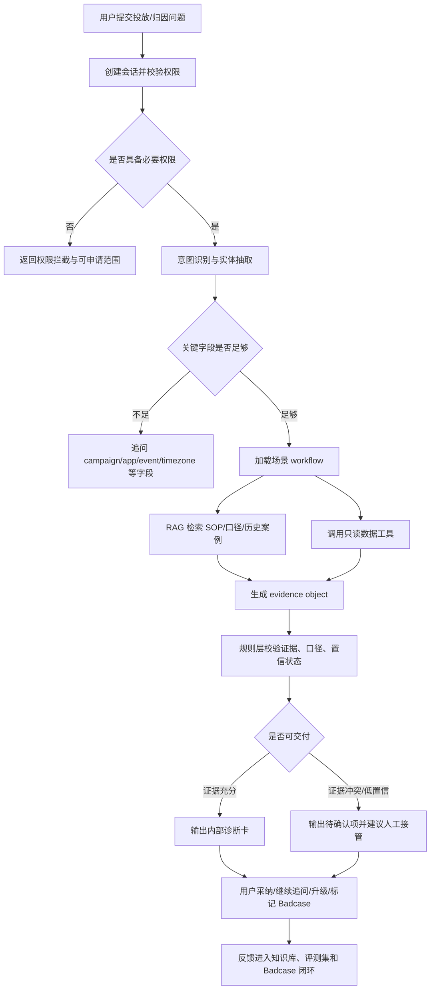

# AdOps Copilot 投放归因排障助手 PRD - 方案层

> 本文继承 `01-decision.md` 的目标、范围、指标和约束。本文只回答采用什么产品方案、为什么选它、业务主链路如何闭环、资源与风险如何取舍。实现细节见 `03-implementation.md`。

## 1. 方案概览

| 项 | 内容 |
| --- | --- |
| 方案一句话 | 在广告后台/协作入口中提供一个证据驱动的投放归因排障 Copilot，帮助一线人员把自然语言问题转成标准排查链路、数据核对、知识引用、原因排序和人工升级摘要。 |
| 核心用户任务 | 快速判断投放异常或归因差异的可能原因，知道下一步查什么、如何解释、是否需要升级。 |
| 本期最小闭环 | 用户提问 → 权限校验 → 意图识别 → 缺字段追问 → RAG/只读工具获取证据 → 场景 workflow 诊断 → 输出内部诊断卡 → 用户反馈/升级 → Badcase 回流。 |
| 体验原则 | 不是聊天优先，而是排障任务优先；不是给“看似聪明”的结论，而是给可追溯的证据和下一步动作。 |

## 2. 用户与任务链路

| 用户/角色 | 任务 | 入口 | 成功终态 | 失败/异常终态 |
| --- | --- | --- | --- | --- |
| 广告运营 | 诊断 CPA/CPI/消耗/转化异常 | 广告后台 Campaign 页面、Copilot 浮层、团队协作机器人 | 获得异常拆解、可能原因、证据和建议动作 | 缺少账户权限、工具不可用、证据不足时进入待补充或人工确认 |
| 客户成功/AM | 解释客户反馈的数据差异 | 工单详情页、客户问题摘要页、Copilot Chat | 获得内部核查结论和人工升级摘要 | 客户可见内容涉及承诺、赔偿或内部敏感信息时强制转人工 |
| 广告优化师 | 判断是否调整预算、素材或渠道 | 报表看板、异常提醒卡片 | 获得指标链路拆解和优先检查维度 | 需要执行预算/出价动作时只生成建议，不自动执行 |
| 技术支持 | 确认 postback、回传和事件映射状态 | 工单升级摘要、技术支持视图 | 获得结构化上下文、已查证据和待补字段 | 缺少 app、event、campaign、时间窗或日志字段时返回追问清单 |
| 产品/运营管理员 | 管理口径知识、Badcase 和评测集 | 管理后台 | 能看到知识版本、Badcase 队列和评测结果 | 知识无 Owner 或评测未通过时禁止进入线上引用 |

## 3. 业务主流程

## 4. 产品结构

| 模块 | 职责 | 输入 | 输出 | 依赖 |
| --- | --- | --- | --- | --- |
| Copilot 入口层 | 接收自然语言问题、页面上下文和用户反馈 | 用户 query、页面对象、用户身份 | 会话、追问、诊断卡、反馈事件 | 广告后台、工单系统、协作工具 |
| 总控路由层 | 意图识别、实体抽取、风险分级、工具白名单 | query、权限、上下文、可用工具 | intent、required_fields、selected_workflow、risk_level | 规则配置、权限系统 |
| 场景 workflow 层 | 固化投放诊断和归因核对必查步骤 | 路由结果、实体、证据需求 | 检查清单、工具计划、诊断结构 | 业务规则、指标字典 |
| RAG 知识层 | 检索 SOP、口径文档、MMP/平台文档和历史案例 | 检索计划、权限范围 | 引用片段、来源、版本、相似案例 | 知识库、向量索引、BM25、rerank |
| Tool Gateway | 调用授权只读数据工具 | 工具计划、参数、权限 | 平台报表、MMP 报表、postback 摘要 | 报表服务、MMP 数据、日志摘要 |
| Evidence Store | 统一保存工具结果和文档证据 | RAG 结果、工具结果、规则计算 | evidence object、claim 绑定关系 | Trace、权限、版本管理 |
| Delivery Guard | 过滤不可见信息，生成最终状态 | workflow 输出、evidence、风险策略 | `delivery_state`、内部诊断卡、人工接管原因 | 安全策略、客户可见规则 |
| Badcase 与评测层 | 接收反馈、沉淀回归集、控制上线门禁 | trace、feedback、人工标注 | Badcase、Golden Dataset、评测报告 | 评测后台、人工审核 |

## 5. 核心体验设计

### 5.1 页面/触点清单

| 页面/触点 | 用户目标 | 核心信息 | 核心操作 | 状态 |
| --- | --- | --- | --- | --- |
| Copilot 浮层 | 在当前页面快速提问 | 页面对象、当前 campaign/app、推荐问题 | 输入问题、选择问题类型、提交 | 默认入口 |
| 投放诊断卡 | 解释 CPA/CPI/消耗/转化异常 | 指标变化、原因排序、证据、下一步动作 | 采纳、继续追问、创建升级摘要 | MVP 核心 |
| 归因核查卡 | 对比平台与 MMP/BI 差异 | 差异比例、口径检查项、postback 状态、待补字段 | 标记已确认、请求技术支持、复制内部摘要 | MVP 核心 |
| 证据抽屉 | 查看诊断依据 | 文档引用、工具结果、来源、更新时间、可见性 | 展开证据、复制引用、标记过期 | MVP 核心 |
| 追问/补字段卡 | 补齐诊断必要信息 | 缺失字段、为什么需要、示例格式 | 补充 campaign/app/event/time range | MVP 核心 |
| 人工升级摘要 | 把问题交给技术/数据/产品 | 已查证据、未确认项、建议负责人 | 创建工单草稿、复制摘要 | MVP 核心 |
| Badcase 标记入口 | 反馈错误或无帮助 | 错误类型、原因、期望答案 | 提交 badcase、关联会话 | MVP 核心 |
| 管理后台 | 管理知识、工具、评测和灰度 | 知识版本、Badcase 队列、评测结果 | 审核、发布、回滚、关闭 Badcase | MVP 支撑 |

### 5.2 关键交互规则

1. **先确认任务类型，再输出结论。** 当用户问题同时包含投放异常、归因差异、SDK 技术细节或客户回复时，系统先拆分任务，并说明本期能处理哪一部分。
2. **字段不足先追问。** 投放诊断至少需要账户/campaign、时间范围、异常指标；归因核对至少需要 app/campaign、event、时间范围、对比系统和时区。缺失时不强答。
3. **证据必须可展开。** 每个主结论至少绑定一个 evidence object；没有证据的假设只能进入“待确认”。
4. **内部诊断优先。** 默认输出内部诊断卡和人工升级摘要。本期不把客户回复草稿作为 MVP 验收内容；如需试点，只能在单独风控开关下生成“人工确认前不可发送”的草稿。
5. **低置信不伪装成结论。** 工具失败、知识过期、证据冲突、权限不足时，诊断卡显示对应状态和下一步，而不是给确定性答案。
6. **人工升级不是失败。** 当系统已经完成结构化收集、证据汇总和已排除项说明，即使需要人工接管，也视为有效辅助。

## 6. 核心场景方案

### 6.1 投放效果异常诊断

| 环节 | 方案 |
| --- | --- |
| 典型问题 | “昨天巴西安卓 Campaign 的 CPA 从 8 美元涨到 15 美元，帮我看下原因。” |
| 必填字段 | account/campaign、time_range、metric、geo/os 可从页面上下文补齐时不追问 |
| 诊断主线 | CPA = Cost / Conversion；进一步拆 Cost、Impression、CPM、Click、CTR、CPC、Install CVR、Post-install CVR 等链路 |
| 证据来源 | 平台报表、MMP/BI 汇总、投放 SOP、历史相似案例 |
| 输出 | 主要变化驱动因素、已排除项、建议动作、需要继续观察的指标、是否建议人工介入 |
| 失败兜底 | 数据工具不可用时输出指标拆解模板和待补字段，不输出强原因 |

### 6.2 归因与数据不一致核对

| 环节 | 方案 |
| --- | --- |
| 典型问题 | “客户说 MMP 看到 300 个安装，但平台后台只有 180 个，为什么？” |
| 必填字段 | app、campaign、event、time_range、platform_count、mmp_count 或可查询对象、timezone |
| 固定核查清单 | 时区、归因窗口、事件定义、去重/再归因、SAN/SKAN、postback 延迟/失败、数据刷新、渠道映射 |
| 证据来源 | 平台报表、MMP 报表、postback 摘要、归因口径文档、历史案例 |
| 输出 | 差异是否存在、差异比例、可能原因排序、口径说明、待客户补充项、内部升级摘要 |
| 失败兜底 | 证据冲突时进入 `citation_conflict` 或 `human_review_required`，不做确定性归因 |

### 6.3 归因/指标口径知识查询

| 环节 | 方案 |
| --- | --- |
| 典型问题 | “为什么平台报表和 MMP 的安装数会不一样？” |
| 必填字段 | 可不要求具体 campaign，但若用户追问具体账户则回到诊断 workflow |
| 检索范围 | 指标定义、归因口径、MMP 文档、平台 SOP、常见 FAQ |
| 输出 | 概念解释、常见原因、适用边界、推荐下一步核查项、引用来源 |
| 失败兜底 | 检索无可靠来源时提示知识库暂无可靠口径，建议转人工或补充文档 |

## 7. 指标到方案映射

| 决策层指标 | 方案动作 | 实现层落点 |
| --- | --- | --- |
| AI 辅助解决率 | 输出可执行下一步动作，支持采纳/升级/继续追问 | `03-implementation.md#14-页面接口数据与业务埋点` |
| 人工采纳率 | 诊断卡提供采纳、部分采纳、无效、复制摘要等反馈 | `03-implementation.md#12-badcase-数据飞轮` |
| 平均初步诊断时长 | 页面上下文自动带入、缺字段结构化追问、工具并行查询 | `03-implementation.md#13-成本计量与性能` |
| 归因核查完整率 | 固定核查清单由 workflow 加载 | `03-implementation.md#5-agent-能力卡` |
| 投放异常检查完整率 | 指标链路拆解由规则/workflow 保证 | `03-implementation.md#5-agent-能力卡` |
| 引用/证据覆盖率 | 所有主结论绑定 evidence object | `03-implementation.md#8-prompt上下文与输出-schema` |
| 越权阻断率 | 路由层和 Tool Gateway 双重权限校验 | `03-implementation.md#9-安全合规与人工确认` |
| Badcase 修复周期 | 反馈进入队列、分派 owner、回归通过后关闭 | `03-implementation.md#12-badcase-数据飞轮` |

## 8. 方案取舍

| 候选方案 | 优点 | 风险 | 结论 |
| --- | --- | --- | --- |
| 纯 Chatbot + RAG | 成本低，上线快，适合知识问答 | 无法处理结构化数据、指标拆解和证据核对，容易幻觉 | 只作为知识查询子能力 |
| 规则引擎 + BI 看板 | 稳定、可解释、成本低 | 无法理解自然语言、跨文档检索和生成升级摘要 | 作为 workflow 与指标计算底座 |
| Agent 自由规划工具调用 | 灵活，能覆盖复杂问题 | 工具滥用、漏查、成本高、难评测 | 不作为默认方案；只在规则允许范围内选择工具 |
| 场景 workflow + LLM 解释 | 必查项稳定、可测、可审计，同时保留自然语言表达能力 | 前期需要定义场景检查清单和工具 schema | 本期采用 |
| 内部诊断 + 受控客户草稿 | 兼顾排障和客户沟通 | 客户可见内容风险高，容易扩大 MVP 范围 | 本期默认内部诊断；客户草稿作为 V1.1 受控试点，不计入 MVP 验收 |

## 9. 版本节奏

| 版本 | 目标 | 范围 | 验收重点 |
| --- | --- | --- | --- |
| V0 准备期，第 0-2 周 | 建立基线、知识清单和评测样本 | 盘点 SOP/口径/历史工单，确认工具字段和权限，构建 Golden Dataset V0 | 基线样本、字段字典、权限矩阵、评测集雏形 |
| V1 底座期，第 3-6 周 | 打通入口、路由、RAG、证据对象 | Copilot 入口、总控路由、知识检索、Evidence Store、反馈事件 | 意图识别、引用覆盖、权限拦截 |
| V1 MVP，第 7-12 周 | 上线投放诊断和归因核对，并具备基础质量闭环 | 投放诊断 workflow、归因核对 workflow、只读工具、诊断卡、升级摘要、Badcase 入队、回归集沉淀、基础评测门禁 | 检查完整率、工具成功率、人工采纳率、Badcase 可入队、核心回归集通过 |
| V1.1 灰度优化，第 13-16 周 | 完善评测和 Badcase 运营机制 | Badcase 分派 SLA、回归集扩容、评测看板、灰度门禁细化、版本回滚演练 | 错误建议率、Badcase 修复周期、核心指标改善 |
| V2 扩展 | 扩展 SDK/API、素材审核、客户回复 | SDK/Postback 深度排障、素材政策检查、多语言客户话术 | 需重新生成独立方案或扩展 PRD |

## 10. 风险与降级

| 风险 | 触发条件 | 降级/兜底 | 监控指标 |
| --- | --- | --- | --- |
| 权限不足 | 用户无账户、客户、campaign、MMP 权限 | 返回权限拦截，不展示数据，不让模型猜测 | permission_blocked rate |
| 工具不可用 | 报表 API、MMP API、postback 摘要超时或失败 | 使用有效缓存/ETL 快照/人工上传数据；标记 `tool_degraded` | tool_error_rate、P95 latency |
| 知识过期 | 文档超过有效期、owner 未确认、版本冲突 | 不引用过期知识，提示待确认并进入知识治理 | stale_citation_rate |
| 证据冲突 | 平台、MMP、SOP 或工具结果相互矛盾 | 输出冲突来源，建议人工确认 | citation_conflict rate |
| 模型幻觉 | 输出无来源、虚构工具、虚构字段、强因果判断 | Delivery Guard 拦截，进入 Badcase | hallucination_flag rate |
| 客户可见风险 | 用户请求直接回复客户、赔偿、合同解释 | 只生成内部草稿或拒答，强制人工确认 | high_risk_intent rate |
| 成本/延迟失控 | 多轮追问、重复检索、工具循环 | 限制工具调用次数、缓存、异步诊断、转人工 | token_cost、tool_calls_per_task |

## 11. 对实现层的约束

实现层必须继承以下约束：

| 约束 | 实现要求 |
| --- | --- |
| MVP 场景 | 必须覆盖投放诊断、归因核对、知识查询、人工升级、Badcase；不得把 SDK/素材审核写成本期验收。 |
| 只读工具 | 工具注册表仅包含只读查询和搜索工具；任何写操作必须标为后续版本。 |
| 证据对象 | 每条主结论必须绑定 evidence object；实现层必须给出字段 schema。 |
| 置信度 | 模型可输出组件判断，最终置信状态由规则/workflow 复算。 |
| 客户可见 | evidence 和输出必须区分内部可见与客户可见。 |
| 评测门禁 | Prompt、模型、RAG、工具、workflow 变化必须跑回归集。 |
| Badcase 闭环 | 线上反馈必须可转成标注、修复、回归、关闭流程。 |
| 待确认问题 | 不得用“待补充”糊弄关键字段；必须写影响和验证方式。 |

实现层还必须区分“首次响应 SLA”和“完整诊断 SLA”：前者用于让用户知道系统已理解任务并开始排查，后者用于衡量工具、RAG 和诊断链路的完整完成时间。

## 12. 变更记录

| 日期 | 变更 | 原因 |
| --- | --- | --- |
| 2026-07-05 | 重新生成三文件分层 PRD 的方案层 | 继承新的决策层，收敛方案主链路和 MVP 边界 |
