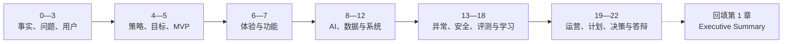

# 《全球 ASO 与本地化增长 Agent》PRD 全文大纲 V2.0

> 本大纲用于冻结 PRD 第 0—22 章及附录的结构、章节目标、必备表格、关键图示、验收产物和生成顺序。后续按章生成前，需要回看优秀 PRD 案例的对应章节，只借鉴论证方法、字段和表达深度，不迁移合同审查项目的行业事实、阈值、规则、数据或模型结论。

## 1. 大纲使用说明

### 1.1 参考源刷新基线

| 来源 | 当前版本证据 | 复读方法 | 对大纲的影响 |
| --- | --- | --- | --- |
| PRD / SDD 模板 | 1,602 行、70 个表格结构；SHA-256 `397996E26EF090E120534A739440286921B6407CECA1D55709306F9C0D22D1A0` | 第 0—2 章全文；全章标题树和全部表格 | 每章增加必备表格、字段和 Gate |
| 优秀 PRD 案例 | 6,807 行、160 个表格结构；SHA-256 `8777C18ED9E5E07FB2681D93761C848F1D6245412C97168A70771A78868AFFA4` | 第 0—2 章全文；全章标题树和全部表格 | 增加填写深度、异常 Case、审计附件和追溯要求 |
| ASO 产品方向与竞品分析 | 当前仓库文件 | 读取与各章相关的用户、痛点、差异化和边界 | 只迁移 ASO 业务内容，不照搬合同结论 |

本版新增的核心要求是：每章不只写“要讲什么”，还要明确“用哪张表承载、表头是什么、用什么图或 Case 证明、何时算完成”。

### 1.2 当前项目状态

| 范围 | 状态 | 说明 |
| --- | --- | --- |
| 第 0 章 | V2 案例结构对齐稿，待评审 | 0.1—0.8 顺序、说明段和 8 张表的字段与案例对应章节一致 |
| 第 1 章 | V2 案例结构对齐稿，待最终回填 | 收敛为 1.1—1.6；保留一页决策链，不增加案例外平行小节 |
| 第 2 章 | V2 案例结构对齐稿，待评审 | 收敛为 2.1—2.7；保留 As-Is 双图与三字段痛点根因表 |
| 第 3—22 章 | 待生成 | 按本大纲和章节依赖逐章生成 |
| 附录 A—L | 按需持续维护 | 只收录可核验材料，不为完整性虚构记录或数据 |

### 1.3 章节优先级

- **P0：** 项目成立、方案落地或 AI 安全评审所必需，必须写到可评审、可追溯、可验收。
- **P1：** 个人 PoC 阶段写到方案级深度，真实试点时再补生产数据、容量、预算和运营细节。
- **P2：** 在核心 PRD 确认后生成，主要服务作品集、答辩或条件启用能力。

### 1.4 全文统一写作契约

每章都要回答：

1. **Why：** 本章支撑哪个产品或技术决策；
2. **Why not：** 为什么不采用不做、人工、规则、搜索或更简单方案；
3. **Know how：** 角色、触发、输入、处理、输出、状态、权限和指标；
4. **Evidence：** 结论来自事实、访谈、样本、日志、公开资料还是待验证假设；
5. **Boundary：** 异常、风险、降级、人工、恢复和明确非目标；
6. **Migration：** 哪些方法可以迁移，哪些 ASO 业务变量必须重新验证；
7. **Interview：** 预算、数据、市场或安全约束变化时，方案是否仍成立。

重要内容继续使用以下标签：

`【事实 F】`、`【推断 I】`、`【假设 H】`、`【模拟 S】`、`【建议 R】`、`【风险 K】`、`【待决策 D】`、`【待补充 T】`。

---

## 2. 全文结构总览

| 层级 | 章节 | 核心回答 |
| --- | --- | --- |
| 项目契约与问题层 | 0—3 | 项目是什么、解决谁的什么问题、证据是否足够 |
| 策略与范围层 | 4—5 | 为什么用 AI、如何差异化、MVP 做什么与不做什么 |
| 产品与体验层 | 6—7 | 产品以什么对象和页面承载，核心功能如何形成业务闭环 |
| AI 与技术层 | 8—12 | AI 如何拆解，数据/RAG、模型、Workflow、Agent、系统如何协同 |
| 风险与验证层 | 13—18 | AI 错了怎么办，如何降级、审计、评测、归因和防复发 |
| 运营与交付层 | 19—22 | 如何上线迭代、配置资源、记录决策并完成作品集答辩 |

> 该图是章节依赖草图。项目作者仍需亲自重画并解释为什么不能跳过用户、业务对象、异常或评测，直接进入模型和 Agent 设计。

### 2.1 每章必备表格、字段与图示

下表是这次重新复读完整表格后的主要增量。后续生成任何章节时，先回看案例同章的表格，再用 ASO 事实重新填写；没有数据时保留“待验证”，不能复制案例数值。

| 章 | 必备表格 | 最小字段 | 必备图 / Case | 完成 Gate |
| --- | --- | --- | --- | --- |
| 0 文档治理 | 读者；四遍阅读法；项目设定；角色边界；版本记录；事实/假设/决策；术语；审计附件 | `读者｜关注内容`；`项目要素｜方案设定｜状态`；`角色｜负责什么｜不负责什么`；其余表头逐项沿用案例 | 阶段图；证据追溯链 | 0.1—0.8 与案例对应，项目性质、禁止声称和证据边界清楚 |
| 1 一页摘要 | 用户任务痛点；指标风险前提 | `用户｜核心任务｜关键痛点`；`类别｜核心内容` | 端到端 MVP 图 | 1.1—1.6 与案例对应，一页形成完整决策链，未把目标写成结果 |
| 2 问题定义 | 痛点根因 | `痛点｜表现｜根因` | 现有业务流程；As-Is 任务链 | 2.1—2.7 与案例对应，流程、根因、优先级、不做成本和北极星问题完整 |
| 3 用户研究 | 角色责任；画像任务约束；用户旅程；场景证据卡；需求优先级；研究样本限制 | 使用者、决策者、审核者、买单者、风险承担者；任务、触发、替代、证据、反例 | 用户旅程；最近任务回放 Case | 一手证据与假设画像分开 |
| 4 策略与 AI 必要性 | 竞品/替代方案；AI 应做/不做；价值假设；约束；被放弃方案 | 候选、优点、缺点、成本/风险、选择依据、重评条件、验证方法 | As-Is / To-Be；AI 必要性决策树 | 比较最强简单替代方案，不以模型名作理由 |
| 5 目标与 MVP | 目标/非目标；指标字典；MVP 做/不做；功能优先级；路线图；成功/失败/停止 | 指标、口径、分子分母、数据源、基线、目标状态、owner；依赖、风险、验证 | MVP 范围图 | Gate A：问题、范围、指标和非目标冻结 |
| 6 信息架构 | 业务对象；对象关系；页面模块；角色可见/可操作；页面状态；原型验收 | object_id、version、state、owner；页面、用户目标、字段来源、权限、空错降级状态 | IA 图；To-Be 旅程；低保真原型 | 页面映射对象、状态和权限，不是单一聊天框 |
| 7 核心功能 | 功能优先级；逐功能卡；输入输出；状态权限；依赖回流；埋点；规则专项 | 功能 ID、触发、前置、字段、主/异常流程、AI/规则/人工、状态、权限、恢复、验收 | 主流程、状态机；正常/异常/权限/恢复 Case | 每个 P0 功能可交给研发和测试 |
| 8 AI 任务 | 能力全景；业务任务映射；任务卡；职责矩阵；内部对象契约；Schema；七层校验；失败恢复 | 任务 ID、输入、输出 Schema、不可接受错误、Gold、指标、人工；对象生产方、消费方、版本 | AI 全景图；端到端调用时序 | 明确 Rule、RAG、LLM、Tool、Human 分工 |
| 9 数据与 RAG | 数据资产；用途授权；治理难题；冲突；清洗；切片；上下文预算；Embedding；索引元数据；检索重排；异常；评测 | 来源、权威、owner、授权、敏感、有效期；chunk/source/version/ACL；Query、候选、阈值、引用 | 离线知识链；在线 RAG 链；端到端深化 Case | 权限、时效、冲突、无答案、删除和回滚齐全 |
| 10 模型决策 | 任务能力要求；硬约束；候选；初筛/细筛；主备；版本；放弃方案 | 任务、候选 revision、质量、安全、时延、成本、部署、结论、重评条件 | 评测决策漏斗 | 无实测不宣称胜出，结果可复现 |
| 11 Prompt/Workflow/Agent | Prompt 分层；变量表；节点路由；工具契约；状态记忆；Agent 终止；外部动作确认 | policy、task、evidence、output contract；来源、可空、为空动作、权限/版本校验；超时、重试、幂等 | Workflow 状态图；工具调用时序 | Prompt 不承担权限、正式规则和事务一致性 |
| 12 系统架构 | 模块职责；数据流；接口；权限矩阵；第三方读写；异步幂等对账；性能成本 | 请求/响应、对象/版本、状态、错误、超时、重试、幂等、权限、日志、恢复 | 系统边界图；信任域；在线/离线时序 | Gate B：功能、AI、数据、系统和人工贯通 |
| 13 异常与边界 | 异常八格；输入/模型/知识/工具/权限/状态/误用矩阵；Corner Case | 用户现象、业务风险、检测、现场证据、止损、根因、修复、回归关闭 | 统一排查图；每类至少一个完整 Case | 错误可发现、影响可限制、状态可解释 |
| 14 降级人工恢复 | 机制释义；触发条件；降级路径；提示与动作；接手角色；接手包；人工动作；恢复对账 | 触发、信号、范围、自动性、恢复条件；接手人、上下文、证据、动作、SLA | 降级树；人工接手时序；服务恢复 Case | 机器失败后人能接、服务恢复后不覆盖人工 |
| 15 安全责任 | 红线；数据边界；攻击面；高风险动作；责任矩阵；审计事件 | 失败输入、系统控制、检测证据、Gate、触发后动作、最终责任 | 信任域图；Prompt Injection / 越权红队 Case | 每条红线可测试，免责声明不替代控制 |
| 16 评测 Gate | 任务卡；数据来源；分层；Gold；组件指标；RAG/Tool；端到端；红队；成本容量；发布 Gate | 输入、期望、不可接受错误、指标；source/split/gold/仲裁；阈值依据、批准人、未通过动作 | 评测漏斗；Offline→Shadow→Pilot 图 | 红线不被平均分抵消；Go/No-Go 可执行 |
| 17 分析归因 | 事件/Trace；漏斗；看板；诊断树；验证路径；条件性实验卡；复盘决策 | request/trace、任务模式、对象/版本、组件版本、人工动作、业务结果；适用时记录主变量、对照、干扰、停止规则 | 指标下降诊断树；基线发布与控制实验对比 Case | 相关性不写成因果，验证方式与任务阶段匹配 |
| 18 Bad Case | 对象分类；严重度；渠道；记录模板；根因/止损；DRI/SLA；修复选择；回归；关闭 | case/request、环境、对象/版本、风险、影响、根因、止损、修复、回归、关闭人 | Bad Case 闭环；第一处错误定位 Case | 代码合并不等于关闭，历史影响已处理 |
| 19 运营迭代 | 灰度阶段；监控；看板；运营节奏；知识生命周期；变更验证；发布回滚；Runbook | SLI、阈值依据、第一动作、owner；变更、影响、验证、回滚、恢复、对账 | 发布治理闭环；Runbook 实战 Case | Gate C：owner、monitor、release Gate、rollback、recovery 齐全 |
| 20 项目管理 | 里程碑；RACI；依赖；TCO；风险预案 | 阶段目标、产物、进入/退出、角色、依赖、成本、风险、备选 | 不确定性消除路线图 | 不虚构团队、预算和排期 |
| 21 Decision Log | 决策标准表；放弃方案；追溯矩阵 | 目标/约束、事实、假设、候选、Why、Why not、代价、验证、重评、owner/date | 决策链图 | 任一 P0 需求可追到来源、风险、测试和指标 |
| 22 答辩 | 多时长讲稿；约束追问题库；个人职责；证据索引 | 主题、主问、约束追问、考察点、答题证据；本人动作、协作、边界、结果状态 | 项目故事线；现场手绘清单 | 只讲真实完成内容，未知项诚实回答 |

---

## 3. 第 0—22 章详细大纲

# 0. 文档说明与项目总览【P0｜V2 案例结构对齐稿】

**章节目标：** 建立全文的生产契约，明确项目性质、事实边界、当前阶段、作者职责和引用规则，防止后续把概念方案、公司公开能力或模拟数据写成个人上线成果。

**核心内容：**

- 0.1 文档目的、适用范围、阅读方式、四遍阅读法、七问迁移法、手画要求和原型说明；
- 0.2 项目基本信息；
- 0.3 项目背景与项目阶段；
- 0.4 作者职责、协作角色与边界；
- 0.5 文档版本记录与变更日志；
- 0.6 已确认事实、待验证假设与待决策事项；
- 0.7 核心术语表与缩略语说明；
- 0.8 一份可答辩 AI PRD 的完整证据链。

**关键产物 / Gate：**

- 8 张表的表头、顺序和信息职责与案例第 0 章一致；
- 项目基本信息、角色边界、事实假设决策、术语和六类审计附件；
- 未确认项目性质时，不允许进入简历结果表述。

# 1. 一页纸项目摘要【P0｜V2 案例结构对齐稿，最后定稿】

**章节目标：** 用一页呈现完整决策链，而不是罗列功能；使评审者快速判断用户、问题、方案、AI 增量、MVP、边界、指标和风险是否一致。

**核心内容：**

- 1.1 一句话产品定位；
- 1.2 目标用户、核心场景与关键痛点；
- 1.3 业务目标与 AI 核心价值；
- 1.4 Google Play 单 App × 双市场的一期 MVP 方案概览；
- 1.5 核心指标、关键风险与上线前提；
- 1.6 当前最重要的产品决策与结论。

**关键产物 / Gate：**

- 用户表固定使用 `用户｜核心任务｜关键痛点`，指标表固定使用 `类别｜核心内容`；
- 一页纸决策摘要只保留案例对应的 1.1—1.6；
- 不将待验证指标写成项目结果；
- 第 2—21 章确认后重新回填，确保摘要不超前承诺。

# 2. 业务背景与问题定义【P0｜V2 案例结构对齐稿】

**章节目标：** 证明问题来自真实业务链路，而不是从“大模型能做什么”倒推需求。

**核心内容：**

- 2.1 行业、市场与业务背景；
- 2.2 现有业务流程与参与角色；
- 2.3 用户当前任务链路（As-Is）；
- 2.4 业务痛点、用户痛点与根因分析；
- 2.5 问题优先级与机会判断；
- 2.6 不解决该问题的成本；
- 2.7 问题定义与北极星问题陈述。

**关键产物 / Gate：**

- 现有业务流程图、As-Is 任务链图、`痛点｜表现｜根因` 三字段表；
- 优先级公式、首期优先项、不做成本和北极星问题；
- 不新增案例第 2 章之外的平行子章节，证据缺口在章首说明中统一标记。

# 3. 用户研究与需求洞察【P0｜待生成】

**章节目标：** 用一手研究验证谁最痛、任务多高频、当前如何解决，并区分使用者、决策者、审核者、购买者和风险承担者。

**核心内容：**

- 3.1 用户分层与第一优先用户选择；
- 3.2 ASO / App Growth 运营核心画像、目标和能力差异；
- 3.3 增长产品经理、本地化、设计、数据和增长负责人的协作职责；
- 3.4 三类场景：0→1 / 新市场基线搭建、整体版本改版、稳定版本精细化优化；
- 3.5 用户旅程、Jobs-to-be-Done、触发、期望结果和失败后果；
- 3.6 访谈提纲、任务回放、证据等级与样本局限；
- 3.7 需求池及影响、频率、可解性、风险和数据可得性优先级。

**关键产物 / Gate：**

- 用户分层、画像、旅程图、JTBD、访谈证据和需求优先级；
- 在没有真实访谈前，画像必须保持为假设画像。

# 4. 产品策略与 AI 必要性论证【P0｜待生成】

**章节目标：** 回答为什么做“商店增长决策 Agent”，而不是翻译工具、关键词平台、报告 Copilot 或纯人工流程优化。

**核心内容：**

- 4.1 产品愿景、定位、价值主张和边界；
- 4.2 As-Is / To-Be 对比；
- 4.3 AppTweak、MobileAction、App Radar 与人工多工具方案的关键启发；
- 4.4 竞品公开事实与本项目推断的分离；
- 4.5 AI、人工、规则、搜索、自动化、数据工具的替代方案比较；
- 4.6 Evidence Object、跨模态“需求—搜索—表达—版本—验证—学习”、ASO Growth State 的差异化；
- 4.7 被放弃方案、代价、重评条件和竞争威胁。

**关键产物 / Gate：**

- 替代方案表、AI 必要性论证、差异化策略和放弃方案记录；
- 不能以“用了大模型/Agent”本身作为价值证明。

# 5. 目标、指标与一期范围【P0｜待生成】

**章节目标：** 冻结 MVP 要验证的最大不确定性，明确成功、失败和停止条件，防止范围膨胀。

**核心内容：**

- 5.1 产品目标、用户目标和非目标；
- 5.2 MVP：Google Play、1 个 App、2 个市场、公开/授权数据、人工审核；
- 5.3 市场机会卡、评论证据、关键词意图、metadata、Creative Brief、版本变更说明、风险清单和验证计划；满足条件时生成 Experiment Card；
- 5.4 P0 / P1 / P2 功能范围；
- 5.5 效率、效果、可信、安全、体验和业务指标；
- 5.6 指标定义、分子分母、数据来源、观察窗口和干扰因素；
- 5.7 PoC 成功/失败/停止标准及真实试点路线。

**关键产物 / Gate：**

- 目标/非目标表、MVP 范围、指标字典、停止条件和 Roadmap；
- 需冻结首个 App 品类、双市场和 MVP 交付形态。

# 6. 信息架构与整体体验设计【P0｜待生成】

**章节目标：** 把产品从“一个聊天框”设计成围绕业务对象、证据和状态协作的增长工作台。

**核心内容：**

- 6.1 Growth Task、App、Market、Locale、Product Fact、Evidence、Listing Version、Strategy Proposal、Experiment、Learning、Badcase 的对象关系；
- 6.2 任务工作台、证据中心、策略包、人工审核、实验中心和学习中心；
- 6.3 各角色在同一对象上的可见信息、可编辑字段和决策权限；
- 6.4 To-Be 用户旅程与导航结构；
- 6.5 输入、AI 输出、人工确认和修改原因；
- 6.6 来源、置信度、不确定性、冲突和过期提示；
- 6.7 空、错、加载、无权限、降级、证据不足和版本冲突状态；
- 6.8 低保真原型与可用性测试计划。

**关键产物 / Gate：**

- 对象关系图、信息架构图、核心页面清单和低保真原型；
- 页面必须映射业务对象、状态和权限，不能只展示对话记录。

# 7. 核心功能 PRD【P0｜待生成】

**章节目标：** 逐项定义从创建任务到实验学习回流的功能闭环，使研发、测试和评审者可以据此执行。

**拟定 P0 功能：**

- 7.1 Growth Task 创建、目标市场和产品事实校验；
- 7.2 商店页、评论、竞品、关键词和规则的数据采集/快照；
- 7.3 评论需求主题与关键词搜索意图分析；
- 7.4 竞品定位、metadata 与商店素材理解；
- 7.5 Evidence Object 归一和市场机会卡；
- 7.6 本地化 title、short description、full description 草案；
- 7.7 截图 / 视频 Creative Brief；
- 7.8 产品事实、品牌、语言、文化和平台规则检查；
- 7.9 人工审核、修改原因、版本管理和交付包；
- 7.10 任务模式识别、验证路径选择、P1 条件性 Experiment Card、结果回流与 Learning State；
- 7.11 埋点、权限、依赖和功能验收。

**每个功能统一写：**

用户故事、触发条件、前置条件、输入、处理、输出、正常流程、异常流程、状态、权限、AI/规则/人工分工、降级恢复、埋点、验收标准和一期非目标。

**关键产物 / Gate：**

- P0 功能清单和逐功能 PRD；
- 每个功能必须发生明确的业务对象状态变化，并能追溯到需求和测试。

# 8. AI 任务拆解与能力设计【P0｜待生成】

**章节目标：** 把端到端业务流程拆成可评测的 AI 子任务，说明为什么用 AI、错误成本是什么、失败时如何替代。

**核心内容：**

- 8.1 AI 能力全景图；
- 8.2 评论主题识别、情绪/需求归纳、关键词意图聚类、竞品与素材理解；
- 8.3 受产品事实和证据约束的 metadata / Creative Brief 生成；
- 8.4 任务模式分类、验证路径推荐；满足稳定基线、足够流量和可控变量时，由 P1 能力生成结构化 Experiment Card；
- 8.5 数据工具、规则、Embedding/聚类、RAG、LLM、多模态模型、Workflow 和人工分工；
- 8.6 不需要 AI 的确定性任务；
- 8.7 高风险、低证据和高不确定性节点的人工确认；
- 8.8 AI 输出 Schema、置信度、引用和校验规则。

**关键产物 / Gate：**

- AI 任务卡、能力地图、人机职责矩阵和端到端 Case；
- 每个 AI 节点必须定义输入、输出、约束、错误成本、评测与替代路径。

# 9. 数据、知识库与 RAG 专项方案【P0｜待生成】

**章节目标：** 定义数据从哪里来、是否允许使用、如何治理和检索，以及如何防止过期、冲突、越权和无依据生成。

**核心内容：**

- 9.1 RAG 适用性及不使用 RAG 的任务；
- 9.2 数据资产：公开商店页/评论、用户产品事实、品牌规范、平台规则、市场/语言知识、历史版本与实验；
- 9.3 用途授权、隐私、脱敏和租户/项目隔离；
- 9.4 Raw / Canonical / Serving 数据分层；
- 9.5 解析清洗、元数据、切片和证据时间快照；
- 9.6 Embedding、向量库、关键词/混合召回与 Rerank；
- 9.7 上下文预算、引用、冲突、无答案和知识时效；
- 9.8 更新、重建、版本、回滚和监控；
- 9.9 RAG 离线评测和一个 ASO 端到端 Case。

**关键产物 / Gate：**

- 数据/知识源清单、用途授权、元数据字典、检索链路、引用契约和评测方案；
- 未接入或未实测的数据源不得写成已有能力。

# 10. 模型选型与方案决策【P1｜待生成】

**章节目标：** 按具体 AI 任务和约束选择模型，不依据榜单、热度或单次 Demo 宣称某模型胜出。

**核心内容：**

- 10.1 各 AI 任务的质量、语言、多模态、结构化输出和风险要求；
- 10.2 效果、成本、时延、上下文、部署、隐私和可观测约束；
- 10.3 候选模型/非模型方案池；
- 10.4 评测集、初筛、细筛和 Pareto 取舍；
- 10.5 主模型、备用模型、切换条件和降级顺序；
- 10.6 Prompt、RAG、规则、工具或微调的选择依据；
- 10.7 模型、Prompt、知识快照、索引和 Workflow 版本；
- 10.8 当前未实测项和禁止宣称的结论。

**关键产物 / Gate：**

- 模型任务卡、候选比较表、评测计划、主备与重评条件；
- PoC 实测前只写候选和评测方法，不写“最终最优模型”。

# 11. Prompt、Workflow 与受控 Agent 设计【P0｜待生成】

**章节目标：** 定义固定工作流和有限动态 Agent 的边界，确保任务可终止、可审计、可降级，不让 Prompt 承担权限和规则责任。

**核心内容：**

- 11.1 System Prompt、Task Prompt 和证据约束原则；
- 11.2 输入变量、上下文组装和多轮状态；
- 11.3 任务创建、采集、分析、归一、生成、校验、审核、实验和回流节点；
- 11.4 路由、工具清单、参数、权限、返回值和错误码；
- 11.5 Agent 可动态计划的局部范围；
- 11.6 中间结果校验、失败重试、终止条件和循环防护；
- 11.7 Evidence、Strategy Proposal、Version Plan、Validation Plan 和条件性 Experiment Card Schema；
- 11.8 外部动作前确认、执行日志和成本/时延控制。

**关键产物 / Gate：**

- Workflow 图、节点契约、状态机、Prompt 变量、工具契约和输出 Schema；
- 自动发布、市场投入和最终合规判断不得交给 Agent。

# 12. 系统架构、接口与权限设计【P1｜待生成】

**章节目标：** 把产品、AI、数据和人工流程映射为可实现的系统边界；个人 PoC 写到方案级，不虚构生产容量和企业系统。

**核心内容：**

- 12.1 前端、业务服务、工作流引擎、模型网关、知识库、规则服务和数据连接器；
- 12.2 模块职责和端到端数据流；
- 12.3 核心 API、请求/响应字段和 Schema 校验；
- 12.4 用户、角色、项目、数据和操作权限矩阵；
- 12.5 鉴权、审计日志和高风险操作留痕；
- 12.6 Google Play、第三方 ASO 数据平台等系统的只读/读写边界；
- 12.7 异步任务、幂等、缓存、对账、恢复和重试；
- 12.8 PoC 成本、时延和容量假设；真实试点待补项。

**关键产物 / Gate：**

- 系统架构图、模块职责、接口清单、权限矩阵和技术假设；
- 所有未真实接入的接口明确标为候选或模拟。

# 13. 正常流程、异常流程与边界处理【P0｜待生成】

**章节目标：** 覆盖从输入到结果回流的正常路径和异常分支，保证错误可发现、状态可解释、任务可恢复。

**核心内容：**

- 13.1 正常完成路径；
- 13.2 App、市场、产品事实、语言和目标输入缺失/冲突；
- 13.3 数据采集失败、样本不足、来源过期和口径冲突；
- 13.4 幻觉、拒答、格式错误、超时和模型不可用；
- 13.5 RAG 无召回、低质量召回、知识冲突和权限不符；
- 13.6 工具失败、回调丢失、重复执行和接口限流；
- 13.7 审核、版本、实验和发布状态异常；
- 13.8 用户误把建议当事实、误把相关性当因果等误用；
- 13.9 Corner Case 矩阵。

**关键产物 / Gate：**

- 正常/异常流程、错误码、状态变化、用户提示和恢复策略；
- 每个 P0 功能至少覆盖正常、边界、安全和恢复用例。

# 14. 模型降级、人工兜底与恢复机制【P0｜待生成】

**章节目标：** 定义在低置信度、风险、超时、成本或系统故障下，哪些能力可降级、哪些必须停止，以及人工如何接手。

**核心内容：**

- 14.1 降级原则与风险分层；
- 14.2 证据不足、规则过期、模型失败、工具失败和预算超限的触发条件；
- 14.3 主模型 → 备用模型 → 检索/规则 → 人工的路径；
- 14.4 降级状态下的用户提示和可用功能；
- 14.5 ASO、母语、品牌、安全和发布等接手角色；
- 14.6 人工接手包：输入、证据、AI 输出、失败节点和日志；
- 14.7 确认、编辑、驳回、补充、重试和升级动作；
- 14.8 重试、幂等、恢复、结果回流、熔断和回滚。

**关键产物 / Gate：**

- 降级矩阵、人工接手 SOP、恢复和回滚规则；
- 降级不能静默发生，用户必须知道输出可信度和能力变化。

# 15. 安全、合规与责任边界【P0｜待生成】

**章节目标：** 建立数据、内容、平台、文化和外部动作的安全红线，并把责任落实到产品控制和人工角色。

**核心内容：**

- 15.1 刷榜、诱导/操纵评论、虚假承诺和未经授权取数红线；
- 15.2 公开数据、用户授权数据、敏感数据和用途边界；
- 15.3 恶意评论、商店页面、Prompt Injection 和来源污染；
- 15.4 产品事实幻觉、品牌偏离、文化误用和平台政策过期；
- 15.5 母语、品牌、增长、发布、合规和法务责任；
- 15.6 证据、不确定性、用户知情、授权与免责声明；
- 15.7 审计、留痕、申诉、事件上报和外部动作确认。

**关键产物 / Gate：**

- 风险分级、安全红线、数据用途矩阵、审计与事件处理规则；
- 免责声明不能代替拦截、权限、人工终审和可测试的安全控制。

# 16. AI 评测、验收与发布 Gate【P0｜待生成】

**章节目标：** 证明各 AI 子任务和端到端业务任务在效果、安全、体验、成本和稳定性上是否达到 PoC 或试点标准。

**核心内容：**

- 16.1 评论、关键词、竞品、metadata、Creative Brief、任务模式判断、验证计划和条件性实验卡任务定义；
- 16.2 自然分布集、风险挑战集、边界集、Gold 和版本管理；
- 16.3 标注规范、ASO/母语专家复核与仲裁；
- 16.4 准确、完整、事实、引用、格式、相关性和拒答评测；
- 16.5 RAG、工具调用、工作流和 Agent 专项评测；
- 16.6 端到端任务完成、人工修改和用户体验评测；
- 16.7 安全红线、红队和故障注入；
- 16.8 成本、时延、稳定性和容量；
- 16.9 P0 功能验收、阈值和 Go / No-Go；
- 16.10 影子模式、专家内测、受控试点和退出/回滚条件。

**关键产物 / Gate：**

- 评测集、Gold、指标口径、验收用例和发布 Gate；
- 安全红线不能被平均质量分抵消；没有实测不得声称达标。

# 17. 数据分析、实验与效果归因【P0｜待生成】

**章节目标：** 把策略、版本、实验、结果和学习状态连接起来，避免把相关性、趋势共现或单次实验直接写成普遍因果。

**核心内容：**

- 17.1 分析目标、事件、对象版本、日志字段和指标口径；
- 17.2 用户漏斗、Growth Task 漏斗和 AI 决策漏斗；
- 17.3 实验假设、证据、主变量、对照、样本、窗口和停止规则；
- 17.4 版本更新、广告投放、节日、产品变化等干扰因素；
- 17.5 无法归因、样本不足和提前停止的处理；
- 17.6 AI 方案与人工基线的效率、质量和安全比较；
- 17.7 结果与 Evidence、Hypothesis、Listing Version、Experiment 的关联；
- 17.8 Learning State 的适用范围、置信度、失效条件和跨市场外推边界；
- 17.9 分析节奏、看板和复盘输出。

**关键产物 / Gate：**

- 埋点与指标表、验证计划、条件性实验卡、归因树、Learning Schema 和复盘模板；
- 当前没有真实线上实验时，只写设计和待验证口径。

# 18. Bad Case 收集、归因与优化闭环【P0｜待生成】

**章节目标：** 找到错误链路中的第一处根因，完成止损、最小充分修复、回归和防复发。

**核心内容：**

- 18.1 Bad Case 分类：事实、证据、语言、文化、品牌、规则、实验、权限、交互和系统；
- 18.2 严重度、影响面和优先级；
- 18.3 自动监控、用户反馈、人工审核和运营抽检渠道；
- 18.4 最小字段、对象/模型/Prompt/知识/Workflow 版本；
- 18.5 第一处错误定位和临时止损；
- 18.6 规则、Prompt、检索、知识、模型、交互或 SOP 的修复选择；
- 18.7 回归集、灰度验证、历史影响和关闭标准；
- 18.8 Badcase State 向产品和评测集回流。

**关键产物 / Gate：**

- Bad Case 分类、台账、归因模板、回归集和关闭机制；
- 不允许用“换更大模型”替代根因分析。

# 19. 上线运营、监控与持续迭代【P1｜待生成】

**章节目标：** 说明产品进入 PoC、影子测试或真实试点后，如何持续监控数据、质量、安全、成本和知识时效。

**核心内容：**

- 19.1 PoC、专家内测、灰度和真实试点策略；
- 19.2 效果、安全、稳定性、成本和人工队列监控；
- 19.3 数据、政策、品牌、市场/语言知识的更新机制；
- 19.4 模型、Prompt、索引、知识和 Workflow 发布流程；
- 19.5 回归、灰度、回滚和变更记录；
- 19.6 用户反馈、人工修改和实验结果回流；
- 19.7 固定运营节奏、Runbook 和迭代优先级。

**关键产物 / Gate：**

- 运营看板、告警、版本更新 SOP、Runbook 和迭代机制；
- 个人 PoC 不虚构生产监控数据或已存在运营团队。

# 20. 项目计划、资源、成本与风险管理【P1｜待生成】

**章节目标：** 按“优先消除最大不确定性”安排项目，而不是按功能数量堆排期。

**核心内容：**

- 20.1 用户研究、数据准备、原型、PoC、评测和试点里程碑；
- 20.2 作者、ASO 专家、母语审核、设计、研发、数据和安全 RACI；
- 20.3 App/市场、数据授权、第三方接口、原型和实验依赖；
- 20.4 模型、数据接口、人工审核、设计和运维成本；
- 20.5 项目风险、预警指标、应对预案和停止条件；
- 20.6 当前个人 PoC 能完成与不能代表的范围。

**关键产物 / Gate：**

- 里程碑、RACI、依赖、成本假设和风险台账；
- 没有真实团队、预算或接口报价时，使用假设区间或待补充，不编造精确数字。

# 21. 关键决策记录与追溯矩阵【P0｜持续维护】

**章节目标：** 记录关键选择的目标、约束、证据、候选、Why / Why not、代价和重评条件，并让 P0 需求可追溯。

**核心内容：**

- 21.1 为什么选择 ASO / App Growth 运营和当前场景；
- 21.2 为什么采用商店增长决策 Agent；
- 21.3 为什么 Google Play-first、单 App、双市场；
- 21.4 为什么采用固定 Workflow + 受控 Agent；
- 21.5 为什么使用 Evidence Object、RAG、多模态或第三方数据连接器；
- 21.6 为什么 MVP 不自动发布、不承诺排名或下载；
- 21.7 模型、评测、人工边界和 Gate 的决策；
- 21.8 被放弃方案、代价和重评触发；
- 21.9 Source—Fact—Requirement—Capability—Risk—Eval—Decision 追溯矩阵。

**关键产物 / Gate：**

- Decision Log、变更记录和追溯矩阵；
- 下游发现上游冲突时必须发起变更，不能静默改写已确认结论。

# 22. 面试答辩与作品集材料【P2｜核心 PRD 确认后生成】

**章节目标：** 把真实决策、方案边界、证据和未验证项转成可经受追问的 AI 产品经理项目表达。

**核心内容：**

- 22.1 3 分钟、5 分钟和 10 分钟项目讲稿；
- 22.2 背景—问题—目标—方案—AI—落地—结果—反思故事线；
- 22.3 业务判断、竞品差异化和 MVP 取舍；
- 22.4 数据、RAG、模型、Workflow、Agent 和系统深挖；
- 22.5 评测、Bad Case、异常、降级、安全和人工兜底；
- 22.6 指标、实验、归因、成本和规模化；
- 22.7 项目失败假设、复盘和下一步；
- 22.8 本人职责、个人 PoC、公司公开资源和真实经历边界；
- 22.9 可展示证据、原型、评测和 Decision Log。

**关键产物 / Gate：**

- 多时长讲稿、面试追问题库、证据包和个人贡献说明；
- 只讲本人真实完成的内容；模拟、方案和待验证结论必须显式标记。

---

## 4. 附录结构

| 附录 | 内容 | 当前阶段要求 |
| --- | --- | --- |
| A | 用户访谈提纲、筛选条件、记录和洞察 | 第 3 章生成时启动 |
| B | 用户故事、需求池与优先级评分 | 第 3—5 章维护 |
| C | 信息架构、低保真原型、页面字段和状态 | 第 6—7 章维护 |
| D | 数据字典、对象 Schema、埋点与指标口径 | 第 6、9、17 章维护 |
| E | 模型、Embedding、Rerank 候选和评测结果 | 第 9—10、16 章维护 |
| F | Prompt、Workflow、工具调用和输出 Schema | 第 11 章维护 |
| G | 评测集、Gold、标注规范、红队和验收报告 | 第 16 章维护 |
| H | Bad Case 台账和回归测试集 | 第 18 章维护 |
| I | 风险清单、权限矩阵、人工 SOP 和 Runbook | 第 12—15、19 章维护 |
| J | 需求—能力—指标追踪矩阵 | 第 5—17 章持续维护 |
| K | 证据索引、假设台账和 Decision Log | 全程维护 |
| L | 需求—设计—能力—测试—指标追溯矩阵 | 第 7、16、21 章冻结 |

---

## 5. 分批生成顺序

| 批次 | 章节 | 目标 | 当前状态 |
| --- | --- | --- | --- |
| B0 | 0—1 | 建立文档契约与阶段性一页纸 | 草案已完成 |
| B1 | 2—5 | 冻结问题、用户、产品策略、目标和 MVP | 第 2 章完成；第 3—5 章待生成 |
| B2 | 6—8 | 完成体验、核心功能和 AI 任务拆解 | 待生成 |
| B3 | 9—12 | 完成数据/RAG、模型、Workflow/Agent 和系统设计 | 待生成 |
| B4 | 13—16 | 完成异常、降级、安全和评测 Gate | 待生成 |
| B5 | 17—19 | 完成实验归因、Bad Case 和持续运营 | 待生成 |
| B6 | 20—22 + 附录 | 完成项目计划、决策追溯和答辩材料 | 待生成 |

### 不允许倒置的依赖

1. 未确认问题和用户前，不进入功能设计；
2. 未确认 MVP 和非目标前，不展开完整技术架构；
3. 未定义业务对象、状态和权限前，不画页面和接口；
4. 未拆解 AI 任务前，不选模型或强行加入 Agent；
5. 未定义数据来源、用途授权和 Evidence Object 前，不写 RAG；
6. 未定义异常、安全和人工接手前，不设置发布 Gate；
7. 未获得真实实验数据前，不报告线上增长结果；
8. 核心章节没有冻结前，不把一页纸摘要和答辩材料作为最终版本。

---

## 6. 当前待决策事项及影响章节

| ID | 待决策事项 | 主要影响章节 | 最晚确认时间 |
| --- | --- | --- | --- |
| D-001 | 首个 App 品类：工具、游戏、短剧或电商 | 3、5—18 | 第 5 章前 |
| D-002 | 双市场具体选择；当前候选为英语市场 + 印度尼西亚语市场 | 3、5、8—18 | 第 5 章前 |
| D-003 | 项目性质：个人 PoC、公司资源概念方案或真实经历延伸 | 0、20—22 | 第 20 章前；事实边界持续生效 |
| D-004 | MVP 只输出证据化策略/实验包，还是实现可交互 Demo | 5—8、12、20、22 | 第 5 章前 |
| D-005 | 本人是否真实使用过 ASOGrow、AppGrowing Global 或商店增长流程 | 4、9、12、20—22 | 对外作品集前 |
| D-006 | 是否有可脱敏产品事实、商店页、版本和历史实验样例 | 5—18 | PoC 设计前 |

## 7. 大纲确认后的下一步

大纲确认后，下一章建议进入：

> **第 3 章：用户研究与需求洞察**

生成前需要先回看优秀 PRD 案例的第 3 章，再结合当前 ASO 产品方向准备：

- 假设用户画像与真实研究证据的分层；
- 访谈对象筛选条件和访谈提纲；
- 三类端到端场景及 JTBD；
- 用户旅程和需求优先级；
- 尚未开展访谈时的诚实表达与验证计划。
